# 画像服务（PROFILE）数据库设计说明书

> 内容：**ER 图 + 分库分表方案 + 数据字典 + 表设计说明书**（§1 图 / §2 实体清单 / §3 设计约定 / §4 关系说明 / §5 分库分表 / §6 数据字典 / §7 表设计说明书）。
> 依据文档：`docs/design/产品设计文档.md` v1.19（§5.11 / §6.4.11 / §4.4 / §8.3.1）、`docs/design/微服务边界与职责基准.md` v2.0（§2.11 / §3 / §4.5 / §4.16-C16）、
> `docs/design/高并发架构演进设计.md` v1.0（§2.1~§2.6）、`services/profile/docs/openapi.yaml` v1.1.0（**唯一可手改源**）。
> 数据域归属：⑥ 画像域（`profile`、`profile_auth`、`profile_audit`、`behavior_event`、**`profile_habit`、`profile_habit_factor`、`behavior_daily_agg`**）——共享主库 + `profile_` schema 前缀隔离（Java 域既有路线）。
> 口径：与 openapi.yaml 冲突时以 openapi.yaml 为准。
> 版本：v1.1 · 2026-09-16（v1.0 画像域 4 表；v1.1 按用户裁决「方案 2 / 边界基准 C16」新增**用户习惯与购买影响因素（长期记忆）3 表**——`profile_habit` / `profile_habit_factor` / `behavior_daily_agg`，确立「**PROFILE 唯一权威存储 + AICORE 无状态计算**」；**不引入 PostgreSQL**（会话短期记忆仍走 Redis、习惯等画像类数据走本域 MySQL）；画像域 4→7 表，七章同步）。

## 1. ER 图（Mermaid）

```mermaid
erDiagram
    %% PROFILE 画像域 ER 图 · 个人画像构建/四权/授权审计/行为事件/习惯与购买影响因素（J-07~J-11，§5.11）
    %% 存储：共享主库 + profile_ schema 前缀隔离；behavior_event / behavior_daily_agg 按月分表（脱敏后入 ES/归档）
    %% 权威数据（实名/信用/履历）经内部接口只读引用；商铺画像=特征集合聚合读模型（M2 占位，不新增采集，不另立第二套评分）
    %% 习惯权重计算由 AICORE 无状态提供（POST /aicore/habit/summarize），本域只落库/四权/门禁；权重只进排序不进定价

    PROFILE {
        bigint account_id PK "1:1引用ACC账户,API输出acc_前缀"
        json tags "维度标签快照,密文AES-256-GCM,脱敏输出,来源可查"
        json sources "数据来源与授权状态快照"
        enum auth_status "个性化开关:ENABLED/DISABLED"
        json interests "主动完善:兴趣/偏好自述,自愿可改"
        varchar occupation "主动完善:职业自述"
        varchar city "主动完善:城市"
        enum status "画像生命周期:ACTIVE/DELETED"
        datetime deleted_at "删除时间,软关闭留痕"
        datetime cleanup_deadline "衍生数据清理期限,删除后30天"
        datetime updated_at "最近更新时间"
    }

    PROFILE_AUTH {
        bigint auth_id PK "雪花ID,内部无API前缀输出"
        bigint account_id FK "所属账户,联合唯一键成员"
        enum source_type "六类数据源:REALNAME/RESUME/BEHAVIOR/REVIEW/PURCHASE/MANUAL"
        boolean authorized "授权状态,RESUME/BEHAVIOR/REVIEW可撤回"
        datetime revoked_at "撤回时间"
    }

    PROFILE_AUDIT {
        bigint audit_id PK "雪花ID,API输出aud_前缀"
        bigint account_id FK "所属账户,仅本人可见"
        enum action "操作类型:VIEW/UPDATE/AUTH/OPT_OUT/DELETE"
        varchar detail "操作明细"
        json snapshot "操作前后快照,脱敏存储"
        datetime created_at "操作时间"
    }

    BEHAVIOR_EVENT {
        bigint event_id PK "雪花ID,内部无API前缀输出"
        bigint account_id "分表键(account_id+event_type)"
        varchar event_type "行为类型:浏览/搜索/会话,分表键"
        json payload "事件载荷,脱敏,不含对话原文"
        datetime created_at "事件时间UTC,按月分表路由键"
    }

    BEHAVIOR_DAILY_AGG {
        bigint agg_id PK "雪花ID,内部无API前缀输出"
        bigint account_id "分表键,日聚合主体"
        date stat_date "统计日,按月分表路由键"
        varchar event_type "行为类型:浏览/搜索/会话,分表键"
        varchar category_code "品类码,习惯计算入参"
        int event_count "当日事件次数"
        int dwell_seconds "当日停留时长秒"
        decimal price_sum "当日浏览价格合计元"
        json factor_snapshot "当日因素快照聚合:价格/信用/溯源/好评/时效"
        datetime aggregated_at "聚合写入时间"
    }

    PROFILE_HABIT {
        varchar habit_id PK "习惯号hab_前缀+UUID"
        bigint account_id FK "所属账户,唯一键成员"
        enum habit_type "六类:CATEGORY_PREF/PRICE_BAND/TIME_WINDOW/FREQUENCY/SUPPLIER_TRUST/CHANNEL"
        varchar topic_key "品类码/价格带码/时段码/供应商ID,唯一键成员"
        decimal weight "习惯权重0~1"
        decimal confidence "置信度0~1,样本不足示弱"
        int sample_count "支撑样本量"
        enum sample_source "样本来源:BEHAVIOR/PURCHASE/MIXED"
        json evidence "典型证据,可解释输出"
        enum status "生命周期:ACTIVE/DISABLED/DELETED"
        datetime cleanup_deadline "删除后30天清理期限"
        datetime updated_at "最近重算时间"
    }

    PROFILE_HABIT_FACTOR {
        varchar factor_id PK "因素号fac_前缀+UUID"
        bigint account_id FK "所属账户,唯一键成员"
        enum factor_code "十类因素码,唯一键成员"
        decimal weight "影响权重0~1,同账号内归一化"
        int sample_count "参与统计的决策次数"
        decimal confidence "置信度0~1"
        json evidence "典型对比证据,可解释输出"
        json factors_json "扩展因素快照"
        enum status "生命周期:ACTIVE/DISABLED/DELETED"
        datetime cleanup_deadline "删除后30天清理期限"
        datetime updated_at "最近重算时间"
    }

    PROFILE ||--o{ PROFILE_AUTH : "数据源授权可撤回,一行一账户×数据源"
    PROFILE ||--o{ PROFILE_AUDIT : "四权操作全审计,只增不改"
    PROFILE ||--o{ PROFILE_HABIT : "习惯结论1:N,随画像四权联动"
    PROFILE ||--o{ PROFILE_HABIT_FACTOR : "购买影响因素1:N,随画像四权联动"
    BEHAVIOR_EVENT ||--o{ BEHAVIOR_DAILY_AGG : "日聚合,N:1,脱敏后聚合"

    %% BEHAVIOR_EVENT / BEHAVIOR_DAILY_AGG N-1 account（ACC 权威账号，逻辑关联非外键，account_id 引用），脱敏后入画像；
    %% PROFILE_HABIT / PROFILE_HABIT_FACTOR N-1 account（同上），长期记忆类数据、唯一权威存储在本域；
    %% PROFILE 1:1 ACCOUNT（ACC 权威账号，acc_ 前缀，经内部接口只读引用，非外键）——§4.5 ⑥ 画像域。
    %% 外部逻辑关联（经内部接口/事件，非外键）：实名/账号取数 ACC；履历/信用取数 CRED/EMP；交易事实取数 TRADE【M2】；
    %% 行为日志（浏览/搜索/会话，脱敏后入画像、不含对话原文）经 MQ profile.behavior 消费入 behavior_event；
    %% 习惯权重计算调用 AICORE `POST /aicore/habit/summarize`（无状态，只算不存），AICORE 不持有习惯数据；
    %% 推荐画像输出被 ASSIST 调用（叠加不替代、价格与画像无关）；DASH 消费商铺画像。
    %% 商铺画像（M2 占位）= 五类特征聚合读模型（聚合 A/B/K 既有数据，不新增采集），信用分派生自 CRED，不另立第二套评分（C8）。
```

## 2. 实体清单

| 实体（表名） | 存储介质 | 说明 |
|---|---|---|
| `profile` | 共享主库（`profile_` schema，主数据，不分片） | 个人画像档案：标签快照 + 来源/授权快照 + 主动完善 + 个性化开关，1:1 账户 |
| `profile_auth` | 共享主库 | 数据源授权记录（履历/行为/评论可撤回），一行一（账户 × 数据源） |
| `profile_audit` | 共享主库 | 画像四权操作审计留痕（查看/修改/授权/关闭/删除），仅本人可见 |
| `behavior_event` | 共享主库，**按月分表** | 行为事件（浏览/搜索/会话），脱敏后入画像、不含对话原文；脱敏后入 ES/归档 |
| **`behavior_daily_agg`** | 共享主库，**按月分表** | **行为日聚合层（2026-09-16 增）**：按 账户×日×行为类型×品类 预聚合，供习惯计算入参；**跨服务搬运量约降 20 倍**（200 万 MAU 口径：4000 万条/天 → 200 万条/天） |
| **`profile_habit`** | 共享主库，不分片 | **用户习惯结论（长期记忆，2026-09-16 增）**：品类偏好/价格带/时段/频次/供应商信任/渠道，含权重、置信度、样本量与可解释证据 |
| **`profile_habit_factor`** | 共享主库，不分片 | **购买影响因素权重（长期记忆，2026-09-16 增）**：价格/信用/溯源/评价/时效/品牌/优惠/规格/新鲜度/资质齐全 十类因素码 |
| 商铺画像【M2 占位】 | 聚合读模型（Redis/快照） | 五类特征聚合（商铺信息/购买者评价/卫生/信用/风险），**不新增采集、不落独立业务表**；口径交付前以评审为准 |
| 习惯计算通道 | **AICORE 无状态**（非本域存储） | `POST /aicore/habit/summarize`（服务端间，内部 Token + 幂等）；**AICORE 只算不存**，算法迭代不触发数据迁移 |
| 短期会话上下文 | **Redis**（非本域存储） | 助手会话 30 分钟 TTL 清空、不留跨会话记忆（R-06）；**本域不承接短期记忆** |

> 权威数据（实名/账号、信用分、履历）一律经内部接口只读引用，PROFILE 不复制权威数据、不重新发号；画像标签属 L1 高敏感，加密存储、脱敏输出。
> **习惯与影响因素为长期记忆类数据的唯一权威存储**（边界基准 v2.0 §2.11/§4.16-C16）；AICORE 不建记忆表、不持有习惯数据。

## 3. 关键设计约定

- **R-07/C7 不杀熟（红线）**：价格不因画像差异化定价（同品同价，不杀熟）；画像与**习惯影响因素权重**仅用于推荐排序「叠加」权重（J-09 叠加不替代、价格与画像无关），**物理上不进入定价链路**；推荐/画像降级 → 回退通用规则排序，不因降级做差异化定价。
- **未成年人不建行为/购买画像**：仅保留必要实名信息；`behavior_event`、`behavior_daily_agg` 采集与 `profile_habit` / `profile_habit_factor` 构建对未成年人**采集侧拦截**（R-07/C7，跨 6 服务口径之一）。
- **商铺画像 = 特征集合（C8）**：商铺画像 = 五类特征聚合（聚合 A/B/K 既有数据，不新增采集）；**信用分 = CRED 派生的可公示评分，不另立第二套评分**；画像用于分级监管不替代人工执法（预警只推送线索、不自动执法）；商铺申诉画像特征复用 A-07/D-03 机制。
- **最小化收集 + 授权可撤回 + 四权齐全（R-07）**：履历/行为/评论入画像需授权、可撤回；未授权字段不入画像；四权（查看/修改/关闭个性化/删除）齐全、操作全审计；实名按注册协议、购买按交易协议不在此处切换；主动完善（兴趣/职业/城市）自愿、可随时修改。
- **习惯与影响因素的合规管辖（2026-09-16 定档）**：「不留跨会话记忆」（R-06）指**对话原文**；习惯结论与购买影响因素属 **J-07 画像类数据，不在 R-06 对话原文红线管辖范围内**——按最小化 + 授权可撤回 + 四权 + 不杀熟 + 未成年人保护执行（C7）。故 **PRD R-06 与 J4-2 隐私承诺不需改写**；本域**不存对话原文**（`behavior_event.payload` / `behavior_daily_agg` 均脱敏，`profile_habit.evidence` 只存结构化证据摘要）。
- **习惯计算职责边界（无状态计算）**：`behavior_daily_agg` → AICORE `POST /aicore/habit/summarize` → 返回习惯与因素结论 → **由 PROFILE 落库**。AICORE 不落库、不建记忆表；**算法迭代（纯统计 → 平台自建小模型）不触发数据迁移**。调用为服务端间（内部 Token + 幂等 + 限流）；失败降级 → 保留上一版结论、不阻塞画像读写。
- **习惯的证据化表达（不存人格标签）**：只存「**权重 + 样本量 + 可解释证据**」，**不存「价格敏感型/中高消费能力」等人格推断标签**——保证可解释、可复算、可撤销，并满足推荐理由标注画像依据（J-09）与个保法最小化。
- **样本来源诚信标记**：`sample_source` = `BEHAVIOR`（M1 行为近似，需求 28 §2 既有口径）/ `PURCHASE`（M2 交易接入）/ `MIXED`——避免把「反复浏览低价」误当「真实购买习惯」。
- **加密与脱敏**：画像标签（`profile.tags`）L1 高敏感，AES-256-GCM 加密存储、脱敏输出、来源可查可解释；`behavior_event.payload` 脱敏后入画像、不含对话原文；`behavior_daily_agg.factor_snapshot` 为聚合值、不含明细；审计 `snapshot` 脱敏存储。标签为 JSON 密文，不做密文检索（查询一律走 `account_id`）；**`profile_habit.weight` / `profile_habit_factor.weight` 保持明文**——只存权重/计数/证据指针、无自由文本，且权重须参与 SQL 排序（密文无法排序）；若 PIA 要求更严，可仅对 `evidence` 单独加密、`weight` 保持明文。
- **删除后衍生数据 30 天清理**：`DELETE /profile/me` 软关闭（`status=DELETED` + `deleted_at` + `cleanup_deadline=删除日+30 天`），衍生数据（行为画像/标签/习惯/影响因素/缓存）30 天内清理，不影响基本功能；删除后推荐自动回退通用规则。**`profile_habit` / `profile_habit_factor` 随画像删除联动置 `DELETED` + 同 `cleanup_deadline`**（与 `profile` 同口径，不另立清理节奏）。
- **状态机**：画像生命周期 构建 → 四权操作 → 关闭个性化回退通用规则 / 删除后 30 天清理；个性化开关 `ENABLED ↔ DISABLED`（关闭后停止行为采集、停止习惯重算、推荐回退通用规则，可重新开启）；授权 `authorized` 可切换（撤回 → 停止采集并清理已入画像字段）；习惯/因素 `ACTIVE ↔ DISABLED → DELETED`（关闭个性化 → `DISABLED`；删除画像 → `DELETED`）。
- **幂等**：`profile_auth` 一行一（账户 × 数据源），`uk_account_source(account_id, source_type)` 幂等复用；`profile_habit` 以 `uk_account_habit(account_id, habit_type, topic_key)` 重算覆盖（不新增重复行）、`profile_habit_factor` 以 `uk_account_factor(account_id, factor_code)` 同理；`behavior_daily_agg` 以 `uk_agg(account_id, stat_date, event_type, category_code)` 幂等（同窗口重复聚合覆盖原行）；`profile_audit`、`behavior_event` **只增不改**（应用层禁 UPDATE/DELETE，库层回收写权限）；服务端间接口（`/profile/recommend`）内部 Token + 幂等。
- **越权**：画像/审计/习惯/影响因素仅本人可见，跨账号访问报 2002（水平越权 IDOR）；`/profile/recommend` 越权账号访问 → 2002。
- **分表/分库定位**：`behavior_event` 与 `behavior_daily_agg` 按月分表，分片键 `account_id + event_type`（对齐高并发 §2.2）；主数据（profile/profile_auth/profile_audit/profile_habit/profile_habit_factor）不分片；P1 共享主库 + `profile_` schema 前缀隔离（详见 §5）。
- **分布式 ID**：写库 Java 域统一雪花 ID（`infra-idgen`，DB 存 bigint，API 输出字符串带业务号前缀，防 JS 大数精度）；workerId Redis `INCR` 分配 + 租约续期（撞车 → 拒绝发号 + P0 告警）；**时钟回拨三档预案**（L1≤5s 退避 → L2 自动切号段兜底 → L3 拒绝发号，见高并发 §2.3.1~§2.3.4）适用。
- **习惯类业务级监控指标**：习惯覆盖率（有习惯结论的活跃账号占比）、习惯采纳率（推荐理由命中习惯依据的比例）、**人工复核量/调用量**（AI 侧联动）——脱敏聚合输出，不出个体明细（PDD §8.5.3）。
- **审计**：`profile_audit` 操作审计日志 ≥6 个月（WORM/哈希链），仅本人可见、分页查询；画像授权率作为业务级监控指标（PDD §8.5.3）。

## 4. 关系说明

| 关系 | 基数 | 说明 |
|---|---|---|
| PROFILE — PROFILE_AUTH | 1 : N | 数据源授权记录，一行一（账户 × 数据源）幂等复用；撤回置 authorized=0 不删行 |
| PROFILE — PROFILE_AUDIT | 1 : N | 四权操作全审计，只增不改，仅本人可见（2002 越权拦截） |
| PROFILE — PROFILE_HABIT | 1 : N | 习惯结论（六类 habit_type × topic_key），随画像四权与删除联动（**逻辑关联**，非物理外键：画像软删不级联物理删除，按 cleanup_deadline 清理） |
| PROFILE — PROFILE_HABIT_FACTOR | 1 : N | 购买影响因素权重（十类 factor_code），同上联动口径 |
| PROFILE — ACCOUNT（ACC） | 1 : 1 | 逻辑关联（经内部接口只读引用，非外键）；account_id 唯一权威在 ACC |
| BEHAVIOR_EVENT — ACCOUNT（ACC） | N : 1 | 逻辑关联（account_id 引用，非外键）；行为事件脱敏后入画像 |
| BEHAVIOR_EVENT — BEHAVIOR_DAILY_AGG | N : 1 | 日聚合（脱敏后按 账户×日×类型×品类 聚合）；异步批处理、不进 OLTP 主库实时 JOIN |
| BEHAVIOR_DAILY_AGG → 习惯计算 | 逻辑关联 | 作为 `POST /aicore/habit/summarize` 入参；**AICORE 无状态、只算不存** |
| PROFILE_HABIT / PROFILE_HABIT_FACTOR → 推荐排序 | 逻辑关联 | 供 `POST /profile/recommend`（ASSIST 调用）叠加排序权重；**只进排序、不进定价**（不杀熟） |
| BEHAVIOR_EVENT → 画像标签计算 | 逻辑关联 | 行为事件（脱敏）驱动标签计算，异步聚合、不进 OLTP 主库实时 JOIN |
| 商铺画像【M2 占位】 → CRED/TRACE/AICORE | 逻辑关联 | 五类特征聚合读模型，聚合 A/B/K 既有数据；信用分派生自 CRED，不另立第二套评分 |
| 短期会话上下文 | 独立（非本域） | Redis 30 分钟 TTL；**本域不承接短期记忆**，与习惯（长期）不同生命周期 |

---

## 5. 分库分表方案

> 平台级策略以《高并发架构演进设计》v1.0 §2.1~§2.6 为准，本节只做「平台策略 → PROFILE 画像域」的落地映射。

### 5.1 分库与隔离

| 阶段 | 平台形态 | PROFILE 落位 |
|---|---|---|
| P1 地基期（M1） | 模块化单体共享主库（MySQL 8，主从读写分离） | PROFILE 表与各域同库，**以 `profile_` schema 前缀隔离**（对齐高并发 §6 优化点① 硬边界：禁跨域直连读表）；Java 域既有路线 |
| P2 服务化期（M2） | 交易/结算独立库，其余域共享主库 | **PROFILE 全程留在共享主库**，不独立成库（非交易/结算域）；行为事件与日聚合量级触发阈值后再评估独立成库（§5.7） |
| 容灾 | 两地三中心：同城双活 + 异地灾备 | RPO≤15min / RTO≤30min（L1）；PROFILE 可用性 L2（≥99.9%），推荐/画像不可用回退通用规则；**习惯结论丢失的最坏后果 = 推荐退化为通用规则**（可接受降级，不单独提级） |

> **技术选型口径（2026-09-16 定档）**：本域**沿用平台 MySQL 8**，**不引入 PostgreSQL**；短期会话记忆归 Redis（30 分钟 TTL）、习惯等画像类数据归本域 MySQL（PDD §3/§4.4、边界基准 §2.12）。

### 5.2 PROFILE 分片矩阵

| 表 | 分片方式 | 分片键 | 表命名 | 归档策略 | 里程碑 |
|---|---|---|---|---|---|
| `profile` | **不分片**（主数据，1:1 账户 + 强一致更新） | — | `profile` | 不归档、不物理删除（删除=软关闭，随账户生命周期） | M1 |
| `profile_auth` | 不分片 | — | `profile_auth` | 不归档（授权留痕） | M1 |
| `profile_audit` | 不分片 | — | `profile_audit` | 审计 ≥6 月（WORM/哈希链留痕） | M1 |
| `behavior_event` | **按月分表（已定）** | `account_id` + `event_type` | `behavior_event_YYYYMM` | 脱敏后入 ES/归档；>12 月热转冷 OSS（Parquet/压缩），保留热表 12 个月 | M1 起 |
| **`behavior_daily_agg`** | **按月分表（2026-09-16 增）** | `account_id` + `event_type` | `behavior_daily_agg_YYYYMM` | 聚合结果保留 13 个月（滚动窗口 90 天 + 缓冲）；>13 月热转冷 OSS；**冷数据不参与习惯计算** | M1 起 |
| **`profile_habit`** | **不分片**（主数据；1 账号 ≤ 数十行） | — | `profile_habit` | 不归档（长期记忆，随账号生命周期）；删除=软删 + 30 天清理 | M1 起 |
| **`profile_habit_factor`** | **不分片**（主数据；1 账号 ≤ 十行） | — | `profile_habit_factor` | 同上 | M1 起 |

> **分片阈值**（平台级建议初值，压测/数据增长标定）：单表 >2000 万行 或 >20GB 触发再分；`behavior_event` / `behavior_daily_agg` 按月分表天然可控，冷数据到点即归档，避免单表膨胀到亿级。
> **分片键口径**：`behavior_event` 分片键为 `account_id + event_type`（高并发 §2.2 已定，**不得改**）；`behavior_daily_agg` 沿用同一分片键（同源、便于按账号跨表对齐）；时间维度（按月）由 `created_at` / `stat_date` 承载，用于路由月表。

### 5.3 分表路由规则（behavior_event / behavior_daily_agg）

- **路由层**：M1 用 MyBatis-Plus 自定义分表插件（拦截按月路由）+ 统一 `ShardingKey` 注解；M2 分库后评估 ShardingSphere-Proxy（业务零改造），或先自研轻量路由。
- **写入**：按 `created_at`（事件）/ `stat_date`（聚合）月份路由到 `{表}_YYYYMM`，`ShardingKey(account_id, event_type)` 显式声明（分片键下推 + 剪枝）。
- **查询**：必须携带 `account_id` 下推（本人行为画像 + 水平越权校验 + 分片键剪枝）；按 `account_id + event_type + 时间范围` 命中 1..N 张月表，按表分页后合并排序。
- **跨月查询**：禁止 SQL UNION 全表扫描；跨月聚合（标签计算/行为活跃/品类偏好/习惯重算）走异步/从库（§5.5），不进 OLTP 主库。
- **禁止跨分片 JOIN / 聚合 / 事务**：行为标签计算、习惯聚合汇总不进 OLTP 主库实时 JOIN（§5.6）。
- **习惯重算窗口**：滚动窗口 90 天（可配置），对应最多命中 4 张 `behavior_daily_agg_YYYYMM`（3 整月 + 当月）；窗口参数随重算任务下发，不写死在路由层。

### 5.4 分布式 ID 与主键策略

| 表 | 主键 | 生成方式 | 说明 |
|---|---|---|---|
| `profile.account_id` | bigint（引用 ACC） | 源服务生成，只读引用 | 1:1 账户，**不重新发号**；API 输出 `acc_` 前缀字符串 |
| `profile_auth.auth_id` | bigint 雪花 ID | 统一组件 `infra-idgen` | 内部记录，无 API 前缀输出 |
| `profile_audit.audit_id` | bigint 雪花 ID | `infra-idgen` | API 输出 `aud_` 前缀字符串（AuditItem.auditId，防 JS 大数精度） |
| `behavior_event.event_id` | bigint 雪花 ID | `infra-idgen` | 含时间戳但**分表路由以业务字段 `created_at` 为准**，不依赖 ID 内嵌时间戳 |
| **`behavior_daily_agg.agg_id`** | bigint 雪花 ID | `infra-idgen` | 同上，**路由以 `stat_date` 为准** |
| **`profile_habit.habit_id`** | varchar(32) 业务号 | `hab_` 前缀 + UUID | **Python 侧（AICORE 计算）产出的结论号**，回传后由 PROFILE 落库；不使用雪花（跨语言边界：Python 侧不参与雪花域，高并发 §2.3.2） |
| **`profile_habit_factor.factor_id`** | varchar(32) 业务号 | `fac_` 前缀 + UUID | 同上 |

- workerId：Redis `INCR` 分配 + 实例重启复用（租约），撞车 → 拒绝发号 + P0 告警。
- **时钟回拨三档预案**（《高并发架构演进设计》§2.3.1~§2.3.4）对本服务 Java 侧生效：L1 轻微回拨（≤5s）退避等待 → L2 超预算**自动切号段模式兜底**（`id_allocator` 表 DB 自增，不依赖时钟）→ L3 号段不可用**拒绝发号 + 快速失败**（幂等键/状态机兜底）；Prometheus 指标 + Alertmanager 分级告警 + NTP 治理。L2 号段兜底期间主键不含时间戳，分表路由仍以 `created_at` / `stat_date` 为准，业务无感。
- **跨语言 ID 边界**：习惯/因素结论号由 AICORE 侧以 `hab_`/`fac_` + UUID 生成（Python 侧不参与雪花域），PROFILE 落库时**原样接收、不重新发号**；入参出参口径见 `services/aicore/docs/openapi.yaml` `x-external-interfaces`。

### 5.5 读写分离与冷热归档

- **读写分离**：主库写、从库读（读是写 3 倍以上）；读请求经 `@ReadOnly` 注解路由到从库；关键「写后立即读」（授权/关闭/删除后立即查画像状态、**习惯重算落库后立即查**）**强制走主库**，避免主从延迟读到旧状态。
- **冷热归档**：`behavior_event` 脱敏后入 ES（检索/聚合），>12 月热转冷 OSS（Parquet/压缩）；`behavior_daily_agg` 保留 13 个月后同样冷归档，查询走归档快照；对账/审计按需回捞。
- **存证**：`profile_audit` 只增不改 + 审计 WORM/哈希链（≥6 月），归档前后哈希链不断。
- **习惯表不做冷归档**：`profile_habit` / `profile_habit_factor` 行数小（≤ 数十行/账号）、访问频繁（每次推荐排序都可能读），全量留热表。

### 5.6 演进步骤（expand-migrate-contract）

> 任何表结构/分表规则变更按「扩展 → 迁移 → 收缩」执行，禁止破坏性 DDL 直上生产（对齐高并发 §2.6）：
> ① **双写**：新表上线，旧表 + 新表双写（幂等）→ ② **回灌**：历史数据按分片键回灌新表，校验一致性 → ③ **切读**：读流量切新表，旧表降级只读 → ④ **收缩**：观察稳定后下线旧表。
> **习惯算法迭代不需 DDL 变更**：AICORE 侧算法升级（纯统计 → 自建小模型）只影响结论内容，`profile_habit` / `profile_habit_factor` 表结构不变（表结构只随「因素码扩展」按本步骤演进）。

### 5.7 待标定项
> ✅ 2026-09-11 评审定档:共性项(分片阈值 2000 万行/20GB、回拨窗口 W=5s/step=1000、热表 12 个月)已评审通过;带 ★ 项初值已定、压测/运行标定;本表待决项裁决与遗留见 [docs/待评审事项汇总.md](/docs/待评审事项汇总.md) 顶部「⭐ 定档记录(2026-09-11)」与 §6 数据库待标定项。

| 项 | 建议初值 | 裁决方式 |
|---|---|---|
| 分片阈值 | 单表 >2000 万行 / >20GB | 评审 + 数据增长标定 |
| 回拨容忍窗口 W / 号段步长 | W=5s、step=1000 | 评审 + 压测标定（TBD-10） |
| 热表保留月数（behavior_event） | 12 个月 | 评审 |
| `behavior_event.event_type` 取值体系 | 浏览/搜索/会话（脱敏，不含对话原文） | 评审 + 行为日志源口径标定 |
| **习惯重算滚动窗口** | ★ 90 天（可配置；对应 ≤4 张月表） | 运行标定（样本量与习惯稳定性权衡） |
| **习惯重算频次** | ★ 每日增量 + 每周全量 | 运行标定（成本 vs 时效） |
| **习惯生效最小样本量** | ★ 20 条决策事件起算，低于则 `confidence` 示弱 | 运行标定 |
| **`behavior_daily_agg` 保留月数** | ★ 13 个月（12 + 1 缓冲） | 评审 |
| **影响因素十类因素码** | ✅ 已定（2026-09-16）：PRICE/CREDIT/TRACE/REVIEW/DELIVERY/BRAND/PROMO/SPEC/FRESHNESS/CERT | 已定档；运营期可配置扩展（走 §5.6 演进） |
| 商铺画像落库形态（M2） | 聚合读模型（Redis/快照），不落独立业务表 | 里程碑交付前评审 |
| 衍生数据清理期限 | 删除后 30 天（openapi cleanupDays=30 已定） | 已定（对齐 openapi） |

---

## 6. 数据字典

> 通用约定：MySQL 8.0，引擎 InnoDB，字符集 utf8mb4；时间 `datetime(3)` 毫秒精度、UTC 存储、输出 Asia/Shanghai；权重 `decimal(5,4)`（0~1，API 输出 number）、置信度 `decimal(3,2)`；本服务无金额字段（`price_sum` 为浏览价聚合，非交易金额）；数组/内嵌对象用 JSON 列（画像标签/来源/载荷/快照/证据）；「密文」= AES-256-GCM 加密存储（L1 敏感，画像标签/载荷脱敏）；**枚举值与 openapi.yaml v1.1.0 `components.schemas` 一一对应**；带 ★ 的值为建议初值、待标定（§5.7）。

### 6.1 profile（画像档案，主数据，不分片）

| 字段 | 类型 | 空 | 键 | 默认 | 说明 |
|---|---|---|---|---|---|
| account_id | bigint UNSIGNED | NO | PK | — | 账户 ID（1:1 引用 ACC account，唯一权威在 ACC）；API 输出 `acc_` 前缀字符串 |
| tags | JSON | YES | — | NULL | 维度标签快照（年龄段/职业/学历带/品类偏好/价格敏感度/行为活跃/评论倾向），**密文**（AES-256-GCM，L1 高敏感）；脱敏输出、来源可查可解释 |
| sources | JSON | YES | — | NULL | 数据来源与授权状态快照（`ProfileSource[]`：source/authorized/collectedAt）；脱敏输出 |
| auth_status | enum('ENABLED','DISABLED') | NO | — | ENABLED | 个性化开关（`ProfileMeResult.authStatus`）；关闭 → 推荐回退通用规则、停止行为采集与习惯重算 |
| interests | JSON | YES | — | NULL | 主动完善：兴趣/偏好自述（自愿、可随时修改） |
| occupation | varchar(50) | YES | — | NULL | 主动完善：职业自述（≤50） |
| city | varchar(50) | YES | — | NULL | 主动完善：城市（≤50） |
| status | enum('ACTIVE','DELETED') | NO | — | ACTIVE | 画像生命周期状态机：ACTIVE 正常 / DELETED 已删除（`ProfileDeleteResult.status=DELETED`） |
| deleted_at | datetime(3) | YES | — | NULL | 删除时间（软关闭留痕） |
| cleanup_deadline | datetime(3) | YES | — | NULL | 衍生数据清理期限（删除日 + 30 天，`cleanupDays=30`） |
| created_at | datetime(3) | NO | — | CURRENT_TIMESTAMP(3) | 画像构建时间 |
| updated_at | datetime(3) | NO | — | CURRENT_TIMESTAMP(3) | 最近更新时间（标签重算/主动完善/四权操作，`ProfileMeResult.updatedAt`） |

### 6.2 profile_auth（数据源授权记录，可撤回，不分片）

| 字段 | 类型 | 空 | 键 | 默认 | 说明 |
|---|---|---|---|---|---|
| auth_id | bigint UNSIGNED | NO | PK | — | 授权记录 ID，雪花 ID（内部，无 API 前缀输出） |
| account_id | bigint UNSIGNED | NO | — | — | 所属账户（引用 ACC account_id） |
| source_type | enum('REALNAME','RESUME','BEHAVIOR','REVIEW','PURCHASE','MANUAL') | NO | — | — | 数据源类型（`ProfileSourceType` 六类）；**可切换授权仅 RESUME/BEHAVIOR/REVIEW**（`AuthUpdateRequest.source`）；REALNAME 按注册协议、PURCHASE 按交易协议、MANUAL 主动完善，不在此处切换 |
| authorized | tinyint(1) | NO | — | 0 | 授权状态（true 授权 / false 撤回）；撤回 → 停止采集并清理已入画像字段（含习惯与影响因素） |
| revoked_at | datetime(3) | YES | — | NULL | 撤回时间 |
| created_at | datetime(3) | NO | — | CURRENT_TIMESTAMP(3) | 首次授权时间 |
| updated_at | datetime(3) | NO | — | CURRENT_TIMESTAMP(3) | 最近授权变更时间（`AuthUpdateResult.updatedAt`） |

> 幂等/唯一：UNIQUE KEY `uk_account_source`(`account_id`, `source_type`)——**一行一（账户 × 数据源）生命周期复用**：授权/撤回复用原行，不新增、不删行（撤回置 authorized=0 + revoked_at）。

### 6.3 profile_audit（画像操作审计日志，不分片）

| 字段 | 类型 | 空 | 键 | 默认 | 说明 |
|---|---|---|---|---|---|
| audit_id | bigint UNSIGNED | NO | PK | — | 审计记录号，雪花 ID；API 输出 `aud_` 前缀字符串（`AuditItem.auditId`） |
| account_id | bigint UNSIGNED | NO | — | — | 所属账户（仅本人可见，越权 2002） |
| action | enum('VIEW','UPDATE','AUTH','OPT_OUT','DELETE') | NO | — | — | 操作类型（`AuditItem.action`：查看/修改/授权/关闭/删除）；**习惯查看/清除复用 VIEW / DELETE 口径**（detail 注明「查看习惯」「清除习惯与影响因素」） |
| detail | varchar(500) | YES | — | NULL | 操作明细（`AuditItem.detail`，如「撤回行为数据授权」） |
| snapshot | JSON | YES | — | NULL | 操作前后快照（脱敏存储，WORM/哈希链留痕） |
| created_at | datetime(3) | NO | — | CURRENT_TIMESTAMP(3) | 操作时间（`AuditItem.at`） |

### 6.4 behavior_event（行为事件，按月分表 behavior_event_YYYYMM）

| 字段 | 类型 | 空 | 键 | 默认 | 说明 |
|---|---|---|---|---|---|
| event_id | bigint UNSIGNED | NO | PK | — | 事件 ID，雪花 ID（`infra-idgen`，内部无 API 前缀输出） |
| account_id | bigint UNSIGNED | NO | — | — | 所属账户，**分表键**（与 event_type 组合） |
| event_type | varchar(32) | NO | — | — | 行为类型：浏览/搜索/会话（脱敏后入画像，不含对话原文）★（§5.7）；**分表键** |
| payload | JSON | NO | — | — | 事件载荷，**脱敏**（不含对话原文）；入画像/ES 前脱敏 |
| created_at | datetime(3) | NO | — | CURRENT_TIMESTAMP(3) | 事件时间（UTC），按月分表路由键 |

> 分片键 `account_id + event_type`（高并发 §2.2 已定）；索引 `idx_account_type_created(account_id, event_type, created_at)` 分片键剪枝；脱敏后入 ES/归档。

### 6.5 behavior_daily_agg（行为日聚合，按月分表 behavior_daily_agg_YYYYMM）★ 2026-09-16 新增

| 字段 | 类型 | 空 | 键 | 默认 | 说明 |
|---|---|---|---|---|---|
| agg_id | bigint UNSIGNED | NO | PK | — | 聚合行 ID，雪花 ID（`infra-idgen`，内部无 API 前缀输出） |
| account_id | bigint UNSIGNED | NO | — | — | 所属账户，**分表键**（与 event_type 组合） |
| stat_date | date | NO | — | — | 统计日（UTC 日历日），**按月分表路由键** |
| event_type | varchar(32) | NO | — | — | 行为类型（浏览/搜索/会话，同 `behavior_event`）；**分表键** |
| category_code | varchar(32) | YES | — | NULL | 品类码（习惯计算入参；非品类行为为空） |
| event_count | int UNSIGNED | NO | — | 0 | 当日事件次数 |
| dwell_seconds | int UNSIGNED | NO | — | 0 | 当日累计停留时长（秒） |
| price_sum | decimal(18,2) | YES | — | NULL | 当日浏览标的价合计（元，**非交易金额**）；用于价格带分布推导 |
| price_band | varchar(16) | YES | — | NULL | 当日价格带（LOW/MID/HIGH，按品类配置阈值分档） |
| factor_snapshot | JSON | YES | — | NULL | 当日因素快照聚合（价格/信用/溯源/好评/时效等可观测因素的均值或分布） |
| aggregated_at | datetime(3) | NO | — | CURRENT_TIMESTAMP(3) | 聚合写入时间 |

> 幂等/唯一：UNIQUE KEY `uk_agg`(`account_id`, `stat_date`, `event_type`, `category_code`)——同一窗口重复聚合**覆盖原行**，不新增重复；索引 `idx_account_date(account_id, stat_date)`（习惯重算按账号取窗口）+ `uk_agg` 左前缀覆盖。
> 分片键 `account_id + event_type`（与 `behavior_event` 同源，便于按账号跨表对齐）；聚合作业由 PROFILE 侧日批任务执行（**Java 侧**，非 AICORE），产出后作为 `/aicore/habit/summarize` 入参。

### 6.6 profile_habit（用户习惯结论，长期记忆，不分片）★ 2026-09-16 新增

| 字段 | 类型 | 空 | 键 | 默认 | 说明 |
|---|---|---|---|---|---|
| habit_id | varchar(32) | NO | PK | — | 习惯号 `hab_` 前缀 + UUID（**AICORE 计算产出**，PROFILE 原样落库不重新发号） |
| account_id | bigint UNSIGNED | NO | — | — | 所属账户（引用 ACC account_id），**唯一键成员** |
| habit_type | enum('CATEGORY_PREF','PRICE_BAND','TIME_WINDOW','FREQUENCY','SUPPLIER_TRUST','CHANNEL') | NO | — | — | 习惯类型（`HabitType` 六类）；**唯一键成员** |
| topic_key | varchar(64) | NO | — | — | 习惯主题键：品类码 / 价格带码 / 时段码 / 供应商 ID / 渠道码；**唯一键成员** |
| weight | decimal(5,4) | NO | — | — | 习惯权重 0~1（同 habit_type 内归一化；**明文存**，需参与 SQL 排序） |
| confidence | decimal(3,2) | NO | — | — | 置信度 0~1（样本不足示弱；推荐理由对低置信弱化，需求 28 §11） |
| sample_count | int UNSIGNED | NO | — | 0 | 支撑样本量（决策事件条数） |
| sample_source | enum('BEHAVIOR','PURCHASE','MIXED') | NO | — | BEHAVIOR | **样本来源诚信标记**：M1 行为近似 / M2 交易 / 混合（需求 28 §2 口径） |
| evidence | JSON | YES | — | NULL | 典型证据（1~3 条 `HabitEvidence`：时间/标的/可读说明），**可解释输出**、来源可查 |
| status | enum('ACTIVE','DISABLED','DELETED') | NO | — | ACTIVE | 生命周期：关闭个性化 → DISABLED；删除画像 → DELETED |
| first_seen_at | datetime(3) | NO | — | CURRENT_TIMESTAMP(3) | 首次观测时间 |
| last_seen_at | datetime(3) | NO | — | CURRENT_TIMESTAMP(3) | 最近观测时间（滑动窗口内） |
| deleted_at | datetime(3) | YES | — | NULL | 软删时间（随画像删除） |
| cleanup_deadline | datetime(3) | YES | — | NULL | 衍生数据清理期限（= 画像删除日 + 30 天，与 `profile.cleanup_deadline` 同口径） |
| updated_at | datetime(3) | NO | — | CURRENT_TIMESTAMP(3) | 最近重算时间 |

> 幂等/唯一：UNIQUE KEY `uk_account_habit`(`account_id`, `habit_type`, `topic_key`)——**重算覆盖原行**，不新增重复；索引 `idx_account_status(account_id, status)`（本人可见性过滤）+ `idx_account_type_weight(account_id, habit_type, weight DESC)`（推荐排序读取）；`uk_account_habit` 左前缀覆盖 `account_id` 查询。

### 6.7 profile_habit_factor（购买影响因素权重，长期记忆，不分片）★ 2026-09-16 新增

| 字段 | 类型 | 空 | 键 | 默认 | 说明 |
|---|---|---|---|---|---|
| factor_id | varchar(32) | NO | PK | — | 因素号 `fac_` 前缀 + UUID（**AICORE 计算产出**，PROFILE 原样落库） |
| account_id | bigint UNSIGNED | NO | — | — | 所属账户，**唯一键成员** |
| factor_code | enum('PRICE','CREDIT','TRACE','REVIEW','DELIVERY','BRAND','PROMO','SPEC','FRESHNESS','CERT') | NO | — | — | **十类购买影响因素码**（`HabitFactorCode`，2026-09-16 定档，可配置扩展）；**唯一键成员** |
| weight | decimal(5,4) | NO | — | — | 该因素在该用户决策中的影响权重 0~1（同账号内归一化；**明文存**，需参与 SQL 排序） |
| sample_count | int UNSIGNED | NO | — | 0 | 参与统计的决策次数 |
| confidence | decimal(3,2) | NO | — | — | 置信度 0~1（样本不足示弱） |
| evidence | JSON | YES | — | NULL | 典型对比证据（≤3 条 `HabitFactorEvidence`：对比标的 + 可读说明，如「17 次采购中 11 次在同类中选择单价较低且溯源完整的选项」） |
| factors_json | JSON | YES | — | NULL | 扩展因素快照（因素码体系扩展期的附加维度，口径固定前可空） |
| status | enum('ACTIVE','DISABLED','DELETED') | NO | — | ACTIVE | 生命周期（同 `profile_habit`） |
| last_evidence_at | datetime(3) | NO | — | CURRENT_TIMESTAMP(3) | 最近一次证据时间 |
| deleted_at | datetime(3) | YES | — | NULL | 软删时间（随画像删除） |
| cleanup_deadline | datetime(3) | YES | — | NULL | 衍生数据清理期限（= 画像删除日 + 30 天） |
| updated_at | datetime(3) | NO | — | CURRENT_TIMESTAMP(3) | 最近重算时间 |

> 幂等/唯一：UNIQUE KEY `uk_account_factor`(`account_id`, `factor_code`)——**重算覆盖原行**；索引 `idx_account_weight(account_id, weight DESC)`（推荐排序读取）；`uk_account_factor` 左前缀覆盖 `account_id` 查询。
> **不存人格标签**：只存「权重 + 样本量 + 可解释证据」，**禁止**存「价格敏感型 / 中高消费能力」等人格推断结论（可解释、可复算、可撤销，满足 J-09 推荐理由标注与个保法最小化）。

### 6.8 商铺画像（M2 占位，聚合读模型，不落独立业务表）

> `GET /profile/merchants/{merchantId}`（`MerchantProfileResult`）M2 占位：五类特征（商铺信息/购买者评价/卫生状况/信用/风险）**聚合 A/B/K 既有数据、不新增采集**；`creditScore` 为 CRED 派生的可公示评分（0~100，不另立第二套评分）；`riskLevel` enum('HIGH','MEDIUM','LOW') 供「画像风险+信用」分级监管，仅线索不自动执法。落库形态以「只读快照/缓存聚合」为建议初值（§5.7），**里程碑交付前口径以评审为准**，本期不建独立业务表。

### 6.9 非本域结构（短期会话上下文，Redis）

| 结构 | 类型 | 说明 |
|---|---|---|
| `sess:{session_id}`（Redis Hash/List） | 会话上下文 | **归 ASSIST 服务**（`services/assist/docs/er.md` §6.1），TTL 30 分钟滑动续期、不留跨会话记忆（R-06）；**PROFILE 不承接短期记忆**，与习惯（长期记忆）分属两条数据线 |

---

## 7. 表设计说明书

### 7.1 profile（画像档案，主数据）

- **用途**：个人画像档案——标签快照 + 来源/授权快照 + 主动完善 + 个性化开关，1:1 账户，承载画像四权与推荐权重叠加（J-07/J-08）。
- **主键（策略）**：`account_id`（1:1 引用 ACC account_id，只读引用**不重新发号**）；API 输出 `acc_` 前缀字符串。
- **索引**：PRIMARY KEY(`account_id`)；无需附加索引（1:1 按账户访问）；如需按城市/职业做内部画像统计，预留 `idx_city`/`idx_occupation`（内部，接口不暴露）。
- **约束**：状态机 ACTIVE → DELETED（软关闭，`deleted_at` + `cleanup_deadline` 留痕）；未授权字段不入画像；未成年人不建行为/购买画像（应用层拦截）；删除后衍生数据 30 天内清理（**含 `profile_habit` / `profile_habit_factor` 联动**）。
- **安全/加密**：`tags` 密文（AES-256-GCM，L1 高敏感）脱敏输出、来源可查可解释；`sources` 脱敏输出；不做密文检索。
- **生命周期**：不归档、不物理删除；随账户全生命周期存续。
- **接口映射**：GET /profile/me（读，含 sources/authStatus）、PUT /profile/me（修改/主动完善）、DELETE /profile/me（删除置 DELETED + 30 天清理，**联动习惯与影响因素**）、POST /profile/me/opt-out（关闭个性化 auth_status=DISABLED）、GET /profile/feeds、GET /profile/guidance（读画像做排序）、POST /profile/recommend（服务端间，读画像与习惯权重叠加）。

### 7.2 profile_auth（数据源授权记录，可撤回）

- **用途**：数据源授权管理（J-07），履历/行为/评论入画像需授权、可撤回；撤回停止采集并清理已入画像字段（含习惯与影响因素）。
- **主键（策略）**：`auth_id` 雪花 ID（`infra-idgen`，内部，无 API 前缀输出）。
- **索引**：PRIMARY KEY(`auth_id`)；UNIQUE KEY `uk_account_source`(`account_id`, `source_type`)——**一行一（账户 × 数据源）幂等复用**（授权/撤回复用原行，不删行）；`uk_account_source` 左前缀覆盖 `account_id` 查询（§4.5 idx(account_id)）。
- **约束**：可切换授权仅 RESUME/BEHAVIOR/REVIEW（`AuthUpdateRequest.source` 枚举）；REALNAME 按注册协议、PURCHASE 按交易协议、MANUAL 主动完善，不在此处切换；撤回置 authorized=0 + revoked_at；接口级 `Idempotency-Key`。
- **安全**：无 L1 明文；授权状态脱敏输出（`ProfileSource.authorized`）。
- **生命周期**：不归档（授权留痕）；撤回不物理删除。
- **接口映射**：PUT /profile/auth（授权/撤回）、GET /profile/me（sources 读取授权状态）。

### 7.3 profile_audit（画像操作审计日志）

- **用途**：画像四权操作审计留痕（J-08/G-08：查看/修改/授权/关闭/删除全审计），**含习惯查看与清除**，仅本人可见、分页。
- **主键（策略）**：`audit_id` 雪花 ID（`infra-idgen`），API 输出 `aud_` 前缀字符串。
- **索引**：PRIMARY KEY(`audit_id`)；KEY `idx_account_created`(`account_id`, `created_at`)——本人分页审计查询（`GET /profile/audit`）。
- **约束**：**只增不改**（应用层禁 UPDATE/DELETE，库层回收写权限）；`action` 枚举对齐 `AuditItem.action`；`snapshot` 脱敏留痕。
- **安全**：`snapshot` 脱敏存储；审计日志 ≥6 月（WORM/哈希链）；仅本人可见（越权 2002）。
- **生命周期**：审计留痕 ≥6 月（WORM/哈希链），不归档删除。
- **接口映射**：GET /profile/audit（分页查询，`AuditPage`）；由 PUT /profile/me、PUT /profile/auth、POST /profile/me/opt-out、DELETE /profile/me、**GET /profile/me/habits（VIEW）、DELETE /profile/me/habits（DELETE）** 等操作写入。

### 7.4 behavior_event（行为事件，按月分表）

- **用途**：行为事件采集（浏览/搜索/会话），脱敏后入画像/ES、驱动标签计算与习惯重算；不含对话原文（R-07 最小化 + 脱敏）。
- **分表**：`behavior_event_YYYYMM` 按月分表；分片键 `account_id + event_type`（高并发 §2.2 已定）；脱敏后入 ES/归档，>12 月热转冷 OSS（§5.2~§5.5）。
- **主键（策略）**：`event_id` 雪花 ID；分表路由以业务字段 `created_at` 为准，不依赖 ID 内嵌时间戳（号段兜底时依然正确）。
- **索引**：PRIMARY KEY(`event_id`)；KEY `idx_account_type_created`(`account_id`, `event_type`, `created_at`)——**分片键剪枝** + 画像标签聚合查询。
- **约束**：**只增不改**（应用层禁 UPDATE/DELETE，库层回收写权限）；`payload` 脱敏（不含对话原文）；未成年人不采行为画像（应用层拦截）；跨月聚合走异步/从库，禁止跨分片 JOIN/聚合/事务。
- **安全**：`payload` 脱敏后入画像/ES；不存对话原文；事件内容不出域。
- **生命周期**：脱敏后入 ES（检索/聚合）；>12 月热转冷 OSS（Parquet/压缩），保留热表 12 个月，对账/审计按需回捞。
- **接口映射**：行为日志经 MQ `profile.behavior` 消费入 `behavior_event`（内部采集，脱敏后入画像，无前端上报接口——2026-09-10 决策）；GET /profile/me（行为标签来源，异步聚合）；POST /profile/recommend（服务端间，行为画像权重）。

### 7.5 behavior_daily_agg（行为日聚合，按月分表）★ 2026-09-16 新增

- **用途**：行为事件的**日粒度预聚合层**——按 账户 × 统计日 × 行为类型 × 品类 聚合出次数/停留/价格带/因素快照，作为习惯与影响因素计算的入参；**跨服务搬运量约降 20 倍**（200 万 MAU 口径：原始事件 4000 万条/天 → 聚合 200 万条/天），是「AICORE 无状态计算」方案可行的前提（边界基准 v2.0 §2.11）。
- **分表**：`behavior_daily_agg_YYYYMM` 按月分表；分片键 `account_id + event_type`（与 `behavior_event` 同源）；保留 13 个月后冷归档（§5.2）。
- **主键（策略）**：`agg_id` 雪花 ID；分表路由以业务字段 `stat_date` 为准。
- **索引**：PRIMARY KEY(`agg_id`)；UNIQUE KEY `uk_agg`(`account_id`, `stat_date`, `event_type`, `category_code`)——**同窗口重复聚合覆盖原行（幂等）**；KEY `idx_account_date`(`account_id`, `stat_date`)——习惯重算按账号取窗口（90 天滚动，命中 ≤4 张月表）。
- **约束**：**只增不改语义的例外**——本表为**可重算聚合**，允许同键覆盖（与 `behavior_event` 只增不改不同，需在应用层显式声明）；聚合输入**不含对话原文**；未成年人聚合在采集侧拦截；窗口重算禁止跨分片 JOIN。
- **安全**：`factor_snapshot` 为聚合值、不含事件明细；不存对话原文；`price_sum` 非交易金额（仅供价格带推导）。
- **生命周期**：保留 13 个月（12 + 1 缓冲）；>13 月热转冷 OSS；冷数据不参与习惯计算（滚动窗口 90 天，在热表范围内）。
- **接口映射**：无前端接口（内部聚合产物）；由 PROFILE 侧日批任务写入（MQ `profile.behavior` 消费后聚合）；作为 `POST /aicore/habit/summarize` 的出方向入参（见 `services/aicore/docs/openapi.yaml` `x-external-interfaces`）。

### 7.6 profile_habit（用户习惯结论，长期记忆）★ 2026-09-16 新增

- **用途**：**用户习惯结论的唯一权威存储**——品类偏好/价格带/时段/频次/供应商信任/渠道六类习惯，含权重、置信度、样本量与可解释证据；驱动 J-09 推荐排序叠加、J-10 信息推荐、J-11 使用引导，并支撑 J-08 四权。
- **主键（策略）**：`habit_id` varchar(32) 业务号（`hab_` 前缀 + UUID，**AICORE 计算产出**）；**Python 侧不参与雪花域**（高并发 §2.3.2 边界），PROFILE 落库原样接收、不重新发号。
- **索引**：PRIMARY KEY(`habit_id`)；UNIQUE KEY `uk_account_habit`(`account_id`, `habit_type`, `topic_key`)——**重算覆盖原行**（幂等）；KEY `idx_account_status`(`account_id`, `status`)——本人可见性过滤与四权查询；KEY `idx_account_type_weight`(`account_id`, `habit_type`, `weight DESC`)——推荐排序读取。
- **约束**：状态机 `ACTIVE ↔ DISABLED → DELETED`；**只存权重/计数/证据、不存人格推断标签**；未成年人不建（采集侧拦截）；关闭个性化 → 停止重算并置 `DISABLED`；删除画像 → 置 `DELETED` + `cleanup_deadline`（30 天清理）；`sample_source` 必须如实标注（M1=BEHAVIOR）。
- **安全**：`evidence` 只存结构化证据摘要（时间/标的/可读说明），不含对话原文；`weight` 明文（需排序），无自由文本可泄露；跨账号访问 2002。
- **生命周期**：不归档（长期记忆，随账号生命周期）；软删 + 30 天内清理衍生数据；推荐降级时保留上一版结论、不阻塞画像读写。
- **接口映射**：GET /profile/me/habits（本人查看，四权之查看）、DELETE /profile/me/habits（本人清除，四权之删除）、GET /profile/me（可选内嵌 `habits` 摘要）、POST /profile/recommend（服务端间，读权重叠加排序）；写入由习惯重算任务（调 `/aicore/habit/summarize`）落库。

### 7.7 profile_habit_factor（购买影响因素权重，长期记忆）★ 2026-09-16 新增

- **用途**：**购买影响因素权重的唯一权威存储**——十类因素码（价格/信用/溯源/评价/时效/品牌/优惠/规格/新鲜度/资质齐全）在该用户决策中的影响权重，供推荐排序叠加与推荐理由标注画像依据（J-09）。
- **主键（策略）**：`factor_id` varchar(32) 业务号（`fac_` 前缀 + UUID，**AICORE 计算产出**）；同 `profile_habit`，不参与雪花域。
- **索引**：PRIMARY KEY(`factor_id`)；UNIQUE KEY `uk_account_factor`(`account_id`, `factor_code`)——**重算覆盖原行**（幂等）；KEY `idx_account_weight`(`account_id`, `weight DESC`)——推荐排序读取。
- **约束**：状态机同 `profile_habit`；**权重只进排序、不进定价链路**（R-07/C7 不杀熟，物理隔离）；`evidence` 为对比证据、可解释；因素码扩展走 §5.6 演进（expand-migrate-contract）。
- **安全**：同 `profile_habit`（无自由文本；证据为结构化摘要；跨账号 2002）。
- **生命周期**：同 `profile_habit`（不归档、软删 + 30 天清理）。
- **接口映射**：GET /profile/me/habits（返回 factors 数组）、DELETE /profile/me/habits（清除）、GET /profile/me（可选内嵌）、POST /profile/recommend（服务端间，读因素权重叠加排序与理由）。

### 7.8 出方向依赖（跨服务，逻辑关联）

- **取数（只读引用）**：ACC（实名/账号，`account_id` 唯一权威）、CRED/EMP（履历/信用，履历数据源）、行为日志（浏览/搜索/会话，脱敏后入画像、不含对话原文）、**TRADE（交易事实，M2 起——用于 `sample_source=PURCHASE`）**——经统一鉴权 + 内部接口。
- **调用（无状态计算）**：**AICORE `POST /aicore/habit/summarize`**——入参为 `behavior_daily_agg` 聚合产物，出参为习惯与影响因素结论信封；**AICORE 只算不存**（内部 Token + 幂等 + 限流），失败降级保留上一版结论。接口 schema 以 `services/aicore/docs/openapi.yaml` `x-external-interfaces` 为唯一可手改源。
- **被依赖（下游）**：ASSIST 调 `/profile/recommend` 获取授权画像与习惯权重叠加推荐排序（J-09，叠加不替代、价格与画像无关）；DASH 消费商铺画像 → 「画像风险 + 信用」分级监管（选择性监管，预警只推送线索不自动执法）。
- **商铺画像特征聚合（M2 占位）**：聚合 A（CRED 商铺信息/信用）、B（TRACE 卫生/抽检）、K（AICORE 风险）既有数据，**不新增采集、不另立第二套评分**；商铺申诉画像特征复用 A-07/D-03 机制。
- **不复制权威数据**：PROFILE 不直接写 CRED `credit_score` / 不建第二套信用评分（C8）；信用分只读引用 CRED；**AICORE 不持有习惯数据、不建记忆表**（边界基准 v2.0 §2.12/§4.16-C16）。

---

*文档结束 · 与 `services/profile/docs/openapi.yaml`（唯一可手改源，v1.1.0）、《高并发架构演进设计》v1.0 §2、《产品设计文档》v1.19 §5.11/§6.4.11/§4.4、《微服务边界与职责基准》v2.0 §2.11/§3/§4.5/§4.16-C16 同步维护。*
