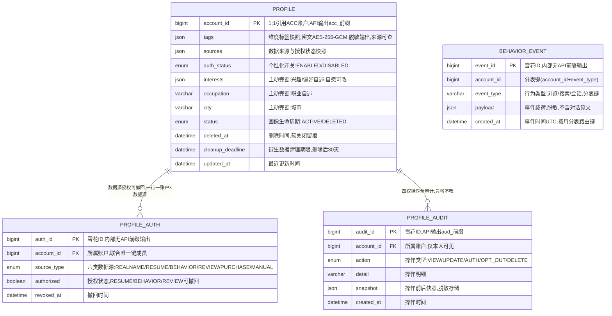

# 画像服务（PROFILE）数据库设计说明书

> 内容：**ER 图 + 分库分表方案 + 数据字典 + 表设计说明书**（§1 图 / §2 实体清单 / §3 设计约定 / §4 关系说明 / §5 分库分表 / §6 数据字典 / §7 表设计说明书）。
> 依据文档：`docs/design/产品设计文档.md` v1.0（基线）（§5.11 / §6.4.11 / §8.3.1）、`docs/design/微服务边界与职责基准.md` v1.6（§2.11 / §4.5）、
> `docs/design/高并发架构演进设计.md` v1.0（§2.1~§2.6）、`services/profile/docs/openapi.yaml` v1.0.0（**唯一可手改源**）。
> 数据域归属：⑥ 画像域（`profile`、`profile_auth`、`profile_audit`、`behavior_event`）——共享主库 + `profile_` schema 前缀隔离（Java 域既有路线）。
> 口径：与 openapi.yaml 冲突时以 openapi.yaml 为准。
> 版本：v1.0 · 2026-09-10（首版：七章齐全；画像域 4 表——profile / profile_auth / profile_audit / behavior_event，behavior_event 按月分表（`account_id`+`event_type`）、脱敏后入 ES/归档，主数据不分片；§5.7 于 2026-09-11 评审定档）。

## 1. ER 图（Mermaid）

## 2. 实体清单

| 实体（表名） | 存储介质 | 说明 |
|---|---|---|
| `profile` | 共享主库（`profile_` schema，主数据，不分片） | 个人画像档案：标签快照 + 来源/授权快照 + 主动完善 + 个性化开关，1:1 账户 |
| `profile_auth` | 共享主库 | 数据源授权记录（履历/行为/评论可撤回），一行一（账户 × 数据源） |
| `profile_audit` | 共享主库 | 画像四权操作审计留痕（查看/修改/授权/关闭/删除），仅本人可见 |
| `behavior_event` | 共享主库，**按月分表** | 行为事件（浏览/搜索/会话），脱敏后入画像、不含对话原文；脱敏后入 ES/归档 |
| 商铺画像【M2 占位】 | 聚合读模型（Redis/快照） | 五类特征聚合（商铺信息/购买者评价/卫生/信用/风险），**不新增采集、不落独立业务表**；口径交付前以评审为准 |

> 权威数据（实名/账号、信用分、履历）一律经内部接口只读引用，PROFILE 不复制权威数据、不重新发号；画像标签属 L1 高敏感，加密存储、脱敏输出。

## 3. 关键设计约定

- **R-07/C7 不杀熟（红线）**：价格不因画像差异化定价（同品同价，不杀熟）；画像仅用于推荐排序「叠加」权重（J-09 叠加不替代、价格与画像无关），不进入定价链路；推荐/画像降级 → 回退通用规则排序，不因降级做差异化定价。
- **未成年人不建行为/购买画像**：仅保留必要实名信息；`behavior_event` 采集与购买画像构建对未成年人拦截（R-07/C7，跨 6 服务口径之一）。
- **商铺画像 = 特征集合（C8）**：商铺画像 = 五类特征聚合（聚合 A/B/K 既有数据，不新增采集）；**信用分 = CRED 派生的可公示评分，不另立第二套评分**；画像用于分级监管不替代人工执法（预警只推送线索、不自动执法）；商铺申诉画像特征复用 A-07/D-03 机制。
- **最小化收集 + 授权可撤回 + 四权齐全（R-07）**：履历/行为/评论入画像需授权、可撤回；未授权字段不入画像；四权（查看/修改/关闭个性化/删除）齐全、操作全审计；实名按注册协议、购买按交易协议不在此处切换；主动完善（兴趣/职业/城市）自愿、可随时修改。
- **加密与脱敏**：画像标签（`profile.tags`）L1 高敏感，AES-256-GCM 加密存储、脱敏输出、来源可查可解释；`behavior_event.payload` 脱敏后入画像、不含对话原文；审计 `snapshot` 脱敏存储。标签为 JSON 密文，不做密文检索（查询一律走 `account_id`）。
- **删除后衍生数据 30 天清理**：`DELETE /profile/me` 软关闭（`status=DELETED` + `deleted_at` + `cleanup_deadline=删除日+30 天`），衍生数据（行为画像/标签/缓存）30 天内清理，不影响基本功能；删除后推荐自动回退通用规则。
- **状态机**：画像生命周期 构建 → 四权操作 → 关闭个性化回退通用规则 / 删除后 30 天清理；个性化开关 `ENABLED ↔ DISABLED`（关闭后停止行为采集、推荐回退通用规则，可重新开启）；授权 `authorized` 可切换（撤回 → 停止采集并清理已入画像字段）。
- **幂等**：`profile_auth` 一行一（账户 × 数据源），`uk_account_source(account_id, source_type)` 幂等复用；`profile_audit`、`behavior_event` **只增不改**（应用层禁 UPDATE/DELETE，库层回收写权限）；服务端间接口（`/profile/recommend`）内部 Token + 幂等。
- **越权**：画像/审计仅本人可见，跨账号访问报 2002（水平越权 IDOR）；`/profile/recommend` 越权账号访问 → 2002。
- **分表/分库定位**：`behavior_event` 按月分表，分片键 `account_id + event_type`（对齐高并发 §2.2）；主数据（profile/profile_auth/profile_audit）不分片；P1 共享主库 + `profile_` schema 前缀隔离（详见 §5）。
- **分布式 ID**：写库 Java 域统一雪花 ID（`infra-idgen`，DB 存 bigint，API 输出字符串带业务号前缀，防 JS 大数精度）；workerId Redis `INCR` 分配 + 租约续期（撞车 → 拒绝发号 + P0 告警）；**时钟回拨三档预案**（L1≤5s 退避 → L2 自动切号段兜底 → L3 拒绝发号，见高并发 §2.3.1~§2.3.4）适用。
- **审计**：`profile_audit` 操作审计日志 ≥6 个月（WORM/哈希链），仅本人可见、分页查询；画像授权率作为业务级监控指标（PDD §8.5.3）。

## 4. 关系说明

| 关系 | 基数 | 说明 |
|---|---|---|
| PROFILE — PROFILE_AUTH | 1 : N | 数据源授权记录，一行一（账户 × 数据源）幂等复用；撤回置 authorized=0 不删行 |
| PROFILE — PROFILE_AUDIT | 1 : N | 四权操作全审计，只增不改，仅本人可见（2002 越权拦截） |
| PROFILE — ACCOUNT（ACC） | 1 : 1 | 逻辑关联（经内部接口只读引用，非外键）；account_id 唯一权威在 ACC |
| BEHAVIOR_EVENT — ACCOUNT（ACC） | N : 1 | 逻辑关联（account_id 引用，非外键）；行为事件脱敏后入画像 |
| BEHAVIOR_EVENT → 画像标签计算 | 逻辑关联 | 行为事件（脱敏）驱动标签计算，异步聚合、不进 OLTP 主库实时 JOIN |
| 商铺画像【M2 占位】 → CRED/TRACE/AICORE | 逻辑关联 | 五类特征聚合读模型，聚合 A/B/K 既有数据；信用分派生自 CRED，不另立第二套评分 |

---

## 5. 分库分表方案

> 平台级策略以《高并发架构演进设计》v1.0 §2.1~§2.6 为准，本节只做「平台策略 → PROFILE 画像域」的落地映射。

### 5.1 分库与隔离

| 阶段 | 平台形态 | PROFILE 落位 |
|---|---|---|
| P1 地基期（M1） | 模块化单体共享主库（MySQL 8，主从读写分离） | PROFILE 表与各域同库，**以 `profile_` schema 前缀隔离**（对齐高并发 §6 优化点① 硬边界：禁跨域直连读表）；Java 域既有路线 |
| P2 服务化期（M2） | 交易/结算独立库，其余域共享主库 | **PROFILE 全程留在共享主库**，不独立成库（非交易/结算域）；行为事件量级触发阈值后再评估独立成库（§5.7） |
| 容灾 | 两地三中心：同城双活 + 异地灾备 | RPO≤15min / RTO≤30min（L1）；PROFILE 可用性 L2（≥99.9%），推荐/画像不可用回退通用规则 |

### 5.2 PROFILE 分片矩阵

| 表 | 分片方式 | 分片键 | 表命名 | 归档策略 | 里程碑 |
|---|---|---|---|---|---|
| `profile` | **不分片**（主数据，1:1 账户 + 强一致更新） | — | `profile` | 不归档、不物理删除（删除=软关闭，随账户生命周期） | M1 |
| `profile_auth` | 不分片 | — | `profile_auth` | 不归档（授权留痕） | M1 |
| `profile_audit` | 不分片 | — | `profile_audit` | 审计 ≥6 月（WORM/哈希链留痕） | M1 |
| `behavior_event` | **按月分表（已定）** | `account_id` + `event_type` | `behavior_event_YYYYMM` | 脱敏后入 ES/归档；>12 月热转冷 OSS（Parquet/压缩），保留热表 12 个月 | M1 起 |

> **分片阈值**（平台级建议初值，压测/数据增长标定）：单表 >2000 万行 或 >20GB 触发再分；`behavior_event` 按月分表天然可控，冷数据到点即归档，避免单表膨胀到亿级。
> **分片键口径**：`behavior_event` 分片键为 `account_id + event_type`（高并发 §2.2 已定，**不得改**）；时间维度（按月）由 `created_at` 承载，用于路由月表。

### 5.3 分表路由规则（behavior_event）

- **路由层**：M1 用 MyBatis-Plus 自定义分表插件（拦截按月路由）+ 统一 `ShardingKey` 注解；M2 分库后评估 ShardingSphere-Proxy（业务零改造），或先自研轻量路由。
- **写入**：按 `created_at` 月份路由到 `behavior_event_YYYYMM`，`ShardingKey(account_id, event_type)` 显式声明（分片键下推 + 剪枝）。
- **查询**：必须携带 `account_id` 下推（本人行为画像 + 水平越权校验 + 分片键剪枝）；按 `account_id + event_type + 时间范围` 命中 1..N 张月表，按表分页后合并排序。
- **跨月查询**：禁止 SQL UNION 全表扫描；跨月聚合（标签计算/行为活跃/品类偏好）走异步/从库（§5.5），不进 OLTP 主库。
- **禁止跨分片 JOIN / 聚合 / 事务**：行为标签计算、画像聚合汇总不进 OLTP 主库实时 JOIN（§5.6）。

### 5.4 分布式 ID 与主键策略

| 表 | 主键 | 生成方式 | 说明 |
|---|---|---|---|
| `profile.account_id` | bigint（引用 ACC） | 源服务生成，只读引用 | 1:1 账户，**不重新发号**；API 输出 `acc_` 前缀字符串 |
| `profile_auth.auth_id` | bigint 雪花 ID | 统一组件 `infra-idgen` | 内部记录，无 API 前缀输出 |
| `profile_audit.audit_id` | bigint 雪花 ID | `infra-idgen` | API 输出 `aud_` 前缀字符串（AuditItem.auditId，防 JS 大数精度） |
| `behavior_event.event_id` | bigint 雪花 ID | `infra-idgen` | 含时间戳但**分表路由以业务字段 `created_at` 为准**，不依赖 ID 内嵌时间戳 |

- workerId：Redis `INCR` 分配 + 实例重启复用（租约），撞车 → 拒绝发号 + P0 告警。
- **时钟回拨三档预案**（《高并发架构演进设计》§2.3.1~§2.3.4）对本服务生效（写库 Java 域）：L1 轻微回拨（≤5s）退避等待 → L2 超预算**自动切号段模式兜底**（`id_allocator` 表 DB 自增，不依赖时钟）→ L3 号段不可用**拒绝发号 + 快速失败**（资金链路暂停、幂等键/状态机兜底）；Prometheus 指标 + Alertmanager 分级告警 + NTP 治理。L2 号段兜底期间主键不含时间戳，分表路由仍以 `created_at` 为准，业务无感。

### 5.5 读写分离与冷热归档

- **读写分离**：主库写、从库读（读是写 3 倍以上）；读请求经 `@ReadOnly` 注解路由到从库；关键「写后立即读」（授权/关闭/删除后立即查画像状态）**强制走主库**，避免主从延迟读到旧状态。
- **冷热归档**：`behavior_event` 脱敏后入 ES（检索/聚合），>12 月热转冷 OSS（Parquet/压缩），查询走归档快照；对账/审计按需回捞。
- **存证**：`profile_audit` 只增不改 + 审计 WORM/哈希链（≥6 月），归档前后哈希链不断。

### 5.6 演进步骤（expand-migrate-contract）

> 任何表结构/分表规则变更按「扩展 → 迁移 → 收缩」执行，禁止破坏性 DDL 直上生产（对齐高并发 §2.6）：
> ① **双写**：新表上线，旧表 + 新表双写（幂等）→ ② **回灌**：历史数据按分片键回灌新表，校验一致性 → ③ **切读**：读流量切新表，旧表降级只读 → ④ **收缩**：观察稳定后下线旧表。

### 5.7 待标定项
> ✅ 2026-09-11 评审定档:共性项(分片阈值 2000 万行/20GB、回拨窗口 W=5s/step=1000、热表 12 个月)已评审通过;带 ★ 项初值已定、压测/运行标定;本表待决项裁决与遗留见 [docs/待评审事项汇总.md](/docs/待评审事项汇总.md) 顶部「⭐ 定档记录(2026-09-11)」与 §6 数据库待标定项。

| 项 | 建议初值 | 裁决方式 |
|---|---|---|
| 分片阈值 | 单表 >2000 万行 / >20GB | 评审 + 数据增长标定 |
| 回拨容忍窗口 W / 号段步长 | W=5s、step=1000 | 评审 + 压测标定（TBD-10） |
| 热表保留月数 | 12 个月 | 评审 |
| `behavior_event.event_type` 取值体系 | 浏览/搜索/会话（脱敏，不含对话原文） | 评审 + 行为日志源口径标定 |
| 商铺画像落库形态（M2） | 聚合读模型（Redis/快照），不落独立业务表 | 里程碑交付前评审 |
| 衍生数据清理期限 | 删除后 30 天（openapi cleanupDays=30 已定） | 已定（对齐 openapi） |

---

## 6. 数据字典

> 通用约定：MySQL 8.0，引擎 InnoDB，字符集 utf8mb4；时间 `datetime(3)` 毫秒精度、UTC 存储、输出 Asia/Shanghai；本服务无金额字段；数组/内嵌对象用 JSON 列（画像标签/来源/载荷/快照）；「密文」= AES-256-GCM 加密存储（L1 敏感，画像标签/载荷脱敏）；**枚举值与 openapi.yaml `components.schemas` 一一对应**；带 ★ 的值为建议初值、待标定（§5.7）。

### 6.1 profile（画像档案，主数据，不分片）

| 字段 | 类型 | 空 | 键 | 默认 | 说明 |
|---|---|---|---|---|---|
| account_id | bigint UNSIGNED | NO | PK | — | 账户 ID（1:1 引用 ACC account，唯一权威在 ACC）；API 输出 `acc_` 前缀字符串 |
| tags | JSON | YES | — | NULL | 维度标签快照（年龄段/职业/学历带/品类偏好/价格敏感度/行为活跃/评论倾向），**密文**（AES-256-GCM，L1 高敏感）；脱敏输出、来源可查可解释 |
| sources | JSON | YES | — | NULL | 数据来源与授权状态快照（`ProfileSource[]`：source/authorized/collectedAt）；脱敏输出 |
| auth_status | enum('ENABLED','DISABLED') | NO | — | ENABLED | 个性化开关（`ProfileMeResult.authStatus`）；关闭 → 推荐回退通用规则、停止行为采集 |
| interests | JSON | YES | — | NULL | 主动完善：兴趣/偏好自述（自愿、可随时修改） |
| occupation | varchar(50) | YES | — | NULL | 主动完善：职业自述（≤50） |
| city | varchar(50) | YES | — | NULL | 主动完善：城市（≤50） |
| status | enum('ACTIVE','DELETED') | NO | — | ACTIVE | 画像生命周期状态机：ACTIVE 正常 / DELETED 已删除（`ProfileDeleteResult.status=DELETED`） |
| deleted_at | datetime(3) | YES | — | NULL | 删除时间（软关闭留痕） |
| cleanup_deadline | datetime(3) | YES | — | NULL | 衍生数据清理期限（删除日 + 30 天，`cleanupDays=30`） |
| created_at | datetime(3) | NO | — | CURRENT_TIMESTAMP(3) | 画像构建时间 |
| updated_at | datetime(3) | NO | — | CURRENT_TIMESTAMP(3) | 最近更新时间（标签重算/主动完善/四权操作，`ProfileMeResult.updatedAt`） |

### 6.2 profile_auth（数据源授权记录，可撤回，不分片）

| 字段 | 类型 | 空 | 键 | 默认 | 说明 |
|---|---|---|---|---|---|
| auth_id | bigint UNSIGNED | NO | PK | — | 授权记录 ID，雪花 ID（内部，无 API 前缀输出） |
| account_id | bigint UNSIGNED | NO | — | — | 所属账户（引用 ACC account_id） |
| source_type | enum('REALNAME','RESUME','BEHAVIOR','REVIEW','PURCHASE','MANUAL') | NO | — | — | 数据源类型（`ProfileSourceType` 六类）；**可切换授权仅 RESUME/BEHAVIOR/REVIEW**（`AuthUpdateRequest.source`）；REALNAME 按注册协议、PURCHASE 按交易协议、MANUAL 主动完善，不在此处切换 |
| authorized | tinyint(1) | NO | — | 0 | 授权状态（true 授权 / false 撤回）；撤回 → 停止采集并清理已入画像字段 |
| revoked_at | datetime(3) | YES | — | NULL | 撤回时间 |
| created_at | datetime(3) | NO | — | CURRENT_TIMESTAMP(3) | 首次授权时间 |
| updated_at | datetime(3) | NO | — | CURRENT_TIMESTAMP(3) | 最近授权变更时间（`AuthUpdateResult.updatedAt`） |

> 幂等/唯一：UNIQUE KEY `uk_account_source`(`account_id`, `source_type`)——**一行一（账户 × 数据源）生命周期复用**：授权/撤回复用原行，不新增、不删行（撤回置 authorized=0 + revoked_at）。

### 6.3 profile_audit（画像操作审计日志，不分片）

| 字段 | 类型 | 空 | 键 | 默认 | 说明 |
|---|---|---|---|---|---|
| audit_id | bigint UNSIGNED | NO | PK | — | 审计记录号，雪花 ID；API 输出 `aud_` 前缀字符串（`AuditItem.auditId`） |
| account_id | bigint UNSIGNED | NO | — | — | 所属账户（仅本人可见，越权 2002） |
| action | enum('VIEW','UPDATE','AUTH','OPT_OUT','DELETE') | NO | — | — | 操作类型（`AuditItem.action`：查看/修改/授权/关闭/删除） |
| detail | varchar(500) | YES | — | NULL | 操作明细（`AuditItem.detail`，如「撤回行为数据授权」） |
| snapshot | JSON | YES | — | NULL | 操作前后快照（脱敏存储，WORM/哈希链留痕） |
| created_at | datetime(3) | NO | — | CURRENT_TIMESTAMP(3) | 操作时间（`AuditItem.at`） |

### 6.4 behavior_event（行为事件，按月分表 behavior_event_YYYYMM）

| 字段 | 类型 | 空 | 键 | 默认 | 说明 |
|---|---|---|---|---|---|
| event_id | bigint UNSIGNED | NO | PK | — | 事件 ID，雪花 ID（`infra-idgen`，内部无 API 前缀输出） |
| account_id | bigint UNSIGNED | NO | — | — | 所属账户，**分表键**（与 event_type 组合） |
| event_type | varchar(32) | NO | — | — | 行为类型：浏览/搜索/会话（脱敏后入画像，不含对话原文）★（§5.7）；**分表键** |
| payload | JSON | NO | — | — | 事件载荷，**脱敏**（不含对话原文）；入画像/ES 前脱敏 |
| created_at | datetime(3) | NO | — | CURRENT_TIMESTAMP(3) | 事件时间（UTC），按月分表路由键 |

> 分片键 `account_id + event_type`（高并发 §2.2 已定）；索引 `idx_account_type_created(account_id, event_type, created_at)` 分片键剪枝；脱敏后入 ES/归档。

### 6.5 商铺画像（M2 占位，聚合读模型，不落独立业务表）

> `GET /profile/merchants/{merchantId}`（`MerchantProfileResult`）M2 占位：五类特征（商铺信息/购买者评价/卫生状况/信用/风险）**聚合 A/B/K 既有数据、不新增采集**；`creditScore` 为 CRED 派生的可公示评分（0~100，不另立第二套评分）；`riskLevel` enum('HIGH','MEDIUM','LOW') 供「画像风险+信用」分级监管，仅线索不自动执法。落库形态以「只读快照/缓存聚合」为建议初值（§5.7），**里程碑交付前口径以评审为准**，本期不建独立业务表。

---

## 7. 表设计说明书

### 7.1 profile（画像档案，主数据）

- **用途**：个人画像档案——标签快照 + 来源/授权快照 + 主动完善 + 个性化开关，1:1 账户，承载画像四权与推荐权重叠加（J-07/J-08）。
- **主键（策略）**：`account_id`（1:1 引用 ACC account_id，只读引用**不重新发号**）；API 输出 `acc_` 前缀字符串。
- **索引**：PRIMARY KEY(`account_id`)；无需附加索引（1:1 按账户访问）；如需按城市/职业做内部画像统计，预留 `idx_city`/`idx_occupation`（内部，接口不暴露）。
- **约束**：状态机 ACTIVE → DELETED（软关闭，`deleted_at` + `cleanup_deadline` 留痕）；未授权字段不入画像；未成年人不建行为/购买画像（应用层拦截）；删除后衍生数据 30 天内清理。
- **安全**：`tags` 密文（AES-256-GCM，L1 高敏感）脱敏输出、来源可查可解释；`sources` 脱敏输出；不做密文检索。
- **生命周期**：不归档、不物理删除；随账户全生命周期存续。
- **接口映射**：GET /profile/me（读，含 sources/authStatus）、PUT /profile/me（修改/主动完善）、DELETE /profile/me（删除置 DELETED + 30 天清理）、POST /profile/me/opt-out（关闭个性化 auth_status=DISABLED）、GET /profile/feeds、GET /profile/guidance（读画像做排序）、POST /profile/recommend（服务端间，读画像权重叠加）。

### 7.2 profile_auth（数据源授权记录，可撤回）

- **用途**：数据源授权管理（J-07），履历/行为/评论入画像需授权、可撤回；撤回停止采集并清理已入画像字段。
- **主键（策略）**：`auth_id` 雪花 ID（`infra-idgen`，内部，无 API 前缀输出）。
- **索引**：PRIMARY KEY(`auth_id`)；UNIQUE KEY `uk_account_source`(`account_id`, `source_type`)——**一行一（账户 × 数据源）幂等复用**（授权/撤回复用原行，不删行）；`uk_account_source` 左前缀覆盖 `account_id` 查询（§4.5 idx(account_id)）。
- **约束**：可切换授权仅 RESUME/BEHAVIOR/REVIEW（`AuthUpdateRequest.source` 枚举）；REALNAME 按注册协议、PURCHASE 按交易协议、MANUAL 主动完善，不在此处切换；撤回置 authorized=0 + revoked_at；接口级 `Idempotency-Key`。
- **安全**：无 L1 明文；授权状态脱敏输出（`ProfileSource.authorized`）。
- **生命周期**：不归档（授权留痕）；撤回不物理删除。
- **接口映射**：PUT /profile/auth（授权/撤回）、GET /profile/me（sources 读取授权状态）。

### 7.3 profile_audit（画像操作审计日志）

- **用途**：画像四权操作审计留痕（J-08/G-08：查看/修改/授权/关闭/删除全审计），仅本人可见、分页。
- **主键（策略）**：`audit_id` 雪花 ID（`infra-idgen`），API 输出 `aud_` 前缀字符串。
- **索引**：PRIMARY KEY(`audit_id`)；KEY `idx_account_created`(`account_id`, `created_at`)——本人分页审计查询（`GET /profile/audit`）。
- **约束**：**只增不改**（应用层禁 UPDATE/DELETE，库层回收写权限）；`action` 枚举对齐 `AuditItem.action`；`snapshot` 脱敏留痕。
- **安全**：`snapshot` 脱敏存储；审计日志 ≥6 月（WORM/哈希链）；仅本人可见（越权 2002）。
- **生命周期**：审计留痕 ≥6 月（WORM/哈希链），不归档删除。
- **接口映射**：GET /profile/audit（分页查询，`AuditPage`）；由 PUT /profile/me、PUT /profile/auth、POST /profile/me/opt-out、DELETE /profile/me 等操作写入。

### 7.4 behavior_event（行为事件，按月分表）

- **用途**：行为事件采集（浏览/搜索/会话），脱敏后入画像/ES、驱动标签计算；不含对话原文（R-07 最小化 + 脱敏）。
- **分表**：`behavior_event_YYYYMM` 按月分表；分片键 `account_id + event_type`（高并发 §2.2 已定）；脱敏后入 ES/归档，>12 月热转冷 OSS（§5.2~§5.5）。
- **主键（策略）**：`event_id` 雪花 ID；分表路由以业务字段 `created_at` 为准，不依赖 ID 内嵌时间戳（号段兜底时依然正确）。
- **索引**：PRIMARY KEY(`event_id`)；KEY `idx_account_type_created`(`account_id`, `event_type`, `created_at`)——**分片键剪枝** + 画像标签聚合查询。
- **约束**：**只增不改**（应用层禁 UPDATE/DELETE，库层回收写权限）；`payload` 脱敏（不含对话原文）；未成年人不采行为画像（应用层拦截）；跨月聚合走异步/从库，禁止跨分片 JOIN/聚合/事务。
- **安全**：`payload` 脱敏后入画像/ES；不存对话原文；事件内容不出域。
- **生命周期**：脱敏后入 ES（检索/聚合）；>12 月热转冷 OSS（Parquet/压缩），保留热表 12 个月，对账/审计按需回捞。
- **接口映射**：行为日志经 MQ `profile.behavior` 消费入 `behavior_event`（内部采集，脱敏后入画像，无前端上报接口——2026-09-10 决策）；GET /profile/me（行为标签来源，异步聚合）；POST /profile/recommend（服务端间，行为画像权重）。

### 7.5 出方向依赖（跨服务，逻辑关联）

- **取数（只读引用）**：ACC（实名/账号，`account_id` 唯一权威）、CRED/EMP（履历/信用，履历数据源）、行为日志（浏览/搜索/会话，脱敏后入画像、不含对话原文）。
- **被依赖（下游）**：ASSIST 调 `/profile/recommend` 获取授权画像权重叠加推荐排序（J-09，叠加不替代、价格与画像无关）；DASH 消费商铺画像 → 「画像风险 + 信用」分级监管（选择性监管，预警只推送线索不自动执法）。
- **商铺画像特征聚合（M2 占位）**：聚合 A（CRED 商铺信息/信用）、B（TRACE 卫生/抽检）、K（AICORE 风险）既有数据，**不新增采集、不另立第二套评分**；商铺申诉画像特征复用 A-07/D-03 机制。
- **不复制权威数据**：PROFILE 不直接写 CRED `credit_score` / 不建第二套信用评分（C8）；信用分只读引用 CRED。

---

*文档结束 · 与 `services/profile/docs/openapi.yaml`（唯一可手改源）、《高并发架构演进设计》v1.0 §2、《产品设计文档》v1.0（基线） §5.11/§6.4.11、《微服务边界与职责基准》v1.6 §2.11 同步维护。*
