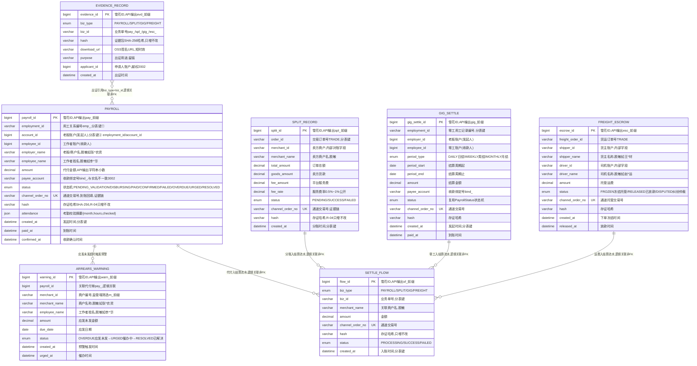

# 结算服务（SETTLE）数据库设计说明书

> 内容：**ER 图 + 分库分表方案 + 数据字典 + 表设计说明书**（§1 图 / §2 实体清单 / §3 设计约定 / §4 关系说明 / §5 分库分表 / §6 数据字典 / §7 表设计说明书）。
> 依据文档：`docs/design/产品设计文档.md` v1.12（§5.2 / §6.4.2 / §8.3.1）、`docs/design/微服务边界与职责基准.md` v1.2（§2.2 / §4.5）、
> `docs/design/高并发架构演进设计.md` v0.3（§2.1~§2.6）、`services/settle/docs/openapi.yaml` v1.0.0（**唯一可手改源**）。
> 数据域归属：⑨ 结算域（SETTLE）——`payroll` / `split_record` / `settle_flow`（+ 预警/出证/零工/运费为执行侧派生实体，见 §2）。
> 　⚠️ 归属错位：`payroll` 原归 ③ 用工域（EMP）、`split_record` 原归 ⑧ 交易域（TRADE），二者执行均在 SETTLE；已经《微服务边界与职责基准》§4-C07 决策（2026-09-08）迁入 ⑨ 结算域、PDD §4.5 已同步；本文档按**执行方 SETTLE** 设计（列为待评审项，见 §5.7）。
> 口径：与 openapi.yaml 冲突时以 openapi.yaml 为准。
> 版本：v1.0 · 2026-09-10（首版：七章齐全；代付/预警/出证/分账/零工/运费/结算流水七实体，`payroll`/`settle_flow`/`split_record` 按月分表（`payroll` 分片键 `employment_id`/`account_id` + `created_at`，M1 起，原样采用高并发 §2.2），主数据不分片；P1 共享主库 `settle_` schema 前缀隔离、P2 独立库（交易/结算拆分第一顺位，M2 优先拆独立部署））。

## 1. ER 图（Mermaid）

## 2. 实体清单

| 实体（表名） | 存储介质 | 说明 |
|---|---|---|
| `payroll`（按月分表 `payroll_YYYYMM`） | MySQL | 工资代付单（I-03）：待校验→代付中→已到账→完成，状态机 + 证据链 |
| `arrears_warning` | MySQL | 欠薪预警（I-03）：「应发未发」超时自动预警，OVERDUE→URGED→RESOLVED |
| `evidence_record` | MySQL | 证据包出证（P-02）：流水+用工记录打包，时间戳+哈希，只增不改 |
| `settle_flow`（按月分表 `settle_flow_YYYYMM`） | MySQL | 结算流水总览（监管端资金审计）：代付/分账/零工/运费统一流水 |
| `split_record`（按月分表 `split_record_YYYYMM`） | MySQL | 商品分账记录（I-04，M2）：货款→卖方、服务费→平台 |
| `gig_settle`（按月分表 `gig_settle_YYYYMM`） | MySQL | 零工结算单（I-05，M2）：日结/周结/月结，复用 I-03 代付能力 |
| `freight_escrow` | MySQL | 运费托管单（F-04，M2）：冻结托管→送达确认放款 |
| 幂等缓存 / 对账锁 | Redis（不入库） | `Idempotency-Key` 幂等缓存（资金写强制）+ 对账/超时扫描 JOB 分布式锁 |

> 平台结算账户为 M0 对接层（第三方持牌通道），不建本地表、不沉淀资金（R-01）；结算余额/汇总由流水聚合，不设余额字段。

## 3. 关键设计约定

- **R-01 只记账不碰钱**：SETTLE 不设任何资金余额字段，真实资金由持牌机构从老板绑定对公/法人账户划转；平台不沉淀资金、不做二清、不设资金池（AC-C1）。余额/汇总由 `settle_flow` 流水聚合计算。
- **R-04 流水只增不改 + 哈希链**：`channel_order_no`（通道交易号）+ `hash`（SHA-256）+ 时间戳即证据链，可出证（P-02）；流水类（payroll/settle_flow/split_record/gig_settle）库层回收 UPDATE/DELETE 写权限，应用层禁改。
- **幂等**：资金类写操作强制 `Idempotency-Key` 头，重复提交返回原单（3008 幂等返回）；服务端间接口（支付回调、分账触发）验签 + 幂等 + 内部 Token。
- **状态机 + 超时查单**：代付 `PENDING_VALIDATION → DISBURSING → PAID → CONFIRMED`（/ FAILED / OVERDUE → URGED → RESOLVED，仲裁走 TICKET）；通道失败/超时（4002）幂等重试或切备选通道；超时状态机自动查单兜底。
- **每日对账**：对账不一致（3009）→ 每日对账 JOB 扫描补差；「写后立即读」强制走主库。
- **欠薪预警**：「应发未发」超时自动触发 `/settle/arrears/warnings`，监管端催办（URGED），仲裁走 TICKET（D-02/T-15，不在本服务）。
- **证据出证**：时间戳 + 哈希（SHA-256），证据包只增不改，`downloadUrl` 为短时效签名 URL；申请人须为当事方或监管角色，越权 2002。
- **越权与业务拦截**：水平越权 2002；实名未完成 3001 / 收款账户实名不匹配 3002 / 对象不存在 3006 / 状态不允许 3007 / 对账不一致 3009 / 通道失败超时 4002；发薪/分账等敏感操作强制 MFA（2003 未通过拦截）。
- **加密与脱敏**：收款账号/户名、手机、姓名等 L1 敏感字段 AES-256-GCM 加密存储、脱敏输出（如 138\*\*\*\*8000、张\*农资、李\*华）；支付/工资密钥最高级隔离（微信 v3 API 证书，KMS 注入、禁写库、不入日志）；如需按密文字段检索，预留 HMAC 指纹辅助列 + 唯一索引（接口不暴露）。
- **分表**：`payroll`/`settle_flow`/`split_record`/`gig_settle` 按月分表（只增流水类）；`arrears_warning`/`evidence_record`/`freight_escrow` 主数据不分片；分片键见 §5.2。
- **分库定位**：P1 模块化单体期共享主库 + `settle_` schema 前缀隔离；P2 交易/结算独立库，SETTLE 为拆分第一顺位、M2 优先拆独立部署（详见 §5.1）。
- **分布式 ID**：写库 Java 域统一雪花 ID（`infra-idgen`，DB 存 bigint，API 输出业务号前缀 `pay_`/`warn_`/`evd_`/`sf_`/`spl_`/`gig_`/`esc_`）；时钟回拨三档预案适用（§5.4）。
- **监管审计（R-11）**：`settle_flow` 为监管端资金流水审计视图（`SettleBizType` 全业务类型 + 通道交易号 + 存证哈希）；审计日志 ≥6 个月（WORM/哈希链）。

## 4. 关系说明

| 关系 | 基数 | 说明 |
|---|---|---|
| PAYROLL — ARREARS_WARNING | 1 : N | 应发未发超时触发预警；`payroll_id` 逻辑关联（跨表，非外键） |
| PAYROLL — SETTLE_FLOW | 1 : N | 代付入结算流水；逻辑关联（`biz_id` 引用，非外键） |
| SPLIT_RECORD — SETTLE_FLOW | 1 : N | 分账入结算流水；逻辑关联（非外键） |
| GIG_SETTLE — SETTLE_FLOW | 1 : N | 零工入结算流水；逻辑关联（非外键） |
| FREIGHT_ESCROW — SETTLE_FLOW | 1 : N | 运费入结算流水；逻辑关联（非外键） |
| EVIDENCE_RECORD — 各业务单 | M : N | 出证引用（`biz_type` + `biz_id`），非外键 |
| → EMP / ACC / TRADE / CRED / DASH | 逻辑关联 | 用工/考勤取数（EMP）、实名/收款绑定（ACC）、订单/货运单（TRADE）、发薪履约/信用联动（EMP/CRED）、欠薪预警上报（DASH），均经内部接口/事件 |
| 幂等缓存 / 对账锁 | Redis 独立 | 不入库；`Idempotency-Key` 幂等缓存 + JOB 单实例分布式锁 |

---

## 5. 分库分表方案

> 平台级策略以《高并发架构演进设计》v0.3 §2.1~§2.6 为准，本节只做「平台策略 → SETTLE 结算域」的落地映射。

### 5.1 分库与隔离

| 阶段 | 库形态 | SETTLE 落位 |
|---|---|---|
| P1 地基期（M1） | 模块化单体共享主库（MySQL 8，主从读写分离） | SETTLE 表与各域同库，**以 `settle_` schema 前缀隔离**（对齐高并发 §6 优化点① 硬边界：禁跨域直连读表） |
| P2 服务化期（M2） | 交易/结算独立库，其余域共享主库 | **SETTLE 独立成库（拆分第一顺位，M2 优先拆独立部署）**，读写容量独立伸缩（对齐 PDD §8.3.2） |
| 容灾 | 两地三中心：同城双活 + 异地灾备 | RPO≤15min / RTO≤30min（L1，对齐 SETTLE README §4.2） |

### 5.2 SETTLE 分片矩阵

| 表 | 分片方式 | 分片键 | 表命名 | 归档策略 | 里程碑 |
|---|---|---|---|---|---|
| `payroll` | **按月分表（已定）** | `employment_id` / `account_id` + `created_at` | `payroll_YYYYMM` | >12 月热转冷 OSS（Parquet/压缩），保留热表 12 个月 | M1 起 |
| `settle_flow` | **按月分表（已定）** | `biz_id` + `created_at` | `settle_flow_YYYYMM` | 同上 | M1 起 |
| `split_record` | **按月分表（只增流水）** | `order_id` + `created_at` | `split_record_YYYYMM` | 同钱包流水 | M2 |
| `gig_settle` | **按月分表（只增流水）** | `employment_id` + `created_at` | `gig_settle_YYYYMM` | 同上 | M2 |
| `arrears_warning` | 不分片（工作单类，行数可控） | — | `arrears_warning` | 不归档（预警/催办留痕） | M1 起 |
| `evidence_record` | 不分片（只增不改，行数可控） | — | `evidence_record` | 不归档（存证留痕） | M1 起 |
| `freight_escrow` | 不分片（托管工作单，M2 占位） | — | `freight_escrow` | 闭单（RELEASED/DISPUTED）后归档 | M2 |

> **口径说明**：`payroll` 分片键/归档策略/里程碑原样采用《高并发架构演进设计》v0.3 §2.2（SETTLE 代付流水 `payroll`：按月分表，`employment_id`/`account_id`，>12 月热转冷 OSS 保留热表 12 个月，M1 起），**不改变**。`settle_flow` 按月分表口径来自 PDD §4.5 ⑨ 结算域。
>
> **分片阈值**（平台级建议初值，压测/数据增长标定）：单表 >2000 万行 或 >20GB 触发再分；按月分表天然可控，冷数据到点即归档，避免单表膨胀到亿级。

### 5.3 分表路由规则

- **路由层**：M1 用 MyBatis-Plus 自定义分表插件（拦截按月路由）+ 统一 `ShardingKey` 注解；M2 分库后评估 ShardingSphere-Proxy（业务零改造），或先自研轻量路由。
- **写入**：按 `created_at` 月份路由到 `{表}_YYYYMM`，`ShardingKey` 显式声明（payroll: `employment_id`/`account_id`；settle_flow: `biz_id`；split_record: `order_id`；gig_settle: `employment_id`）。
- **查询**：代付单列表（GET /settle/payrolls、/settle/payrolls/mine）带 `month`/`status` → 命中 1..N 张月表；**必须携带分片键下推**（payroll 按 `employment_id`/`account_id` + 水平越权校验）。
- **跨月查询**：禁止 SQL UNION 全表扫描；优先「分片键 + 日期范围」索引下推；跨月聚合（监管审计总览、对账汇总）走异步/从库（§5.5）。
- **禁止跨分片 JOIN / 聚合 / 事务**：`settle_flow` 与各业务单为逻辑关联（`biz_id` 引用），跨分片核对走异步/从库，不进 OLTP 主库（§5.6）。

### 5.4 分布式 ID 与主键策略

| 表 | 主键 | 生成方式 | 说明 |
|---|---|---|---|
| `payroll.payroll_id` | bigint 雪花 ID | 统一组件 `infra-idgen` | API 输出字符串带 `pay_` 前缀（防 JS 大数精度） |
| `arrears_warning.warning_id` | bigint 雪花 ID | `infra-idgen` | API 输出 `warn_` 前缀 |
| `evidence_record.evidence_id` | bigint 雪花 ID | `infra-idgen` | API 输出 `evd_` 前缀 |
| `settle_flow.flow_id` | bigint 雪花 ID | `infra-idgen` | API 输出 `sf_` 前缀 |
| `split_record.split_id` | bigint 雪花 ID | `infra-idgen` | API 输出 `spl_` 前缀 |
| `gig_settle.gig_settle_id` | bigint 雪花 ID | `infra-idgen` | API 输出 `gig_` 前缀 |
| `freight_escrow.escrow_id` | bigint 雪花 ID | `infra-idgen` | API 输出 `esc_` 前缀 |

- workerId：Redis `INCR` 分配 + 租约续期，撞车 → 拒绝发号 + P0 告警。
- **时钟回拨三档预案**（《高并发架构演进设计》§2.3.1~§2.3.4，经 `infra-idgen` 统一能力，对本服务生效）：L1 轻微回拨（≤5s）退避等待 → L2 超预算**自动切号段模式兜底**（`id_allocator` 表 DB 自增，不依赖时钟）→ L3 号段不可用**拒绝发号 + 快速失败**（资金链路暂停并公告，幂等键/状态机兜底，恢复后重试不重复）；Prometheus `idgen_*` 指标 + Alertmanager 分级告警 + NTP（chrony）治理。
- **号段兜底期间**：主键不含时间戳，**分表路由一律以业务字段 `created_at` 为准，不依赖 ID 内嵌时间戳**，业务无感。

### 5.5 读写分离与冷热归档

- **读写分离**：主库写、从库读（`@ReadOnly` 注解路由）；关键资金「写后立即读」（发起代付/到账回调/放款/出证后立即查状态）**强制走主库**，避免主从延迟读到旧状态。
- **冷热归档**：只增流水（`payroll`/`settle_flow`/`split_record`/`gig_settle`）>12 月热转冷 OSS（Parquet/压缩），查询走归档快照；对账/审计按需回捞。
- **存证**：流水只增不改 + `hash` 哈希链（R-04），归档前后哈希链跨归档连续不断。

### 5.6 演进步骤（expand-migrate-contract）

> 任何表结构/分表规则变更按「扩展 → 迁移 → 收缩」执行，禁止破坏性 DDL 直上生产（对齐高并发 §2.6）：
> ① **双写**：新表上线，旧表 + 新表双写（幂等）→ ② **回灌**：历史数据按分片键回灌新表，校验一致性 → ③ **切读**：读流量切新表，旧表降级只读 → ④ **收缩**：观察稳定后下线旧表。

### 5.7 待标定项

| 项 | 建议初值 | 裁决方式 |
|---|---|---|
| 分片阈值 | 单表 >2000 万行 / >20GB | 评审 + 数据增长标定 |
| 回拨容忍窗口 W / 号段步长 | W=5s、step=1000 | 评审 + 压测标定（TBD-10） |
| 热表保留月数 | 12 个月 | 评审 |
| **归属错位回改确认（§4-C07）** | 按执行方 SETTLE 设计（payroll/split_record 迁入 ⑨ 结算域） | 评审（EMP/TRADE 侧口径最终确认） |
| `split_record` 分片键 | `order_id` + `created_at`（高并发 §2.2 仍列 split_record 于 TRADE `buyer_id`） | 评审 |
| 欠薪预警「应发未发」超时时限 | 应发日期 + X 工作日（对齐发薪周期） | 评审 |
| 证据包 OSS 签名 URL 时效 | 短时效（如 15 分钟） | 评审 |
| 零工/运费 M2 表分片口径 | 与 payroll 同口径（按月） | M2 评审 |

---

## 6. 数据字典

> 通用约定：MySQL 8.0；引擎 InnoDB；字符集 utf8mb4；时间 `datetime(3)` 毫秒精度、UTC 存储、输出 Asia/Shanghai；金额 `decimal(18,2)` 存储、API 输出字符串小数（防浮点误差）；费率 `decimal(5,4)`；数组/内嵌对象用 JSON 列；「密文」= AES-256-GCM 加密存储（L1 敏感）；**枚举值与 openapi.yaml `components.schemas` 一一对应**；带 ★ 的值为建议初值、待标定（§5.7）。

### 6.1 payroll（工资代付单，按月分表 payroll_YYYYMM）

| 字段 | 类型 | 空 | 键 | 默认 | 说明 |
|---|---|---|---|---|---|
| payroll_id | bigint UNSIGNED | NO | PK | — | 代付单号，雪花 ID；API 输出 `pay_` 前缀字符串 |
| employment_id | varchar(32) | NO | — | — | 用工关系编号 `emp_` 前缀，**分表键①**（逻辑关联 EMP.employment） |
| account_id | bigint UNSIGNED | NO | — | — | 老板（发起人）账户，**分表键②**（employment_id/account_id 组合）；水平越权校验 |
| employee_id | bigint UNSIGNED | NO | — | — | 工作者（收款人）账户（逻辑关联 ACC.account） |
| employer_name | varchar(64) | YES | — | NULL | 老板/商户名称，**脱敏输出**如 张\*农资 |
| employee_name | varchar(64) | YES | — | NULL | 工作者姓名，**脱敏输出**如 李\*华 |
| amount | decimal(18,2) | NO | — | — | 代付金额（元），API 输出 string |
| payee_account | varchar(32) | NO | — | — | 收款账户绑定号 `bind_` 前缀；与实名不一致 → 3002 拒绝 |
| status | enum('PENDING_VALIDATION','DISBURSING','PAID','CONFIRMED','FAILED','OVERDUE','URGED','RESOLVED') | NO | — | PENDING_VALIDATION | 代付状态机（PayrollStatus） |
| channel_order_no | varchar(64) | YES | UK | NULL | 第三方通道交易号（到账回填，证据链）；NULL 豁免唯一索引 |
| hash | varchar(128) | NO | — | — | 存证哈希：SHA-256(前链 hash + 行数据 + 时间戳)，R-04 只增不改 |
| attendance | JSON | YES | — | NULL | 考勤校验摘要 `{month, hours, checked}`（代付依据，PayrollDetail.attendance） |
| remark | varchar(200) | YES | — | NULL | 备注（可选，PayrollDisburseRequest.remark） |
| created_at | datetime(3) | NO | — | CURRENT_TIMESTAMP(3) | 发起时间，**分表键** |
| paid_at | datetime(3) | YES | — | NULL | 到账时间（PAID 后回填） |
| confirmed_at | datetime(3) | YES | — | NULL | 收款确认时间（CONFIRMED 时） |

### 6.2 arrears_warning（欠薪预警，不分片）

| 字段 | 类型 | 空 | 键 | 默认 | 说明 |
|---|---|---|---|---|---|
| warning_id | bigint UNSIGNED | NO | PK | — | 预警编号，雪花 ID；API 输出 `warn_` 前缀字符串 |
| payroll_id | bigint UNSIGNED | NO | — | — | 关联代付单号 `pay_`（逻辑关联，非外键） |
| merchant_id | varchar(32) | YES | — | NULL | 商户编号（监管端筛选 `m_` 前缀） |
| merchant_name | varchar(64) | YES | — | NULL | 商户名称，**脱敏输出**如 张\*农资 |
| employee_name | varchar(64) | YES | — | NULL | 工作者姓名，**脱敏输出**如 李\*华 |
| amount | decimal(18,2) | NO | — | — | 应发未发金额（元） |
| due_date | date | NO | — | — | 应发日期 |
| status | enum('OVERDUE','URGED','RESOLVED') | NO | — | OVERDUE | 预警状态机（ArrearsStatus）：应发未发→催办中→已解决（仲裁走 TICKET） |
| created_at | datetime(3) | NO | — | CURRENT_TIMESTAMP(3) | 预警触发时间（超时扫描 JOB） |
| urged_at | datetime(3) | YES | — | NULL | 催办时间（URGED 时） |

### 6.3 evidence_record（证据包出证，不分片，只增不改）

| 字段 | 类型 | 空 | 键 | 默认 | 说明 |
|---|---|---|---|---|---|
| evidence_id | bigint UNSIGNED | NO | PK | — | 证据包编号，雪花 ID；API 输出 `evd_` 前缀字符串 |
| biz_type | enum('PAYROLL','SPLIT','GIG','FREIGHT') | NO | — | — | 出证业务类型（EvidenceBizType） |
| biz_id | varchar(64) | NO | — | — | 业务单号（pay_/spl_/gig_/esc_） |
| hash | varchar(128) | NO | — | — | 证据包 SHA-256 哈希（时间戳 + 哈希，只增不改） |
| download_url | varchar(512) | YES | — | NULL | OSS 签名 URL（短时效★，EvidenceResult.downloadUrl） |
| purpose | varchar(200) | YES | — | NULL | 出证用途（可选留痕，如「劳动仲裁」） |
| applicant_id | bigint UNSIGNED | NO | — | — | 申请人账户（当事方或监管角色，越权 2002） |
| created_at | datetime(3) | NO | — | CURRENT_TIMESTAMP(3) | 出证时间 |

### 6.4 settle_flow（结算流水总览，按月分表 settle_flow_YYYYMM）

| 字段 | 类型 | 空 | 键 | 默认 | 说明 |
|---|---|---|---|---|---|
| flow_id | bigint UNSIGNED | NO | PK | — | 结算流水号，雪花 ID；API 输出 `sf_` 前缀字符串 |
| biz_type | enum('PAYROLL','SPLIT','GIG','FREIGHT') | NO | — | — | 业务类型（SettleBizType） |
| biz_id | varchar(64) | NO | — | — | 业务单号，**分表键**（逻辑关联各业务单） |
| merchant_name | varchar(64) | YES | — | NULL | 关联商户名称，**脱敏输出** |
| amount | decimal(18,2) | NO | — | — | 金额（元），API 输出 string |
| channel_order_no | varchar(64) | YES | UK | NULL | 通道交易号；NULL 豁免唯一索引 |
| hash | varchar(128) | NO | — | — | 存证哈希（只增不改） |
| status | enum('PROCESSING','SUCCESS','FAILED') | NO | — | PROCESSING | 流水状态（SettleFlowItem.status） |
| created_at | datetime(3) | NO | — | CURRENT_TIMESTAMP(3) | 入账时间，**分表键** |

### 6.5 split_record（商品分账记录，按月分表 split_record_YYYYMM，M2）

| 字段 | 类型 | 空 | 键 | 默认 | 说明 |
|---|---|---|---|---|---|
| split_id | bigint UNSIGNED | NO | PK | — | 分账单号，雪花 ID；API 输出 `spl_` 前缀字符串 |
| order_id | varchar(32) | NO | — | — | 交易订单号（TRADE，`O-` 前缀），**分表键**（逻辑关联 TRADE.order） |
| merchant_id | varchar(32) | YES | — | NULL | 卖方商户（内部对账字段；接口以 merchantName 脱敏输出） |
| merchant_name | varchar(64) | YES | — | NULL | 卖方商户名称，**脱敏输出** |
| total_amount | decimal(18,2) | NO | — | — | 订单总额（元） |
| goods_amount | decimal(18,2) | NO | — | — | 卖方货款（元） |
| fee_amount | decimal(18,2) | NO | — | — | 平台服务费（元） |
| fee_rate | decimal(5,4) | NO | — | — | 服务费率 0.5%~1%（分品类公开，P-01），示例 0.01 |
| status | enum('PENDING','SUCCESS','FAILED') | NO | — | PENDING | 分账状态（SplitStatus） |
| channel_order_no | varchar(64) | YES | UK | NULL | 通道交易号（持牌分账通道，证据链）；NULL 豁免唯一索引 |
| hash | varchar(128) | NO | — | — | 存证哈希（R-04 只增不改） |
| created_at | datetime(3) | NO | — | CURRENT_TIMESTAMP(3) | 分账时间，**分表键** |

### 6.6 gig_settle（零工结算单，按月分表 gig_settle_YYYYMM，M2）

| 字段 | 类型 | 空 | 键 | 默认 | 说明 |
|---|---|---|---|---|---|
| gig_settle_id | bigint UNSIGNED | NO | PK | — | 零工结算单号，雪花 ID；API 输出 `gig_` 前缀字符串 |
| employment_id | varchar(32) | NO | — | — | 零工用工记录编号 `emp_`，**分表键** |
| employer_id | bigint UNSIGNED | NO | — | — | 老板（发起人）账户（内部字段，越权 2002） |
| employee_id | bigint UNSIGNED | NO | — | — | 零工（收款人）账户（内部字段） |
| period_type | enum('DAILY','WEEKLY','MONTHLY') | NO | — | — | 结算周期（GigPeriodType：日结/周结/月结） |
| period_start | date | NO | — | — | 结算周期起 |
| period_end | date | NO | — | — | 结算周期止 |
| amount | decimal(18,2) | NO | — | — | 结算金额（元） |
| payee_account | varchar(32) | NO | — | — | 收款绑定号 `bind_`（实名不匹配 → 3002） |
| status | enum('PENDING_VALIDATION','DISBURSING','PAID','CONFIRMED','FAILED','OVERDUE','URGED','RESOLVED') | NO | — | PENDING_VALIDATION | 复用 PayrollStatus 状态机 |
| channel_order_no | varchar(64) | YES | UK | NULL | 通道交易号；NULL 豁免唯一索引 |
| hash | varchar(128) | NO | — | — | 存证哈希（只增不改） |
| created_at | datetime(3) | NO | — | CURRENT_TIMESTAMP(3) | 发起时间，**分表键** |
| paid_at | datetime(3) | YES | — | NULL | 到账时间 |

### 6.7 freight_escrow（运费托管单，不分片，M2）

| 字段 | 类型 | 空 | 键 | 默认 | 说明 |
|---|---|---|---|---|---|
| escrow_id | bigint UNSIGNED | NO | PK | — | 托管单号，雪花 ID；API 输出 `esc_` 前缀字符串 |
| freight_order_id | varchar(32) | NO | — | — | 货运订单号（TRADE，`F-` 前缀）（逻辑关联） |
| shipper_id | varchar(32) | YES | — | NULL | 货主账户（内部字段，按角色过滤 2002） |
| shipper_name | varchar(64) | YES | — | NULL | 货主名称，**脱敏输出**如 王\*材 |
| driver_id | varchar(32) | YES | — | NULL | 司机账户（内部字段） |
| driver_name | varchar(64) | YES | — | NULL | 司机名称，**脱敏输出**如 赵\*运 |
| amount | decimal(18,2) | NO | — | — | 托管运费（元） |
| status | enum('FROZEN','RELEASED','DISPUTED') | NO | — | FROZEN | 托管状态（EscrowStatus）：冻结托管→已放款；纠纷存证仲裁 |
| channel_order_no | varchar(64) | YES | UK | NULL | 通道托管交易号；NULL 豁免唯一索引 |
| hash | varchar(128) | NO | — | — | 存证哈希（只增不改） |
| created_at | datetime(3) | NO | — | CURRENT_TIMESTAMP(3) | 下单冻结时间 |
| released_at | datetime(3) | YES | — | NULL | 放款时间（RELEASED 时） |

### 6.8 辅助结构（Redis，不入库）

| 结构 | 类型 | 说明 |
|---|---|---|
| `idem:{Idempotency-Key}`（Redis） | 幂等缓存 | 资金类写操作（代付/分账/零工/运费放款）幂等缓存；重复提交返回原单（3008） |
| 对账/超时扫描 JOB 锁（Redis SETNX/Redisson） | 分布式锁 | 单实例执行器防重复扫描（PDD §8.3.1 无状态约束） |
| 通道查询热态（可选） | 缓存 | 代付状态/通道交易号热态，写后立即读走主库 |

---

## 7. 表设计说明书

### 7.1 payroll（工资代付单，按月分表）

- **用途**：工资保障代付（I-03）——老板经持牌通道向工作者代付，平台校验用工/考勤后记账留痕、不碰钱；承载代付状态机 + 证据链。
- **主键（策略）**：`payroll_id` bigint 雪花 ID（`infra-idgen`），API 输出 `pay_` 前缀；分表路由以业务字段 `created_at` 为准（号段兜底时依然正确）。
- **索引**：PRIMARY KEY(`payroll_id`)；KEY `idx_employment_created`(`employment_id`, `created_at`)——按用工关系查询 + **分片键剪枝**；KEY `idx_account_created`(`account_id`, `created_at`)——发起人（老板）列表 + 分片键剪枝；KEY `idx_status_created`(`status`, `created_at`)——状态筛选/超时扫描；UNIQUE KEY `uk_channel_order_no`(`channel_order_no`)——**NULL 豁免**（未到账无通道号不参与）。
- **约束**：状态机 `PENDING_VALIDATION → DISBURSING → PAID → CONFIRMED`（/ FAILED / OVERDUE → URGED → RESOLVED）；**只增不改**（库层回收写权限）；`Idempotency-Key` 幂等（重复提交 3008）；「已到账」后仅收款人本人可确认（非 PAID 确认报 3007）。
- **加密/脱敏**：`employer_name`/`employee_name` 脱敏输出；收款账号经 ACC 绑定（`payee_account` 只存绑定号，实名不一致 3002 拒绝）；`hash` 哈希链存证。
- **生命周期**：热表 12 个月 → 归档 OSS（Parquet/压缩），对账/审计按需回捞，哈希链跨归档连续。
- **接口映射**：POST /settle/payroll/disburse（发起）、GET /settle/payrolls（发起人列表）、GET /settle/payrolls/mine（收款人流水）、GET /settle/payrolls/{payrollId}（详情）、POST /settle/payrolls/{payrollId}/confirm（收款确认）、POST /settle/payroll/callback（通道回调，服务端间，x-external-interfaces）。

### 7.2 arrears_warning（欠薪预警，不分片）

- **用途**：「应发未发」超时自动预警（I-03），监管端催办、当事方可见；仲裁走 TICKET（D-02/T-15，不在本服务）。
- **主键（策略）**：`warning_id` 雪花 ID，API 输出 `warn_` 前缀。
- **索引**：PRIMARY KEY(`warning_id`)；KEY `idx_payroll`(`payroll_id`)——按代付单反查预警；KEY `idx_status_created`(`status`, `created_at`)——监管端列表/待催办队列；KEY `idx_merchant`(`merchant_id`)——监管端按商户筛选。
- **约束**：状态机 `OVERDUE → URGED → RESOLVED`；非预警状态催办报 3007；催办需监管角色（RBAC），催办记录留痕 + 站内信/通知触达老板。
- **加密/脱敏**：`merchant_name`/`employee_name` 脱敏输出。
- **生命周期**：不归档（预警/催办留痕，≥6 月 WORM/哈希链）。
- **接口映射**：GET /settle/arrears/warnings（列表）、POST /settle/arrears/warnings/{warningId}/urge（催办）。

### 7.3 evidence_record（证据包出证，不分片，只增不改）

- **用途**：将流水 + 用工/考勤记录打包出证（P-02 结算侧），`evidenceId` + SHA-256 哈希 + `downloadUrl`，供劳动仲裁/执法调取。
- **主键（策略）**：`evidence_id` 雪花 ID，API 输出 `evd_` 前缀。
- **索引**：PRIMARY KEY(`evidence_id`)；KEY `idx_biz`(`biz_type`, `biz_id`)——按业务单反查出证历史；KEY `idx_applicant_created`(`applicant_id`, `created_at`)——申请人出证记录。
- **约束**：**只增不改**；申请人须为当事方（工作者/老板本人）或监管角色（越权 2002）；对象不存在 3006。
- **加密/脱敏**：证据包落 OSS（服务端加密），库仅存哈希 + 签名 URL（短时效★）；`hash` 哈希链存证。
- **生命周期**：不归档（存证留痕）；OSS 证据包按审计要求保留。
- **接口映射**：POST /settle/evidence（出证）。

### 7.4 settle_flow（结算流水总览，按月分表）

- **用途**：监管端资金流水审计（README 三端分布「资金流水审计」）——代付/分账/零工/运费全业务类型流水总览（通道交易号 + 存证哈希），R-11 监管审计视图。
- **主键（策略）**：`flow_id` 雪花 ID，API 输出 `sf_` 前缀。
- **索引**：PRIMARY KEY(`flow_id`)；KEY `idx_biz_created`(`biz_id`, `created_at`)——按业务单反查 + **分片键剪枝**；KEY `idx_biztype_created`(`biz_type`, `created_at`)——监管总览按类型+月筛选；UNIQUE KEY `uk_channel_order_no`(`channel_order_no`)——**NULL 豁免**。
- **约束**：**只增不改** + `hash` 哈希链；与各业务单为逻辑关联（`biz_id` 引用，非外键）；跨月聚合走异步/从库，不进 OLTP 主库。
- **加密/脱敏**：`merchant_name` 脱敏输出。
- **生命周期**：热表 12 个月 → 归档 OSS；对账/审计按需回捞，哈希链跨归档连续。
- **接口映射**：GET /settle/flows（监管端资金流水审计列表）。

### 7.5 split_record（商品分账记录，按月分表，M2）

- **用途**：商品购买结算分账（I-04，M2）——订单验收通过后经持牌通道分账（货款→卖方、服务费→平台，费率 0.5%~1% 公开 P-01）；执行由 TRADE 触发（服务端间 /settle/split/execute）。
- **主键（策略）**：`split_id` 雪花 ID，API 输出 `spl_` 前缀。
- **索引**：PRIMARY KEY(`split_id`)；KEY `idx_order_created`(`order_id`, `created_at`)——按订单查询 + **分片键剪枝**；KEY `idx_status_created`(`status`, `created_at`)——分账列表；UNIQUE KEY `uk_channel_order_no`(`channel_order_no`)——**NULL 豁免**。
- **约束**：状态机 `PENDING → SUCCESS / FAILED`；**只增不改** + `hash`；分账失败幂等重试 + 每日对账（3009）；全程走持牌分账通道不沉淀（R-01）。
- **加密/脱敏**：`merchant_name` 脱敏输出。
- **生命周期**：热表 12 个月 → 归档 OSS（M2 交付前口径以评审为准）。
- **接口映射**：GET /settle/splits（分账流水列表）、POST /settle/split/execute（服务端间触发，TRADE→SETTLE，x-external-interfaces）。

### 7.6 gig_settle（零工结算单，按月分表，M2）

- **用途**：零工劳务结算（I-05，M2）——日结/周结/月结，复用 I-03 代付能力；到账计入劳务信用（I-02/I-05 联动）。
- **主键（策略）**：`gig_settle_id` 雪花 ID，API 输出 `gig_` 前缀。
- **索引**：PRIMARY KEY(`gig_settle_id`)；KEY `idx_employment_created`(`employment_id`, `created_at`)——**分片键剪枝** + 应结未结聚合；KEY `idx_status_created`(`status`, `created_at`)；UNIQUE KEY `uk_channel_order_no`(`channel_order_no`)——**NULL 豁免**。
- **约束**：复用 PayrollStatus 状态机；`Idempotency-Key` 幂等；收款账户实名不匹配 3002、通道失败 4002；应结未结（dueAmount/paidAmount）为按 `employment_id + period` 聚合视图，不落单独余额表。
- **加密/脱敏**：收款账号经 ACC 绑定，只存绑定号。
- **生命周期**：热表 12 个月 → 归档 OSS（M2 交付前口径以评审为准）。
- **接口映射**：POST /settle/gig/disburse（发起）、GET /settle/gig/dues（应结未结查询）。

### 7.7 freight_escrow（运费托管单，不分片，M2）

- **用途**：货运运费托管结算（F-04，M2）——下单冻结运费（第三方持牌通道托管，平台不沉淀）→ 送达确认放款入司机账户，杜绝拖欠；货损/迟到纠纷存证仲裁（走 TICKET T-15/D-02）。
- **主键（策略）**：`escrow_id` 雪花 ID，API 输出 `esc_` 前缀。
- **索引**：PRIMARY KEY(`escrow_id`)；KEY `idx_freight`(`freight_order_id`)——按货运订单反查；KEY `idx_status_created`(`status`, `created_at`)——托管单列表/待放款队列；UNIQUE KEY `uk_channel_order_no`(`channel_order_no`)——**NULL 豁免**。
- **约束**：状态机 `FROZEN → RELEASED / DISPUTED`；非托管中状态放款报 3007；`Idempotency-Key` 幂等；放款失败重试 + 对账。
- **加密/脱敏**：`shipper_name`/`driver_name` 脱敏输出。
- **生命周期**：闭单（RELEASED/DISPUTED）后归档（M2 交付前口径以评审为准）。
- **接口映射**：GET /settle/freight/escrows（托管单列表）、POST /settle/freight/release（到货确认放款）。

### 7.8 出方向依赖（跨服务，逻辑关联）

- **取数（只读引用，经内部接口）**：ACC（实名/收款绑定 `wallet_binding`——代付/分账/零工收款账户）；EMP（用工关系 `employment`、考勤 `attendance`——代付前校验）；TRADE（订单 `order`、货运单——分账触发源/运费托管来源）。
- **事件上报（权威数据回写，非外键）**：到账确认/放款成功后发事件更新发薪履约率（EMP）+ 劳务信用（CRED，I-02/I-05 联动）；欠薪预警上报 DASH（A-08 聚合推送）。
- **服务端间接口**：POST /settle/payroll/callback（支付通道回调，验签+幂等）；POST /settle/split/execute（TRADE→SETTLE 分账触发，内部 Token + 幂等）。
- **定时任务**：每日对账 JOB 扫描补差（3009）+ 超时状态机查单兜底 + 欠薪「应发未发」超时扫描。
- **支付通道（外部）**：微信商家转账/分账、支付宝、聚合——资金全走持牌通道，密钥最高级隔离（KMS 注入、禁写库、不入日志）。

---

*文档结束 · 与 `services/settle/docs/openapi.yaml`（唯一可手改源）、《高并发架构演进设计》v0.3 §2、《产品设计文档》v1.11 §5.2/§6.4.2、《微服务边界与职责基准》v1.2 §2.2 同步维护。*
