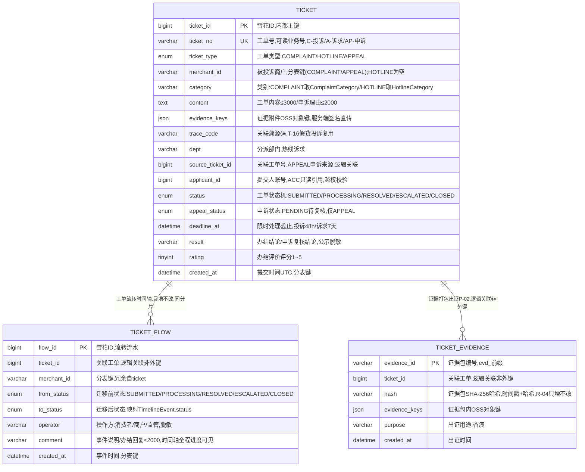

# 工单服务（TICKET）数据库设计说明书

> 内容：**ER 图 + 分库分表方案 + 数据字典 + 表设计说明书**（§1 图 / §2 实体清单 / §3 设计约定 / §4 关系说明 / §5 分库分表 / §6 数据字典 / §7 表设计说明书）。
> 依据文档：`docs/design/产品设计文档.md` v1.0（基线）（§5.5 / §6.4.5 / §8.3.1）、`docs/design/微服务边界与职责基准.md` v1.6（§2.5 / §4.5）、
> `docs/design/高并发架构演进设计.md` v1.0（§2.1~§2.6）、`services/ticket/docs/openapi.yaml` v1.0.0（**唯一可手改源**）。
> 数据域归属：④ 工单域（`ticket`、`ticket_flow`、`ticket_evidence`）——共享主库 + `ticket_` schema 前缀隔离（Java 域既有路线）。
> 口径：与 openapi.yaml 冲突时以 openapi.yaml 为准。
> 版本：v1.0 · 2026-09-10（首版：七章齐全；工单域 3 表，ticket/ticket_flow 按月分表（merchant_id + created_at，>18 月归档），申诉 D-03 复用统一工单内核）。

## 1. ER 图（Mermaid）

## 2. 实体清单

| 实体（表名） | 存储介质 | 说明 |
|---|---|---|
| `ticket` | 共享主库（ticket_ schema），**按月分表** | 统一工单内核：投诉直达（D-02，含「未成年人违规进入」举报）/ 群众热线诉求（G-01）/ 恶意差评申诉（D-03【M2】）主数据 |
| `ticket_flow` | 共享主库，**按月分表** | 工单流转/处理时间轴（TimelineEvent），只增不改、全程进度可见 |
| `ticket_evidence` | 共享主库（不分片） | 投诉证据包出证（P-02）：时间戳 + SHA-256 哈希存证、只增不改、可出证 |
| 超时升级/催办队列 | MQ + 定时 JOB | 48h/7 个工作日限时超时自动升级市监、催办；分布式锁（Redis SETNX）防重复扫描，**不入库** |
| 证据文件（evidenceKeys 所指） | OSS（仅存对象键） | 证据附件服务端签名直传，不占应用带宽，本服务不存媒体原文 |

> 权威数据（商户 `merchant_id`→CRED、账号 `applicant_id`→ACC）经内部接口只读引用，不复制权威数据；附件一律 OSS 直传、仅存对象键。

## 3. 关键设计约定

- **统一工单内核**：投诉（D-02）、群众热线诉求（G-01）、恶意差评申诉（D-03【M2】）共用 `ticket` 主表，以 `ticket_type`（COMPLAINT/HOTLINE/APPEAL）区分；T-16 假货/假材料投诉复用 D-02 机制（关联 `trace_code`，同一溯源码多次投诉自动预警）。
- **R-03 数据分级授权（工单结果脱敏公示）**：`result`（办结结论）、`merchant_name`、`operator` 等 L1/L2 字段脱敏输出（如 XX农资店、消费者、王\*员）；公示仅脱敏结果、不泄露当事人身份。
- **R-04 证据存证（时间戳 + 哈希，可出证）**：`ticket_evidence` 证据包 SHA-256 哈希存证、只增不改、可出证（维权/执法调取）；`evidence_keys` 仅存 OSS 对象键；出证下载走短时效签名 URL。
- **P-04 政务双轨**：12345 不可接 → 自建工单 + 线下流转（红线）；优秀建议/高频诉求转 CIVIC G-02 建议论坛。
- **C8 职业索赔识别（AI 辅助 + 人工确认）**：恶意差评申诉与职业索赔识别结果仅辅助、人工确认后处置（改判/驳回），不自动处置。
- **未成年人保护（跨 6 服务 C11 一环）**：举报类别含「未成年人违规进入」（`MINOR_ENTRY`），举报数据上报 DASH A-08 违规入场高频举报聚合（人工复核）。
- **限时办结**：投诉 48h / 诉求 7 个工作日（2026-09-11 已定档）记 `deadline_at`；超时自动升级/催办走定时 JOB + MQ（Redisson/SETNX 分布式锁防重复扫描，PDD §8.3.1）。
- **幂等**：工单提交接口级 `Idempotency-Key` 防重复；`uk_ticket_no` 唯一 + 状态机拦截（重复办结/重复申诉 → 3007）。
- **状态机**：`SUBMITTED → PROCESSING → RESOLVED / ESCALATED → CLOSED`（超时自动升级市监；办结后评价置 `evaluated_at`，不新增状态枚举）；申诉 `PENDING` 待复核（复核后改判/驳回待标定 §5.7）。
- **越权（IDOR）**：工单详情/处理/评价/出证仅当事双方或监管可见（2002）；`applicant_id`（提交人）+ `merchant_id`（被投诉商户）双维度水平越权校验。
- **加密与脱敏**：`content`/`result` 含 L1 敏感信息按 R-03 脱敏公示；证据文件 OSS 加密存储；如需按手机号/身份检索，预留 HMAC 指纹辅助列（接口不暴露）。
- **审计**：工单流转/出证/公示操作审计日志 ≥6 个月（WORM/哈希链）；`ticket_flow`/`ticket_evidence` 只增不改留痕。
- **分布式 ID**：写库 Java 域统一雪花 ID（`infra-idgen`）+ 工单号段双轨 + 时钟回拨三档预案（详见 §5.4）。

## 4. 关系说明

| 关系 | 基数 | 说明 |
|---|---|---|
| TICKET — TICKET_FLOW | 1 : N | 工单流转时间轴（TimelineEvent），只增不改；逻辑关联（双方按月分表，跨分片禁物理外键） |
| TICKET — TICKET_EVIDENCE | 1 : N | 证据打包出证（P-02），逻辑关联（ticket 分表、evidence 不分片，非外键） |
| TICKET — TICKET（申诉） | 1 : 0..1 | APPEAL 申诉经 `source_ticket_id` 关联投诉/差评来源工单（逻辑关联，非外键） |
| TICKET → CRED | 逻辑关联 | 办结 → 评分事件上报 `/cred/score/events`（投诉计入商户信用）；`merchant_id` 只读引用 CRED |
| TICKET → DASH | 逻辑关联 | `MINOR_ENTRY` 举报 → 上报 A-08 违规入场高频举报聚合（人工复核后推送） |
| TICKET → CIVIC | 逻辑关联 | 优秀建议/高频诉求转 G-02 建议论坛（经内部接口） |
| TICKET → MQ / JOB | 逻辑关联 | 超时升级/催办走定时 JOB + MQ；OSS 证据直传（服务端签名） |

---

## 5. 分库分表方案

> 平台级策略以《高并发架构演进设计》v1.0 §2.1~§2.6 为准，本节做「平台策略 → TICKET 工单域」的落地映射。

### 5.1 分库与隔离

| 阶段 | 平台形态 | TICKET 落位 |
|---|---|---|
| P1 地基期（M1） | 模块化单体共享主库（MySQL 8，主从读写分离） | TICKET 表与各域同库，**以 `ticket_` schema 前缀隔离**（对齐高并发 §6 优化点① 硬边界：禁跨域直连读表） |
| P2 服务化期（M2） | 交易/结算独立库，其余域共享主库 | **TICKET 全程留在共享主库**（非交易/结算域），不独立成库 |
| 容灾 | 两地三中心：同城双活 + 异地灾备 | RPO≤15min / RTO≤30min（L1，投诉直达属核心链路，README §4.2） |

### 5.2 TICKET 分片矩阵

| 表 | 分片方式 | 分片键 | 表命名 | 归档策略 | 里程碑 |
|---|---|---|---|---|---|
| `ticket` | **按月分表（已定）** | `merchant_id` + `created_at` | `ticket_YYYYMM` | 工单随处置闭案，>18 月归档 | M1 起 |
| `ticket_flow` | **按月分表（已定）** | `merchant_id` + `created_at` | `ticket_flow_YYYYMM` | 工单随处置闭案，>18 月归档 | M1 起 |
| `ticket_evidence` | **不分片**（存证出证，只增不改） | — | `ticket_evidence` | 存证只增不改、长期保留（出证/执法调取）；审计 ≥6 月 WORM/哈希链 | M1 起 |

> **分片口径（高并发 §2.2 原样采用，不改）**：`ticket` / `ticket_flow` 按月分表，分片键 `merchant_id + created_at`，M1 起，工单随处置闭案、>18 月归档（工单口径 18 月，区别于通用流水 12 月）。
> **分片阈值**（平台级建议初值，压测/数据增长标定）：单表 >2000 万行 或 >20GB 触发再分；按月分表天然可控，冷数据到点即归档。

### 5.3 分表路由规则

- **路由层**：M1 用 MyBatis-Plus 自定义分表插件（拦截按月路由）+ 统一 `ShardingKey` 注解；M2 分库后评估 ShardingSphere-Proxy（业务零改造），或先自研轻量路由。
- **写入**：按 `created_at` 月份路由到 `ticket_YYYYMM` / `ticket_flow_YYYYMM`，`ShardingKey(merchant_id, created_at)` 显式声明。
- **查询**：
  - **商户待处理**（GET /ticket/tickets/pending）：携带 `merchant_id` 下推 + 状态筛选——分片键剪枝主路径。
  - **监管端全量/分派**（GET /ticket/tickets/audit）：按状态/部门筛选，无法按单一 `merchant_id` 剪枝，按 `created_at` 月份 + 索引下推、走异步/从库。
  - **我的投诉列表**（GET /ticket/tickets/mine）：按 `applicant_id` 查询，无法按 `merchant_id` 剪枝，按 `created_at` 月份 + `idx_applicant_created` 下推、走异步/从库。
  - **工单详情时间轴**（GET /ticket/tickets/{ticketId}）：`ticket` + `ticket_flow` 同月（工单 48h/7 个工作日生命周期通常单月内），跨月按 `ticket_id + 日期范围` 下推、异步/从库。
- **跨月查询**：禁 SQL UNION 全表扫描；聚合（投诉率/信用联动统计）走异步/从库；**禁止跨分片 JOIN / 聚合 / 事务**。
- **HOTLINE 无商户边界**：诉求工单无 `merchant_id`（空），按月分表路由以 `created_at` 月份为准；分片键 `merchant_id` 仅在 COMPLAINT/APPEAL 生效（M2 分库时 HOTLINE 分片键待标定，§5.7）。

### 5.4 分布式 ID 与主键策略

| 表 | 主键 | 生成方式 | 说明 |
|---|---|---|---|
| `ticket.ticket_id` | bigint 雪花 ID | 统一组件 `infra-idgen` | 内部主键（分表 join / 流水引用）；**分表路由以业务字段 `created_at` 为准，不依赖 ID 内嵌时间戳** |
| `ticket.ticket_no` | varchar(32) 业务号 | 号段 `id_allocator`（DB 自增号段，可读） | 工单号，API 输出 `ticketId`；格式 `{类型前缀}-{YYYYMMDD}-{序列}`，前缀 C-投诉 / A-诉求 / AP-申诉（openapi 示例简写 `C-20260901`） |
| `ticket_flow.flow_id` | bigint 雪花 ID | `infra-idgen` | 流转流水主键（TimelineEvent 内嵌，无独立 API 前缀输出） |
| `ticket_evidence.evidence_id` | varchar(32) 业务号 | `evd_` 前缀 + UUID | 证据包编号，API 输出 `evidenceId`（出证凭据，非雪花） |
| 引用外部 ID（merchant_id / applicant_id） | 由源服务生成 | `m_` / `acc_` 前缀 | 只读引用 CRED / ACC，不重新发号 |

- **双轨口径（高并发 §2.3）**：雪花（`ticket_id`/`flow_id`，流水/工单全局唯一、趋势递增）+ 号段（`ticket_no`，连续可读工单编号 `TKT-YYYYMMDD-XXXX` 同义，前缀按服务定制）；workerId Redis `INCR` 分配 + 租约续期（撞车 → 拒绝发号 + P0 告警）。
- **时钟回拨三档预案**（高并发 §2.3.1~§2.3.4，写库 Java 域适用）：L1 轻微回拨（≤5s）退避等待 → L2 超预算**自动切号段模式兜底**（`id_allocator` 表 DB 自增，不依赖时钟）→ L3 号段不可用**拒绝发号 + 快速失败**；Prometheus 指标 + Alertmanager 分级告警 + NTP 治理。号段兜底期间主键不含时间戳，分表路由仍以业务字段 `created_at` 为准，业务无感。

### 5.5 读写分离与冷热归档

- **读写分离**：主库写、从库读（读是写 3 倍以上）；读请求经 `@ReadOnly` 注解路由到从库；关键「写后立即读」（提交工单/办结/评价后立即查状态）**强制走主库**，避免主从延迟读到旧状态。
- **冷热归档**：`ticket` / `ticket_flow` >18 月热转冷 OSS（Parquet/压缩），查询走归档快照；对账/审计/执法按需回捞。
- **存证**：`ticket_evidence` 只增不改 + SHA-256 哈希链（R-04），归档前后哈希链不断；证据文件 OSS 长期留痕。

### 5.6 演进步骤（expand-migrate-contract）

> 任何表结构/分表规则变更按「扩展 → 迁移 → 收缩」执行，禁止破坏性 DDL 直上生产（对齐高并发 §2.6）：
> ① **双写**：新表上线，旧表 + 新表双写（幂等）→ ② **回灌**：历史数据按分片键回灌新表，校验一致性 → ③ **切读**：读流量切新表，旧表降级只读 → ④ **收缩**：观察稳定后下线旧表。

### 5.7 待标定项
> ✅ 2026-09-11 评审定档:共性项(分片阈值 2000 万行/20GB、回拨窗口 W=5s/step=1000、热表 12 个月)已评审通过;带 ★ 项初值已定、压测/运行标定;本表待决项裁决与遗留见 [docs/待评审事项汇总.md](/docs/待评审事项汇总.md) 顶部「⭐ 定档记录(2026-09-11)」与 §6 数据库待标定项。

| 项 | 建议初值 | 裁决方式 |
|---|---|---|
| 分片阈值 | 单表 >2000 万行 / >20GB | 评审 + 数据增长标定 |
| 工单归档月数 | 18 个月（高并发 §2.2 已定） | 已定，运行标定复核 |
| 回拨容忍窗口 W / 号段步长 | W=5s、step=1000 | 评审 + 压测标定（TBD-10） |
| 投诉处理时限 / 诉求办结时限 | ✅ 已定（2026-09-11）：投诉 48h / 诉求 7 个工作日（工作日历计算） | 已定档，★运营标定 |
| 申诉复核后状态（改判/驳回）枚举 | 待 openapi 补充（D-03 M2 交付前补齐） | 评审（随 D-03 定稿） |
| HOTLINE 诉求分库分片键（无 merchant_id） | 候选 `applicant_id` 或 `dept` | 评审（M2 分库前裁决） |
| 同一溯源码多次投诉预警阈值 | 待定（T-16） | 评审 + 运行标定 |

---

## 6. 数据字典

> 通用约定：MySQL 8.0，引擎 InnoDB，字符集 utf8mb4；时间 `datetime(3)` 毫秒精度、UTC 存储、输出 Asia/Shanghai；金额 `decimal(18,2)` 存储、API 输出字符串小数（本服务无金额字段）；数组/内嵌对象用 JSON 列；「密文」= AES-256-GCM 加密存储（L1 敏感）；**枚举值与 openapi.yaml `components.schemas` 一一对应**；证据/附件一律仅存 OSS 对象键。

### 6.1 ticket（统一工单主数据，按月分表 ticket_YYYYMM）

| 字段 | 类型 | 空 | 键 | 默认 | 说明 |
|---|---|---|---|---|---|
| ticket_id | bigint UNSIGNED | NO | PK | — | 工单内部主键，雪花 ID（`infra-idgen`）；分表路由以业务字段 `created_at` 为准 |
| ticket_no | varchar(32) | NO | UK | — | 工单号，可读业务号（号段 `id_allocator`）；前缀 C-投诉 / A-诉求 / AP-申诉；API 输出 `ticketId` |
| ticket_type | enum('COMPLAINT','HOTLINE','APPEAL') | NO | — | — | 工单类型（PDD §4.5 `type`）；统一工单内核：投诉/热线诉求/申诉 |
| merchant_id | varchar(32) | YES | — | NULL | 被投诉商户编号（引用 CRED 域 ID，只读引用）；**分表键**（与 created_at 组合）；HOTLINE 诉求无商户为空 |
| merchant_name | varchar(64) | YES | — | NULL | 商户名称快照（脱敏展示，如 XX农资店；权威在 CRED） |
| category | varchar(50) | NO | — | — | 类别/部门：COMPLAINT 取 ComplaintCategory（COUNTERFEIT/QUALITY/PRICE/SERVICE/MINOR_ENTRY/OTHER）、HOTLINE 取 HotlineCategory（SUGGESTION/COMPLAINT/CONSULT/HELP） |
| content | text | NO | — | — | 工单内容（投诉/诉求 ≤3000）/ 申诉理由（≤2000，AppealRequest.reason） |
| evidence_keys | JSON | YES | — | NULL | 证据附件 OSS 对象键（服务端签名直传，仅存键不存原文） |
| trace_code | varchar(64) | YES | — | NULL | 关联溯源码（T-16 假货/假材料投诉复用；同一溯源码多次投诉自动预警） |
| order_id | varchar(64) | YES | — | NULL | 关联订单号（商品详情/订单页投诉入口，可选） |
| dept | varchar(50) | YES | — | NULL | 分派部门（热线诉求，如 市监局/城管/交通） |
| source_ticket_id | bigint UNSIGNED | YES | — | NULL | 关联工单号（APPEAL 申诉来源：投诉/差评来源；逻辑关联非外键） |
| applicant_id | bigint UNSIGNED | NO | — | — | 提交人账号（投诉人/诉求人/申诉商户，引用 ACC `account_id`；PDD §4.5 `created_by`；水平越权校验） |
| status | enum('SUBMITTED','PROCESSING','RESOLVED','ESCALATED','CLOSED') | NO | — | SUBMITTED | 工单状态机：已提交→处理中→已解决/已升级市监→已办结（公示，可评价） |
| appeal_status | enum('PENDING') | YES | — | NULL | 申诉状态（仅 APPEAL）：PENDING 待复核（openapi 唯一暴露值）；复核后「改判/驳回」待标定（§5.7） |
| deadline_at | datetime(3) | YES | — | NULL | 限时处理截止（投诉 48h / 诉求 7 个工作日，2026-09-11 已定档，PDD §4.5 `deadline`）；超时自动升级 |
| result | varchar(2000) | YES | — | NULL | 办结结论（投诉/诉求，公示脱敏）/ 申诉复核结论（改判/驳回） |
| rating | tinyint UNSIGNED | YES | — | NULL | 办结评价评分 1~5 星（EvaluateRequest.rating） |
| comment | varchar(500) | YES | — | NULL | 评价意见 ≤500（EvaluateRequest.comment，可选） |
| evaluated_at | datetime(3) | YES | — | NULL | 评价时间（EvaluateResult.evaluatedAt） |
| published_at | datetime(3) | YES | — | NULL | 办结公示时间（ResolveResult.publishedAt） |
| created_at | datetime(3) | NO | — | CURRENT_TIMESTAMP(3) | 提交时间（UTC），**分表键** |
| closed_at | datetime(3) | YES | — | NULL | 办结时间（软关闭留痕，不物理删除） |

### 6.2 ticket_flow（工单流转流水，按月分表 ticket_flow_YYYYMM）

| 字段 | 类型 | 空 | 键 | 默认 | 说明 |
|---|---|---|---|---|---|
| flow_id | bigint UNSIGNED | NO | PK | — | 流转流水 ID，雪花 ID（`infra-idgen`） |
| ticket_id | bigint UNSIGNED | NO | — | — | 关联工单（逻辑关联非外键——双方按月分表，跨分片禁 FK） |
| merchant_id | varchar(32) | YES | — | NULL | **分表键**（与 created_at 组合），冗余自 ticket；HOTLINE 为空 |
| from_status | enum('SUBMITTED','PROCESSING','RESOLVED','ESCALATED','CLOSED') | NO | — | — | 迁移前状态（PDD §4.5 `from_status`） |
| to_status | enum('SUBMITTED','PROCESSING','RESOLVED','ESCALATED','CLOSED') | NO | — | — | 迁移后状态（PDD §4.5 `to_status`；映射 openapi `TimelineEvent.status`） |
| operator | varchar(32) | YES | — | NULL | 操作方（消费者/商户/监管，脱敏展示） |
| comment | varchar(2000) | NO | — | — | 事件说明（PDD §4.5 `comment`；映射 openapi `TimelineEvent.note`，如 提交投诉/商家处理/升级市监/办结回复——最长 2000，对齐 openapi `HandleRequest.reply` ≤2000 / `EscalateRequest.reason` ≤1000，2026-09-11 终审加宽自 varchar(500)） |
| created_at | datetime(3) | NO | — | CURRENT_TIMESTAMP(3) | 事件时间（映射 openapi `TimelineEvent.at`），**分表键** |

### 6.3 ticket_evidence（证据包出证存证，不分片）

| 字段 | 类型 | 空 | 键 | 默认 | 说明 |
|---|---|---|---|---|---|
| evidence_id | varchar(32) | NO | PK | — | 证据包编号 `evd_` 前缀 + UUID（映射 openapi `EvidenceResult.evidenceId`） |
| ticket_id | bigint UNSIGNED | NO | — | — | 关联工单（逻辑关联非外键——ticket 分表、evidence 不分片） |
| hash | varchar(128) | NO | — | — | 证据包 SHA-256 哈希（时间戳 + 哈希，只增不改，R-04 可出证；映射 `EvidenceResult.hash`） |
| evidence_keys | JSON | NO | — | — | 证据包内 OSS 对象键（打包存证，映射 ticket 的 `evidence_keys`） |
| purpose | varchar(200) | YES | — | NULL | 出证用途（EvidenceRequest.purpose，留痕，如 消费维权） |
| created_at | datetime(3) | NO | — | CURRENT_TIMESTAMP(3) | 出证时间（映射 `EvidenceResult.createdAt`） |

> 注：`EvidenceResult.downloadUrl`（证据包下载签名 URL）为短时效 OSS 签名、出证时即时生成，**不落库**。

---

## 7. 表设计说明书

### 7.1 ticket（统一工单主数据，按月分表）

- **用途**：投诉/热线/申诉的统一工单内核（D-02 / G-01 / G-03 / D-03 / T-16）——限时处理、升级市监、办结公示、计入信用。
- **主键（策略）**：`ticket_id` bigint 雪花 ID（`infra-idgen`）内部主键；`ticket_no` varchar 业务号（号段 `id_allocator`，`C-`/`A-`/`AP-` 前缀）为 API `ticketId`（防 JS 大数精度 + 可读）。
- **索引**：PRIMARY KEY(`ticket_id`)；UNIQUE KEY `uk_ticket_no`(`ticket_no`)——**幂等键**，重复提交返回原工单；KEY `idx_merchant_status`(`merchant_id`, `status`)——商户待处理队列 + **分片键剪枝**（PDD §4.5 `idx(merchant_id, status)`）；KEY `idx_status_deadline`(`status`, `deadline_at`)——超时升级扫描 + 监管分派（PDD §4.5 `idx(status, deadline)`）；KEY `idx_applicant_created`(`applicant_id`, `created_at`)——「我的投诉列表」（无 merchant_id，异步/从库）；KEY `idx_source_ticket`(`source_ticket_id`)——申诉反查来源。
- **约束**：状态机 `SUBMITTED → PROCESSING → RESOLVED / ESCALATED → CLOSED`；申诉 `appeal_status=PENDING` 待复核；办结=软关闭（`closed_at` 留痕，不物理删除）；非处理中状态不可处理/升级（3007）；已办结不可重复办结（3007）；同一溯源码多次投诉预警（T-16）；按月分表，跨月禁 UNION 全表扫描、禁跨分片 JOIN。
- **加密/脱敏**：`content`/`result` 按 R-03 脱敏公示（L1/L2 分级）；`merchant_name`/`operator` 脱敏展示；证据仅 OSS 键。
- **生命周期**：按月分表 + >18 月热转冷 OSS（Parquet/压缩），保留热表 18 个月；办结留痕不删；审计 ≥6 月。
- **接口映射**：POST /ticket/complaint（建单）、POST /ticket/hotline（诉求建单）、GET /ticket/tickets/mine（本人列表）、GET /ticket/tickets/pending（商户待处理）、GET /ticket/tickets/audit（监管全量）、GET /ticket/tickets/{ticketId}（详情+时间轴）、POST /ticket/tickets/{ticketId}/handle（商家处理）、POST /ticket/tickets/{ticketId}/escalate（升级）、POST /ticket/tickets/{ticketId}/resolve（办结公示）、POST /ticket/tickets/{ticketId}/evaluate（评价）、POST /ticket/tickets/{ticketId}/appeal（申诉，ticket_type=APPEAL 建单）。

### 7.2 ticket_flow（工单流转流水，按月分表）

- **用途**：工单处理时间轴（TimelineEvent），全程进度可见；只增不改、审计留痕（谁操作/何时/状态迁移）。
- **分表**：`ticket_flow_YYYYMM` 按月分表；分片键 `merchant_id + created_at`；>18 月热转冷 OSS（§5.2~§5.5）。
- **主键（策略）**：`flow_id` bigint 雪花 ID（`infra-idgen`）；分表路由以业务字段 `created_at` 为准，不依赖 ID 内嵌时间戳。
- **索引**：PRIMARY KEY(`flow_id`)；KEY `idx_ticket_created`(`ticket_id`, `created_at`)——工单详情时间轴（PDD §4.5 `idx(ticket_id, created_at)`）；KEY `idx_merchant_created`(`merchant_id`, `created_at`)——分片键剪枝。
- **约束**：**只增不改**（应用层禁 UPDATE/DELETE，库层回收写权限）；`from_status → to_status` 迁移合法校验（状态机，非法迁移拦截）；与 `ticket` 逻辑关联（跨分片禁 FK）。
- **加密/脱敏**：`operator` 脱敏展示（消费者/商户/监管）；`comment` 不含 L1 敏感明文（脱敏后写入）。
- **生命周期**：热表 18 个月 → 归档 OSS（Parquet/压缩）；审计 ≥6 月（WORM/哈希链）；哈希链跨归档连续。
- **接口映射**：GET /ticket/tickets/{ticketId}（`timeline[]` 由本表聚合）；handle/escalate/resolve/evaluate 各接口落一条流转。

### 7.3 ticket_evidence（证据包出证存证，不分片）

- **用途**：投诉证据打包出证（P-02）——时间戳 + SHA-256 哈希存证、只增不改，供维权/执法调取。
- **主键（策略）**：`evidence_id` varchar(32) 业务号（`evd_` 前缀 + UUID），API `evidenceId`（非雪花）。
- **索引**：PRIMARY KEY(`evidence_id`)；KEY `idx_ticket`(`ticket_id`)——按工单查出证历史（PDD §4.5 `idx(ticket_id)`）；KEY `idx_hash`(`hash`)——存证校验反查。
- **约束**：**只增不改**（存证哈希链，R-04）；与 `ticket` 逻辑关联（ticket 分表、evidence 不分片，非外键）；出证仅投诉当事人/监管可申请（2002）；工单不存在报 3006。
- **加密/脱敏**：`hash` 存证 SHA-256；`evidence_keys` 仅 OSS 对象键；下载走短时效签名 URL（不落库）。
- **生命周期**：存证只增不改、长期保留（出证/执法调取）；审计 ≥6 月（WORM/哈希链）。
- **接口映射**：POST /ticket/evidence（出证，返回 evidenceId/hash/downloadUrl/createdAt）。

### 7.4 出方向依赖（跨服务，逻辑关联）

- **取数（只读引用）**：CRED（商户 `merchant_id`——唯一权威）、ACC（账号 `applicant_id`——实名/身份）。
- **事件上报**：办结 → 评分事件上报 CRED `/cred/score/events`（投诉计入商户信用）；`MINOR_ENTRY` 举报 → 上报 DASH（A-08 违规入场高频举报聚合，人工复核后推送）。
- **异步流转**：超时升级/催办 → 定时 JOB + MQ（分布式锁防重复扫描）；优秀建议/高频诉求 → 转 CIVIC G-02 建议论坛。
- **附件**：证据 OSS 服务端签名直传，本服务仅存对象键、不存媒体原文。

---

*文档结束 · 与 `services/ticket/docs/openapi.yaml`（唯一可手改源）、《高并发架构演进设计》v1.0 §2、《产品设计文档》v1.0（基线） §5.5/§6.4.5、《微服务边界与职责基准》v1.6 §2.5 同步维护。*
