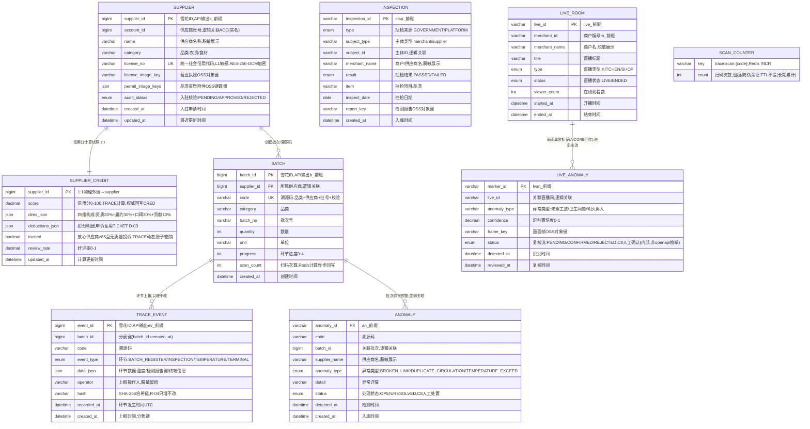

# 溯源服务（TRACE）数据库设计说明书

> 内容：**ER 图 + 分库分表方案 + 数据字典 + 表设计说明书**（§1 图 / §2 实体清单 / §3 设计约定 / §4 关系说明 / §5 分库分表 / §6 数据字典 / §7 表设计说明书）。
> 依据文档：`docs/design/产品设计文档.md` v1.0（基线）（§5.6 / §5.14.3 / §6.4.6 / §8.3.1）、`docs/design/微服务边界与职责基准.md` v1.6（§2.6 / §3 / §4.5）、
> `docs/design/高并发架构演进设计.md` v1.0（§2.1~§2.6）、`services/trace/docs/openapi.yaml` v1.0.0（**唯一可手改源**）。
> 数据域归属：⑤ 溯源域（`supplier`、`batch`、`trace_event`、`inspection`）；另含本服务扩展实体 `supplier_credit`（信用分计算快照）、`anomaly`（溯源异常预警）、`live_room` / `live_anomaly`（店铺直播 B-04）。
> 口径：与 openapi.yaml 冲突时以 openapi.yaml 为准。
> 版本：v1.1 · 2026-09-11（v1.0 首版 2026-09-10：七章齐全；**终审回改**——供应商黑榜阈值统一 ≤40、SCAN_COUNTER 取消 expire_at（TTL 不设）、T-17/T-18 M3 预留口径入 README；共享主库 + `trace_` schema 前缀隔离；`trace_event` 按月分表 `batch_id + created_at`、只增不改长期冷备；供应商信用分 TRACE 计算、CRED 权威存储，经接口回写）。

## 1. ER 图（Mermaid）

## 2. 实体清单

| 实体（表名） | 存储介质 | 说明 |
|---|---|---|
| `supplier` | 共享主库（trace_ schema，不分片） | 供应商主数据 + 入驻品类资质核验（T-01），承载入驻核验状态机 |
| `supplier_credit` | 共享主库（不分片） | 供应商信用分四维计算快照（T-05 公式在 TRACE），权威存储回写 CRED |
| `batch` | 共享主库（不分片） | 批次 + 溯源码（一物一码/一批一码，T-08），溯源链路主档 |
| `trace_event` | 共享主库，**按月分表** `trace_event_YYYYMM` | 环节记录（①批号②检测③温控④终端），时间戳 + 哈希存证、只增不改（T-08/T-09/R-04） |
| `inspection` | 共享主库（不分片，M2） | 政府/平台抽检结果公示（B-03），数据来源双轨 |
| `anomaly` | 共享主库（不分片） | 溯源异常预警（断链/重复流通/温度超限，T-10），只推送线索不自动执法 |
| `live_room` | 共享主库（不分片，M2） | 店铺/后厨直播（B-04），开播留痕 + 状态 |
| `live_anomaly` | 共享主库（不分片，M2） | 直播画面异常标记（AICORE K-05 回传），进复核流、人工确认 |
| `trace:scan:{code}` | Redis（计数，不入库） | 扫码次数计数（防伪旁证），异步回写 `batch.scan_count` |

> 证照/图片/画面帧一律 OSS 前端直传、本服务仅存对象键（不存媒体原文）；供应商信用分权威在 CRED（经接口回写），本服务仅存计算快照；扫码计数用 Redis INCR（高热读写路径不进 MySQL）。

## 3. 关键设计约定

- **R-09 强监管品类只做信息撮合 + 溯源核验**：供应商入驻只做资质信息核验与留痕、**不替代行政许可**；资质不达标 → 3003 退回补传，实名未完成 → 3001。
- **R-04 环节记录只增不改 + 哈希存证**：`trace_event` 应用层禁 UPDATE/DELETE（库层回收写权限），`hash` = SHA-256（前链 hash + 行数据 + 时间戳）即证据链，可出证（P-02）；哈希链跨归档连续。
- **R-15 供应商信用分防刷拦截**：T-05 公式（资质合规 30% + 交易履约 30% + 质量口碑 30% + 正向贡献 10%）在 TRACE 计算；防刷拦截 + 评分事件来源单一；扣分申诉复用 TICKET D-03，本服务不建第二套申诉。
- **信用分权威单一来源（§4-C02 已决策）**：TRACE = 公式计算方 + 数据源，`supplier_credit` 仅存**计算快照**；信用分与红黑榜**权威存储与公示在 CRED**（`credit_score`/`redblack`），经接口回写（`POST /cred/score/supplier`）；放心供应商标识（≥85 且无质量投诉）由 TRACE 动态授予/撤销、CRED 存储公示。TRACE **不直接写** CRED 表（只上报评分事件）。
- **加密与脱敏**：`license_no`（统一社会信用代码）等 L1 高敏感字段 AES-256-GCM 加密存储；`name`/`merchant_name`/`supplier_name`/`operator` 脱敏展示（如 张\*饭馆、王\*员）；证照/图片/画面帧仅存 OSS 对象键，不落媒体原文。
- **幂等**：环节上报按 `uk_batch_type(batch_id, event_type)` 幂等去重（重复上报返回原 `eventId`）；直播开播走 `Idempotency-Key`；服务端间 `/trace/live/callback`（AICORE → TRACE）内部 Token + 幂等 + 限流。
- **状态机**：入驻核验 `PENDING → APPROVED / REJECTED`（REJECTED 可补传重审）；溯源链路 ①批号→②检测→③温控→④终端，任一环节缺失 = 断链显式标注（`REGISTERED`/`MISSING` 为响应派生枚举，非存储列）；直播 `LIVE → ENDED`；`live_anomaly` 复核流 `PENDING → CONFIRMED / REJECTED`（C8 人工确认、不自动处罚，内部状态非 openapi 枚举）；供应商榜单（≥85 放心供应商 ⇄ 警告 ≤85 ⇄ 黑榜 ≤40，2026-09-11 定档阈值）由信用分派生、权威在 CRED `redblack`，非本服务表列。
- **越权（IDOR）**：供应商列表/批次列表/环节上报仅本人供应商可见（水平越权 2002 拦截）；异常预警列表需监管角色（2002 拦截）；扫码验真无需登录（`security: []` 覆写，公开读）。
- **分表**：`trace_event` 按月分表，分片键 `batch_id + created_at`；只增不改、长期冷备；主数据（supplier/batch 等）不分片（详见 §5）。
- **分库定位**：P1 模块化单体期全平台共享主库 + `trace_` schema 前缀隔离；P2 交易/结算独立库后 TRACE 仍留共享主库（详见 §5.1）。
- **扫码验真高热读（读多写少）**：溯源码 `code` 建**布隆过滤器**（防穿透）+ Redis 缓存（code → batch_id 主档映射）+ 全链时间轴**只读快照**（公示数据快照化，高并发 §2.4.3 优化点②）；扫码计数走 Redis INCR，异步回写 `batch.scan_count`（防伪旁证）。
- **监管审计**：溯源记录时间戳 + 哈希存证、可出证供执法调取；审计日志 ≥6 个月（WORM/哈希链）；预警只推送线索、不自动执法（C8）。

## 4. 关系说明

| 关系 | 基数 | 说明 |
|---|---|---|
| SUPPLIER — SUPPLIER_CREDIT | 1 : 1 | 信用分四维计算快照（物理外键，`supplier_id` 复用为主键） |
| SUPPLIER — BATCH | 1 : N | 供应商创建多个批次（`supplier_id` 逻辑关联，供应商未入驻 → 3005） |
| BATCH — TRACE_EVENT | 1 : N | 批次下挂环节记录（按月分表，逻辑关联 `batch_id`，跨分片禁 JOIN） |
| BATCH — ANOMALY | 1 : N | 批次触发异常预警（逻辑关联 `code`/`batch_id`，非外键） |
| LIVE_ROOM — LIVE_ANOMALY | 1 : N | 直播间含 0..N 个画面异常标记（逻辑关联 `live_id`） |
| INSPECTION — 主体 | N : 1 | 抽检公示经 `subject_type` + `subject_id` 逻辑关联 merchant/supplier（非外键） |
| SCAN_COUNTER | 独立 | Redis 计数，经 `code` 关联 batch，异步回写 `batch.scan_count` |
| → ACC / CRED / DASH / TICKET / AICORE / OSS | 逻辑关联 | 实名（ACC）、信用分（CRED 权威回写）、断链预警（DASH）、扣分申诉（TICKET D-03）、画面识别（AICORE K-05）、证照/图片/帧（OSS 对象键） |

---

## 5. 分库分表方案

> 平台级策略以《高并发架构演进设计》v1.0 §2.1~§2.6 为准，本节只做「平台策略 → TRACE 溯源域」的落地映射。

### 5.1 分库与隔离

| 阶段 | 库形态 | TRACE 落位 |
|---|---|---|
| P1 地基期（M1） | 模块化单体共享主库（MySQL 8，主从读写分离） | TRACE 表与各域同库，**以 `trace_` schema 前缀隔离**（对齐高并发 §6 优化点① 硬边界：禁跨域直连读表） |
| P2 服务化期（M2） | 交易/结算独立库，其余域共享主库 | **TRACE 全程留在共享主库**，不独立成库（非交易/结算域） |
| 容灾 | 两地三中心：同城双活 + 异地灾备 | RPO≤15min / RTO≤30min（平台 L1 基线；TRACE 为 L2，随共享主库容灾体系） |

### 5.2 分片矩阵

| 表 | 分片方式 | 分片键 | 表命名 | 归档策略 | 里程碑 |
|---|---|---|---|---|---|
| `supplier` | **不分片**（主数据，行数有限 + 强一致更新） | — | `supplier` | 不归档、不物理删除（退回/关闭=软状态留痕） | M1 |
| `supplier_credit` | 不分片（1:1 快照） | — | `supplier_credit` | 快照覆盖 + 审计留痕 | M1 |
| `batch` | 不分片（主数据，行数可控） | — | `batch` | 不归档（溯源主档长期保留） | M1 |
| `trace_event` | **按月分表（已定）** | `batch_id` + `created_at` | `trace_event_YYYYMM` | **溯源存证只增不改，长期冷备** | M1 起 |
| `inspection` | 不分片 | — | `inspection` | 公示留痕，不归档 | M2 |
| `anomaly` | 不分片 | — | `anomaly` | 审计留痕 ≥6 个月（预警线索） | M1 基础 |
| `live_room` | 不分片 | — | `live_room` | 直播留痕，M2 后按审计保留 | M2 |
| `live_anomaly` | 不分片 | — | `live_anomaly` | 复核留痕 ≥6 个月 | M2 |

> **分片阈值**（平台级建议初值，压测/数据增长标定）：单表 >2000 万行 或 >20GB 触发再分；`trace_event` 按月分表天然可控，存证数据到点即冷备，避免单表膨胀到亿级。
> **口径说明**：`trace_event` 的归档策略按《高并发架构演进设计》v1.0 §2.2 原样采用——**「溯源存证只增不改，长期冷备」**（区别于钱包流水的「>12 月热转冷 OSS」，溯源存证为可出证证据链，长期保留）。

### 5.3 分表路由规则（trace_event）

- **路由层**：M1 用 MyBatis-Plus 自定义分表插件（拦截按月路由）+ 统一 `ShardingKey` 注解；M2 分库后评估 ShardingSphere-Proxy（业务零改造），或先自研轻量路由。
- **写入**：按 `created_at` 月份路由到 `trace_event_YYYYMM`，`ShardingKey(batch_id, created_at)` 显式声明。
- **扫码验真**（GET /trace/scan/{code}）：`code` 经布隆过滤器 + Redis 缓存 → 命中 `batch_id` → 按 `batch_id + 日期范围` 下推到对应月表；**必须携带 `batch_id` 下推**（分片键剪枝）。
- **环节上报**（POST /trace/batch/{code}/event）：`code` → `batch_id` → 按当前月路由写入；幂等键 `uk_batch_type(batch_id, event_type)` 在月表内唯一。
- **跨月查询**：禁止 SQL UNION 全表扫描；跨月聚合走异步/从库（§5.5）；全链时间轴优先走只读快照。
- **禁止跨分片 JOIN / 聚合 / 事务**：断链率统计/异常聚合不进 OLTP 主库（走异步任务 + DASH 聚合）。

### 5.4 分布式 ID 与主键策略

| 表 | 主键 | 生成方式 | 说明 |
|---|---|---|---|
| `supplier.supplier_id` | bigint 雪花 ID | 统一组件 `infra-idgen` | API 输出字符串带 `s_` 前缀（防 JS 大数精度 + 可读） |
| `supplier_credit.supplier_id` | bigint（= supplier_id） | 由 `supplier` 带入 | 1:1 复用主键 |
| `batch.batch_id` | bigint 雪花 ID | `infra-idgen` | API 输出 `b_` 前缀；`code` 为业务可读溯源码（品类+供应商+批号+校验） |
| `trace_event.event_id` | bigint 雪花 ID | `infra-idgen` | API 输出 `ev_` 前缀；**分表路由以业务字段 `created_at` 为准，不依赖 ID 内嵌时间戳** |
| `inspection.inspection_id` | varchar 业务号 | `insp_` 前缀 + UUID/雪花 | 公示记录凭据 |
| `anomaly.anomaly_id` | varchar 业务号 | `an_` 前缀 | 预警记录凭据 |
| `live_room.live_id` | varchar 业务号 | `live_` 前缀 | 直播间号 |
| `live_anomaly.marker_id` | varchar 业务号 | `lvan_` 前缀 | 复核流标记凭据 |
| 引用外部 ID（account_id / merchant_id / subject_id） | 由源服务生成 | `acc_` / `m_` 前缀 | 只读引用，不重新发号 |

- workerId：Redis `INCR` 分配 + 实例重启复用（租约），撞车 → 拒绝发号 + P0 告警。
- **时钟回拨三档预案**（《高并发架构演进设计》§2.3.1~§2.3.4，TRACE 为写库 Java 域、经 `infra-idgen` 复用）：L1 轻微回拨（≤5s）退避等待 → L2 超预算**自动切号段模式兜底**（`id_allocator` 表 DB 自增，不依赖时钟）→ L3 号段不可用**拒绝发号 + 快速失败**；Prometheus 指标 + Alertmanager 分级告警 + NTP 治理。L2 号段兜底期间主键不含时间戳，**分表路由仍以业务字段 `created_at` 为准**，业务无感。

### 5.5 读写分离与冷热归档

- **读写分离**：主库写、从库读（读是写 3 倍以上）；读请求经 `@ReadOnly` 注解路由到从库；关键「写后立即读」（入驻核验/环节上报后立即查状态）**强制走主库**，避免主从延迟读到旧状态。
- **扫码高热读**：扫码验真（2 万 QPS 场景）走只读副本 + 多级缓存（Caffeine + Redis）+ 全链时间轴只读快照；缓存命中率目标 ≥98%（高并发 §5.1）。
- **冷热归档**：`trace_event` 长期冷备（溯源存证只增不改，证据链长期保留），哈希链跨归档连续；其余表按审计要求保留（≥6 个月，WORM/哈希链留痕）。
- **存证**：环节记录只增不改 + `hash` 哈希链（R-04/P-02），归档前后哈希链不断。

### 5.6 演进步骤（expand-migrate-contract）

> 任何表结构/分表规则变更按「扩展 → 迁移 → 收缩」执行，禁止破坏性 DDL 直上生产（对齐高并发 §2.6）：
> ① **双写**：新表上线，旧表 + 新表双写（幂等）→ ② **回灌**：历史数据按分片键回灌新表，校验一致性 → ③ **切读**：读流量切新表，旧表降级只读 → ④ **收缩**：观察稳定后下线旧表。

### 5.7 待标定项
> ✅ 2026-09-11 评审定档:共性项(分片阈值 2000 万行/20GB、回拨窗口 W=5s/step=1000、热表 12 个月)已评审通过;带 ★ 项初值已定、压测/运行标定;本表待决项裁决与遗留见 [docs/待评审事项汇总.md](/docs/待评审事项汇总.md) 顶部「⭐ 定档记录(2026-09-11)」与 §6 数据库待标定项。

| 项 | 建议初值 | 裁决方式 |
|---|---|---|
| 分片阈值 | 单表 >2000 万行 / >20GB | 评审 + 数据增长标定 |
| 回拨容忍窗口 W / 号段步长 | W=5s、step=1000 | 评审 + 压测标定（TBD-10） |
| 扫码计数 Redis → MySQL 回写周期 | 异步批量回写（如 5min★） | 评审 + 压测标定 |
| 供应商信用分刷新/放心标识授予频率 | 评分事件触发 + 定时对账（★） | 评审 + 运行标定 |
| 品类资质门槛扩展（T-19） | 农资/食材首期，门槛按表扩展 | 评审 |
| 直播画面复核流内部状态机 | PENDING→CONFIRMED/REJECTED（C8） | 评审（M2） |

---

## 6. 数据字典

> 通用约定：MySQL 8.0，引擎 InnoDB，字符集 utf8mb4；时间 `datetime(3)` 毫秒精度、UTC 存储、输出 Asia/Shanghai；本服务无金额字段；评分/置信度/好评率用 decimal（API 输出 number）；数组/内嵌对象用 JSON 列；「密文」= AES-256-GCM 加密存储（L1 敏感）；**枚举值与 openapi.yaml `components.schemas` 一一对应**；证照/图片/画面帧仅存 OSS 对象键；带 ★ 的值为建议初值、待标定（§5.7）。

### 6.1 supplier（供应商主数据，不分片）

| 字段 | 类型 | 空 | 键 | 默认 | 说明 |
|---|---|---|---|---|---|
| supplier_id | bigint UNSIGNED | NO | PK | — | 供应商 ID，雪花 ID（`infra-idgen`）；API 输出 `s_` 前缀字符串 |
| account_id | bigint UNSIGNED | NO | — | — | 供应商账号（逻辑关联 ACC，只读引用；实名后入驻） |
| name | varchar(64) | NO | — | — | 供应商名称，**脱敏展示**（如 XX农资） |
| category | varchar(50) | NO | — | — | 品类（首期农资/食材，门槛按表扩展 T-19） |
| license_no | varchar(255) | NO | UK | — | 营业执照统一社会信用代码，**密文**；`uk_license_no` |
| license_image_key | varchar(255) | NO | — | — | 营业执照图像 OSS 对象键 |
| permit_image_keys | JSON | YES | — | NULL | 品类资质附件 OSS 对象键数组（农资：许可+批号；食材：许可+检验报告） |
| audit_status | enum('PENDING','APPROVED','REJECTED') | NO | — | PENDING | 入驻核验状态机（对齐 `SupplierSubmitResult.auditStatus`） |
| created_at | datetime(3) | NO | — | CURRENT_TIMESTAMP(3) | 入驻申请时间 |
| updated_at | datetime(3) | NO | — | CURRENT_TIMESTAMP(3) | 最近更新时间 |

### 6.2 supplier_credit（供应商信用分计算快照，不分片，1:1）

| 字段 | 类型 | 空 | 键 | 默认 | 说明 |
|---|---|---|---|---|---|
| supplier_id | bigint UNSIGNED | NO | PK | — | 物理外键 → supplier.supplier_id（1:1 复用主键） |
| score | decimal(5,2) | NO | — | — | 信用分 0~100（T-05 公式 TRACE 计算，**权威回写 CRED**） |
| dims_json | JSON | NO | — | — | 四维构成：资质合规 30% + 交易履约 30% + 质量口碑 30% + 正向贡献 10%（`SupplierCreditDim`） |
| deductions_json | JSON | YES | — | NULL | 扣分明细（reason/points/at），申诉复用 TICKET D-03 |
| trusted | tinyint(1) | NO | — | 0 | 放心供应商标识（≥85 且无质量投诉，TRACE 动态授予/撤销，CRED 存储公示） |
| review_rate | decimal(3,2) | NO | — | 0.00 | 好评率 0~1（`SupplierItem.reviewRate`） |
| updated_at | datetime(3) | NO | — | CURRENT_TIMESTAMP(3) | 计算更新时间 |

### 6.3 batch（批次 + 溯源码，不分片）

| 字段 | 类型 | 空 | 键 | 默认 | 说明 |
|---|---|---|---|---|---|
| batch_id | bigint UNSIGNED | NO | PK | — | 批次 ID，雪花 ID；API 输出 `b_` 前缀字符串 |
| supplier_id | bigint UNSIGNED | NO | — | — | 所属供应商（逻辑关联；供应商未入驻 → 3005） |
| code | varchar(64) | NO | UK | — | 溯源码（品类+供应商+批号+校验，一物一码/一批一码）；`uk_code` |
| category | varchar(50) | NO | — | — | 品类（首期农资/食材） |
| batch_no | varchar(50) | NO | — | — | 批次号（供应商侧可读） |
| quantity | int UNSIGNED | YES | — | NULL | 数量（可选） |
| unit | varchar(16) | YES | — | NULL | 单位（可选，如 袋） |
| progress | tinyint UNSIGNED | NO | — | 0 | 环节进度 0~4（已完成环节数，派生自 trace_event） |
| scan_count | int UNSIGNED | NO | — | 0 | 扫码次数（防伪旁证；Redis INCR 异步回写） |
| created_at | datetime(3) | NO | — | CURRENT_TIMESTAMP(3) | 创建时间 |

### 6.4 trace_event（环节记录，按月分表 trace_event_YYYYMM）

| 字段 | 类型 | 空 | 键 | 默认 | 说明 |
|---|---|---|---|---|---|
| event_id | bigint UNSIGNED | NO | PK | — | 环节记录 ID，雪花 ID；API 输出 `ev_` 前缀 |
| batch_id | bigint UNSIGNED | NO | — | — | 所属批次，**分表键**（与 created_at 组合） |
| code | varchar(64) | NO | — | — | 溯源码（上报入参，冗余留痕） |
| event_type | enum('BATCH_REGISTER','INSPECTION','TEMPERATURE','TERMINAL') | NO | — | — | 环节类型：①批号 ②检测 ③温控 ④终端（对齐 `TraceEventType`） |
| data_json | JSON | YES | — | NULL | 环节数据（温度值/检测报告对象键/终端信息等，按环节类型） |
| operator | varchar(50) | YES | — | NULL | 上报操作人，**脱敏留痕** |
| hash | varchar(128) | NO | — | — | 存证哈希：SHA-256（前链 hash + 行数据 + 时间戳），哈希链（R-04） |
| recorded_at | datetime(3) | NO | — | — | 环节发生时间（UTC） |
| created_at | datetime(3) | NO | — | CURRENT_TIMESTAMP(3) | 上报时间，**分表键** |

> 幂等：UNIQUE KEY `uk_batch_type`(`batch_id`, `event_type`)——同一批次同一环节至多一条，重复上报返回原 `eventId`。

### 6.5 inspection（抽检结果公示，不分片，M2）

| 字段 | 类型 | 空 | 键 | 默认 | 说明 |
|---|---|---|---|---|---|
| inspection_id | varchar(32) | NO | PK | — | 抽检公示号 `insp_` 前缀 |
| type | enum('GOVERNMENT','PLATFORM') | NO | — | — | 抽检来源（数据来源双轨，对齐 `InspectionType`） |
| subject_type | varchar(16) | NO | — | — | 主体类型：merchant / supplier |
| subject_id | varchar(64) | NO | — | — | 主体 ID（逻辑关联，只读引用） |
| merchant_name | varchar(64) | YES | — | NULL | 商户/供应商名称，**脱敏展示** |
| result | enum('PASSED','FAILED') | NO | — | — | 抽检结果（对齐 `InspectionItem.result`） |
| item | varchar(64) | YES | — | NULL | 抽检项目/品类（如 农药残留） |
| inspect_date | date | NO | — | — | 抽检日期（对齐 `InspectionItem.date`） |
| report_key | varchar(255) | YES | — | NULL | 检测报告 OSS 对象键（可选） |
| created_at | datetime(3) | NO | — | CURRENT_TIMESTAMP(3) | 入库时间 |

### 6.6 anomaly（溯源异常预警，不分片）

| 字段 | 类型 | 空 | 键 | 默认 | 说明 |
|---|---|---|---|---|---|
| anomaly_id | varchar(32) | NO | PK | — | 异常记录号 `an_` 前缀 |
| code | varchar(64) | NO | — | — | 溯源码（异常所在批次） |
| batch_id | bigint UNSIGNED | YES | — | NULL | 关联批次（逻辑关联） |
| supplier_name | varchar(64) | YES | — | NULL | 供应商名称，**脱敏展示** |
| anomaly_type | enum('BROKEN_LINK','DUPLICATE_CIRCULATION','TEMPERATURE_EXCEED') | NO | — | — | 异常类型：断链/重复流通/温度超限（对齐 `AnomalyType`） |
| detail | varchar(255) | YES | — | NULL | 异常详情（如「环节缺失：流通温控」「温度超限：8.5℃」） |
| status | enum('OPEN','RESOLVED') | NO | — | OPEN | 处理状态（预警只推线索、人工处置 C8，对齐 `AnomalyStatus`） |
| detected_at | datetime(3) | NO | — | — | 检测时间（对齐 `AnomalyItem.detectedAt`） |
| created_at | datetime(3) | NO | — | CURRENT_TIMESTAMP(3) | 入库时间 |

### 6.7 live_room（店铺/后厨直播，不分片，M2）

| 字段 | 类型 | 空 | 键 | 默认 | 说明 |
|---|---|---|---|---|---|
| live_id | varchar(32) | NO | PK | — | 直播间号 `live_` 前缀 |
| merchant_id | varchar(32) | NO | — | — | 商户编号 `m_` 前缀（未入驻 → 3005；未授权 → 3007） |
| merchant_name | varchar(64) | YES | — | NULL | 商户名称，**脱敏展示**（如 张\*饭馆） |
| title | varchar(100) | NO | — | — | 直播标题 |
| type | enum('KITCHEN','SHOP') | NO | — | — | 直播类型：后厨明厨亮灶 / 店铺实况（对齐 `LiveType`） |
| status | enum('LIVE','ENDED') | NO | — | LIVE | 直播状态（对齐 `LiveStatus`） |
| viewer_count | int UNSIGNED | NO | — | 0 | 在线观看数（`LiveItem.viewerCount`，Redis 计数，下播回写） |
| started_at | datetime(3) | NO | — | — | 开播时间 |
| ended_at | datetime(3) | YES | — | NULL | 结束时间（ENDED 时有值） |

### 6.8 live_anomaly（直播画面异常标记，不分片，M2）

| 字段 | 类型 | 空 | 键 | 默认 | 说明 |
|---|---|---|---|---|---|
| marker_id | varchar(32) | NO | PK | — | 异常标记号 `lvan_` 前缀 |
| live_id | varchar(32) | NO | — | — | 关联直播间（逻辑关联 live_room.live_id） |
| anomaly_type | varchar(64) | NO | — | — | 异常类型：未穿工装/卫生问题/明火离人等（对齐回调 `anomalyType`） |
| confidence | decimal(3,2) | NO | — | — | 识别置信度 0~1（对齐回调 `confidence`） |
| frame_key | varchar(255) | YES | — | NULL | 画面帧 OSS 对象键（留痕） |
| status | enum('PENDING','CONFIRMED','REJECTED') | NO | — | PENDING | 复核流状态机（**内部状态，非 openapi 枚举**；C8 人工确认、不自动处罚） |
| detected_at | datetime(3) | NO | — | — | 识别时间 |
| reviewed_at | datetime(3) | YES | — | NULL | 复核时间 |

### 6.9 扫码计数（Redis，不入库）

| 字段 | 类型 | 说明 |
|---|---|---|
| key | `trace:scan:{code}` | 扫码计数键（按溯源码） |
| count | string/int | 扫码次数（INCR 自增） |
| 回写 | — | 异步批量回写 `batch.scan_count`（防伪旁证留痕）；TTL 不设（长期累计） |
| 防穿透 | — | 溯源码 `code` 建布隆过滤器 + 空值缓存（null 30s），命中才查库（高并发 §2.4.2） |

---

## 7. 表设计说明书

### 7.1 supplier（供应商主数据）

- **用途**：供应商入驻 + 品类资质核验（T-01）主数据——实名 + 资质核验后开通上架，只做信息核验、不替代行政许可（R-09）。
- **主键（策略）**：`supplier_id` bigint 雪花 ID（`infra-idgen`），API 输出 `s_` 前缀字符串。
- **索引**：PRIMARY KEY(`supplier_id`)；UNIQUE KEY `uk_license_no`(`license_no`)——统一社会信用代码唯一（幂等，重复入驻返回原供应商）；KEY `idx_account_id`(`account_id`)——按账号反查；KEY `idx_category`(`category`)——品类筛选（PDD §4.5 `idx(category)`）；KEY `idx_audit_status`(`audit_status`, `created_at`)——待核验队列。
- **约束**：入驻核验状态机 `PENDING → APPROVED / REJECTED`（REJECTED 可补传重审）；资质不达标 → 3003 退回、实名未完成 → 3001；不物理删除（退回/关闭=软状态留痕）。
- **安全**：`license_no` AES-256-GCM 加密存储（L1）；`name` 脱敏展示；证照仅存 OSS 对象键；如需按信用代码检索预留 HMAC 指纹辅助列（接口不暴露）。
- **生命周期**：不归档、不物理删除；随供应商全生命周期存续；审计留痕 ≥6 月。
- **接口映射**：POST /trace/supplier（入驻）、GET /trace/suppliers（列表，信用/放心筛选）、GET /trace/suppliers/{supplierId}（信用档案详情）。

### 7.2 supplier_credit（供应商信用分计算快照）

- **用途**：供应商信用分 T-05 公式（资质 30% + 履约 30% + 口碑 30% + 贡献 10%）**计算方自有数据**——四维构成 + 扣分明细快照；权威存储与公示回写 CRED（§4-C02）。
- **主键（策略）**：`supplier_id`（1:1 物理外键 → supplier.supplier_id）。
- **索引**：PRIMARY KEY(`supplier_id`)；KEY `idx_updated_at`(`updated_at`)——信用分刷新/放心标识授予扫描。
- **约束**：放心供应商标识（≥85 且无质量投诉）TRACE 动态授予/撤销 → CRED 存储公示；信用分 ≤40 黑榜降权/禁新单、**存量订单须预付全款担保（T-06，2026-09-11 定档阈值）**（权威在 CRED `redblack`）；防刷拦截（R-15）；扣分申诉复用 TICKET D-03（本服务不建第二套申诉）。
- **安全**：`dims_json`/`deductions_json` 不含 L1 明文（脱敏/聚合值）；TRACE 不直接写 CRED 表（只上报评分事件）。
- **生命周期**：快照覆盖 + 审计留痕；评分事件与 CRED 每日对账兜底。
- **接口映射**：GET /trace/suppliers/{supplierId}（四维构成 + 扣分明细）、GET /trace/suppliers（信用分/放心筛选）；出方向 POST /cred/score/supplier（回写 CRED）。

### 7.3 batch（批次 + 溯源码）

- **用途**：创建批次即生成唯一溯源码（T-08，一物一码/一批一码），溯源链路主档；扫码验真按 `code` 命中批次。
- **主键（策略）**：`batch_id` bigint 雪花 ID（`infra-idgen`），API 输出 `b_` 前缀；`code` 为业务可读溯源码（品类+供应商+批号+校验）。
- **索引**：PRIMARY KEY(`batch_id`)；UNIQUE KEY `uk_code`(`code`)——溯源码唯一（扫码验真主键 + 布隆过滤器）；KEY `idx_supplier_id`(`supplier_id`)——供应商批次列表（PDD §4.5 `idx(supplier_id)`）；KEY `idx_category`(`category`, `created_at`)——品类筛选。
- **约束**：供应商未入驻 → 3005；环节进度 `progress` 派生自 trace_event（0~4）；扫码计数 Redis INCR 异步回写（防伪旁证）；本人供应商可见（2002 越权）。
- **安全**：溯源码公开可读（不含 L1 敏感）；供应商名脱敏展示。
- **生命周期**：不归档（溯源主档长期保留）；`code → batch_id` 主档映射进 Redis 缓存 + 布隆过滤器。
- **接口映射**：POST /trace/batch（创建）、GET /trace/batches（列表）、GET /trace/scan/{code}（扫码验真，按 code 命中批次）。

### 7.4 trace_event（环节记录，按月分表）

- **用途**：按批次上报环节记录（①批号②检测③温控④终端），时间戳 + 哈希存证、只增不改（T-08/T-09/R-04），构成溯源全链时间轴。
- **分表**：`trace_event_YYYYMM` 按月分表；分片键 `batch_id + created_at`；只增不改、长期冷备（§5.2~§5.5）。
- **主键（策略）**：`event_id` 雪花 ID（`infra-idgen`）；**分表路由以业务字段 `created_at` 为准，不依赖 ID 内嵌时间戳**（号段兜底时依然正确）。
- **索引**：PRIMARY KEY(`event_id`)；UNIQUE KEY `uk_batch_type`(`batch_id`, `event_type`)——**幂等键**，重复上报返回原 `eventId`；KEY `idx_batch_created`(`batch_id`, `created_at`)——全链时间轴查询 + 分片键剪枝。
- **约束**：**只增不改**（应用层禁 UPDATE/DELETE，库层回收写权限）；`hash` 哈希链完整可验（R-04/P-02）；温度超限 → 触发异常预警（/trace/anomalies）；溯源码无效 → 3006。
- **安全**：`operator` 脱敏留痕；`data_json` 环节数据（温度/检测报告键）不含 L1 明文；检测报告仅 OSS 对象键。
- **生命周期**：长期冷备（溯源存证只增不改，证据链长期保留）；哈希链跨归档连续；对账/出证按需回捞。
- **接口映射**：POST /trace/batch/{code}/event（上报）、GET /trace/scan/{code}（全链时间轴读取，ChainNode 由 event_type 派生 + MISSING 标注）。

### 7.5 inspection（抽检结果公示，不分片，M2）

- **用途**：政府抽检 + 平台抽检结果统一入口公示（B-03），数据来源双轨（公开数据 + 商户申报/平台巡检），与 A-02 档案联动。
- **主键（策略）**：`inspection_id` varchar 业务号（`insp_` 前缀 + UUID/雪花）。
- **索引**：PRIMARY KEY(`inspection_id`)；KEY `idx_subject`(`subject_type`, `subject_id`, `inspect_date`)——按主体查抽检历史；KEY `idx_date`(`inspect_date`)——公示列表排序。
- **约束**：M2 占位，里程碑交付前口径以评审为准；`result` 仅 PASSED/FAILED；公示脱敏（R-03）。
- **安全**：商户/供应商名脱敏展示；检测报告仅 OSS 对象键（可选）。
- **生命周期**：公示留痕，不归档；审计 ≥6 月。
- **接口映射**：GET /trace/inspection（公示列表，分页 + 商户/品类筛选）。

### 7.6 anomaly（溯源异常预警，不分片）

- **用途**：监管端溯源监控台（T-10）——断链/重复流通/温度超限自动预警；只推送线索、不自动执法（C8）。
- **主键（策略）**：`anomaly_id` varchar 业务号（`an_` 前缀）。
- **索引**：PRIMARY KEY(`anomaly_id`)；KEY `idx_type_status`(`anomaly_type`, `status`, `detected_at`)——预警列表筛选；KEY `idx_batch`(`batch_id`)——按批次反查。
- **约束**：状态机 `OPEN → RESOLVED`（人工处置，C8）；需监管角色（2002 拦截）；预警上报 DASH（A-08 聚合）。
- **安全**：供应商名脱敏展示；`detail` 不含 L1 明文。
- **生命周期**：审计留痕 ≥6 个月（预警线索）；RESOLVED 后仍留痕。
- **接口映射**：GET /trace/anomalies（监管端预警列表，类型/状态筛选）。

### 7.7 live_room + live_anomaly（店铺直播，不分片，M2）

- **用途**：商户发起店铺/后厨直播（B-04，明厨亮灶 + 实况），消费者观看/互动/举报，监管端抽查（K-05 画面异常识别）；画面异常标记进复核流、人工确认（C8）。
- **主键（策略）**：`live_id` varchar 业务号（`live_` 前缀）；`marker_id` varchar 业务号（`lvan_` 前缀）。
- **索引**：live_room：PRIMARY KEY(`live_id`)；KEY `idx_merchant_status`(`merchant_id`, `status`)——商户直播列表；KEY `idx_status_started`(`status`, `started_at`)——直播列表筛选。live_anomaly：PRIMARY KEY(`marker_id`)；KEY `idx_live`(`live_id`, `detected_at`)——按直播查标记；KEY `idx_status`(`status`, `detected_at`)——待复核队列。
- **约束**：直播状态机 `LIVE → ENDED`；商户未入驻 → 3005、未授权 → 3007 拒绝开播；直播画面帧送 AICORE K-05 识别（服务端间 `/trace/live/callback` 回传，内部 Token + 幂等 + 限流）；`live_anomaly` 复核流 `PENDING → CONFIRMED / REJECTED`（C8 人工确认、不自动处罚）。
- **安全**：商户名脱敏展示；画面帧仅 OSS 对象键（脱敏后送 AICORE）；直播内容实时合规（敏感内容过滤）。
- **生命周期**：直播留痕（M2 后按审计保留）；复核流审计 ≥6 月；`viewer_count` Redis 计数下播回写。
- **接口映射**：POST /trace/live（开播）、GET /trace/lives（列表）、POST /trace/live/callback（AICORE 画面异常标记回传，服务端间，x-external-interfaces）。

### 7.8 出方向依赖（跨服务，逻辑关联）

- **取数（只读引用）**：ACC（实名/账号，供应商入驻前置）；OSS（证照/图片/画面帧对象键）。
- **回写（权威同步）**：CRED（供应商信用分 `credit_score` + 红黑榜 `redblack` + 放心供应商标识，`POST /cred/score/supplier`，§4-C02 已决策）。
- **事件上报**：DASH（断链/重复流通/温度超限预警，A-08 聚合，只推线索不自动执法）。
- **识别依赖**：AICORE（K-05 直播画面异常识别，帧任务送 AICORE、标记经 `/trace/live/callback` 回传）。
- **申诉复用**：TICKET D-03（扣分申诉，本服务不建第二套申诉）。
- **存证**：哈希链只增不改（P-02），各环节记录留痕存证、可出证供执法调取。

---

*文档结束 · 与 `services/trace/docs/openapi.yaml`（唯一可手改源）、《高并发架构演进设计》v1.0 §2、《产品设计文档》v1.0（基线） §5.6/§5.14.3/§6.4.6、《微服务边界与职责基准》v1.6 §2.6 同步维护。*
