# 交易服务（TRADE）数据库设计说明书

> 内容：**ER 图 + 分库分表方案 + 数据字典 + 表设计说明书**（§1 图 / §2 实体清单 / §3 设计约定 / §4 关系说明 / §5 分库分表 / §6 数据字典 / §7 表设计说明书）。
> 依据文档：`docs/design/产品设计文档.md` v1.12（§5.9 / §6.4.8 / §8.3.1）、`docs/design/微服务边界与职责基准.md` v1.2（§2.9 / §3 / §4.5）、
> `docs/design/高并发架构演进设计.md` v0.3（§2.1~§2.6）、`services/trade/docs/openapi.yaml` v1.0.0（**唯一可手改源**）。
> 数据域归属：⑧ 交易域（`order`、`escrow`、`split_record`，M2）。⚠️ `split_record` 归本域但分账执行在 SETTLE（§4-C07 归属错位，如实注明）。
> 口径：与 openapi.yaml 冲突时以 openapi.yaml 为准。
> 版本：v1.0 · 2026-09-10（首版：七章齐全；交易域 ⑧ `order`/`escrow`/`split_record` 按月分表 + 按买家 `buyer_id` hash 二级（M2），争议/退货/互评/上门服务等工作单不分片；`split_record` 归属错位 §4-C07 如实注明）。

## 1. ER 图（Mermaid）

```mermaid
erDiagram
    %% TRADE 交易域 ER 图 · 担保交易 + 货款托管 + 分账 + 争议仲裁 + 退货退款 + 交易互评 + 上门服务(T-11~T-15/D-04/T-23/A-09)
    %% 分表：order/escrow/split_record 按月分表 + 按买家 buyer_id hash 二级(buyer_id + created_at,M2,高并发§2.2)
    %% 权威数据(实名/商品/信用分)经内部接口只读引用；分账执行在 SETTLE；证据附件仅存 OSS 对象键——逻辑关联、非外键

    ORDER {
        bigint order_id PK "雪花ID,API输出O-前缀业务号"
        bigint buyer_id "买家账号,分片键(hash二级)"
        bigint seller_id "卖家账号,仅卖家可发货/审核(2002)"
        varchar item_id "商品编号,只读引用PROD"
        varchar item_name "商品名称快照"
        int qty "数量"
        decimal total_amount "订单总额含服务费,API输出string"
        decimal fee_rate "服务费率0.5%~1%分品类公开(P-01)"
        enum status "订单状态机:PENDING_PAYMENT/PAID/SHIPPED/PENDING_ACCEPTANCE/COMPLETED/REFUNDING/REFUNDED/DISPUTING/CLOSED"
        varchar idem_key UK "幂等键Idempotency-Key,uk_idem(buyer_id,idem_key)NULL豁免"
        varchar buyer_name "买方名称,脱敏快照"
        varchar seller_name "卖方名称,脱敏快照"
        datetime created_at "下单时间,分表键"
        datetime shipped_at "发货时间"
        datetime accepted_at "验收时间"
    }

    ESCROW {
        bigint escrow_id PK "托管单号,API输出esc_前缀"
        bigint order_id UK "1:1关联订单"
        bigint buyer_id "分片键(冗余自订单)"
        enum status "托管状态机:FROZEN/RELEASED/REFUNDED"
        decimal amount "托管金额,API输出string"
        varchar channel_order_no UK "通道交易号(证据链),NULL豁免"
        varchar hash "存证哈希SHA-256链(P-02),接口不暴露"
        datetime created_at "托管时间,分表键"
    }

    SPLIT_RECORD {
        bigint split_id PK "分账单号,API输出spl_前缀"
        bigint order_id UK "1:1关联订单"
        bigint buyer_id "分片键(冗余)"
        decimal goods_amount "卖方货款,API输出string"
        decimal fee_amount "平台服务费,API输出string"
        enum status "分账状态:PENDING/SUCCESS/FAILED"
        datetime created_at "分账创建时间,分表键"
    }

    DISPUTE {
        bigint dispute_id PK "争议单号,API输出D-前缀"
        bigint order_id UK "关联订单,1:0..1,重复争议3007"
        bigint claimant_id "发起方账号"
        varchar claim "争议主张≤2000"
        json evidence_keys "证据附件OSS对象键"
        enum status "争议状态:DISPUTING/ARBITRATED"
        varchar verdict "仲裁结论(放款/退款),脱敏公示(R-03)"
        datetime published_at "公示时间"
        datetime created_at "发起时间"
    }

    RETURN_ORDER {
        bigint return_id PK "退货单号,API输出R-前缀"
        bigint order_id UK "关联订单,1:0..1"
        bigint buyer_id "申请买家"
        varchar reason "退货原因≤1000"
        json evidence_keys "证据附件OSS对象键"
        enum status "退货状态:PENDING_REVIEW/APPROVED/REJECTED(完整枚举待评审)"
        varchar review_reason "驳回原因(驳回必填)"
        datetime reviewed_at "审核时间"
        datetime created_at "申请时间"
    }

    TRADE_REVIEW {
        bigint review_id PK "互评号,API输出trev_前缀"
        bigint order_id "关联订单"
        bigint reviewer_id "评价方账号"
        bigint reviewee_id "被评价方账号"
        int rating "评分1~5星"
        varchar comment "评价内容≤1000"
        json evidence_keys "证据附件(可选)"
        datetime created_at "评价时间"
    }

    HOME_SERVICE {
        bigint order_id PK "服务单号,API输出O-前缀"
        bigint consumer_id "消费者账号(预约人)"
        bigint provider_id "服务方账号(接单后回填)"
        varchar service_type "服务类型(家政/维修等)"
        varchar address "服务地址,加密存储,输出脱敏"
        datetime time "预约时间"
        enum status "服务单状态机:PENDING_ACCEPT/ACCEPTED/SERVING/COMPLETED"
        datetime created_at "预约时间"
        datetime accepted_at "接单时间"
    }

    ORDER ||--|| ESCROW : "下单即托管,1:1,同分片"
    ORDER ||--|| SPLIT_RECORD : "验收通过分账,1:1,同分片(归属错位§4-C07)"
    ORDER ||--o| DISPUTE : "争议仲裁,1:0..1"
    ORDER ||--o| RETURN_ORDER : "退货退款,1:0..1"
    ORDER ||--o{ TRADE_REVIEW : "双方互评,1:0..2"

    %% 外部逻辑关联(经内部接口/事件,非外键):
    %% ORDER.buyer_id/seller_id → ACC(实名/账号只读); ORDER.item_id → PROD(商品只读)
    %% SPLIT_RECORD → SETTLE(分账执行,§4-C07 归属错位:归本域但执行在SETTLE)
    %% TRADE_REVIEW/DISPUTE.verdict → CRED(/cred/score/events 评分事件,信用联动)
    %% 防刷单/合规监控 → DASH; 托管结果回调 ← 支付分账通道; 证据附件仅存 OSS 对象键
    %% HOME_SERVICE 与 ORDER 无外键(独立服务单流,同用 O- 前缀,待评审§5.7)
```

## 2. 实体清单

| 实体（表名） | 存储介质 | 说明 |
|---|---|---|
| `order` | MySQL **按月分表 + buyer_id hash 二级** | 担保交易订单（T-11/T-12/T-14），担保交易状态机，买卖双方脱敏快照 |
| `escrow` | MySQL **随订单同分片（按月分表）** | 货款托管（R-01 持牌机构托管，平台不沉淀），1:1，通道交易号证据链 |
| `split_record` | MySQL **随订单同分片（按月分表）** | 分账记录（I-04）：卖方货款 + 平台服务费；⚠️ 归本域但执行在 SETTLE（§4-C07） |
| `dispute` | MySQL（不分片） | 争议仲裁（T-15）：双方主张 + 证据 + 仲裁结论脱敏公示（R-03） |
| `return_order` | MySQL（不分片） | 退货退款（D-04）：验收通过后申请 → 审核 → 寄回/上门取 → 退款 |
| `trade_review` | MySQL（暂不分片） | 交易互评（T-13）：双方互评 1~5 星，评分事件上报 CRED（信用联动） |
| `home_service` | MySQL（不分片） | 上门服务单（T-23）：预约 → 接单 → 上门 → 完成，扫码核验复用 TRACE |
| `trade:idem:{Idempotency-Key}` | Redis（不入库） | 资金类接口幂等缓存（下单/退款/申诉），防跨月重放 |
| 防刷计数器 | Redis（不入库） | R-15 同 IP/设备高频、价格异常拦截计数（系统动作） |

> 证据附件（图片/视频）一律 OSS 前端直传、本服务仅存对象键；权威数据（实名、商品、信用分）经内部接口只读引用；分账执行、评分事件经内部接口/事件出方向依赖（非外键）。

## 3. 关键设计约定

- **R-01 不碰货款 = 不二清**：货款托管于持牌机构（`escrow`，非平台账户），平台仅收服务费（`fee_rate` 0.5%~1% 分品类公开，P-01）；`order.total_amount = escrow.amount = split.goods_amount + split.fee_amount`（全额托管 → 验收后分账拆分）；不设平台资金余额字段。
- **R-15 防刷单防作弊**：同 IP/设备高频、价格异常拦截（Redis 计数，系统动作无前端接口）；风控拦截留痕、违规商家计入信用分（上报 CRED）。
- **R-03 数据分级授权**：争议仲裁结论（`dispute.verdict`）脱敏公示；买卖双方名称（`buyer_name`/`seller_name`）脱敏快照展示（如 李\*店）；`home_service.address` L1 敏感，AES-256-GCM 加密存储 + 脱敏输出。
- **分表定位**：`order`/`escrow`/`split_record` 按月分表 + 按买家 `buyer_id` hash 二级（分片键 `buyer_id + created_at`，M2，高并发 §2.2 已定）；其余工作单/主数据不分片（详见 §5）。
- **分库定位**：P1 共享主库 + `trade_` schema 前缀隔离；P2 交易/结算独立库（SETTLE 先拆、TRADE 随后独立部署）（详见 §5.1）。
- **幂等**：下单携带 `Idempotency-Key`，`order.idem_key` 唯一键（`uk_idem(buyer_id, idem_key)` NULL 豁免），重复下单 3008 幂等返回；重复争议/互评由状态机拦截（3007）；支付通道回调服务端验签 + 幂等（x-external-interfaces）；资金类接口幂等键 + 状态机 + 对账补偿最终一致。
- **状态机**：订单 `PENDING_PAYMENT → PAID(托管) → SHIPPED(在途) → PENDING_ACCEPTANCE(48h) → COMPLETED(放款+互评)`；分支 `REFUNDING → REFUNDED`、`DISPUTING → CLOSED`；托管 `FROZEN → RELEASED/REFUNDED`；分账 `PENDING → SUCCESS/FAILED`；争议 `DISPUTING → ARBITRATED`；退货 `PENDING_REVIEW → APPROVED/REJECTED`（完整 D-04 枚举待评审）；上门服务 `PENDING_ACCEPT → ACCEPTED → SERVING → COMPLETED`。超时未发货自动催发/可取消、验收超期自动确认（系统动作 JOB/MQ）。
- **越权（IDOR）**：订单详情/发货/验收/退款仅交易双方/监管可见（2002）；卖家发货、退货审核仅卖家本人；互评仅交易双方；上门服务接单仅服务方角色。
- **敏感操作 MFA**：放款/退款/申诉类敏感操作强制 MFA（2003 拦截）。
- **存证（P-02）**：`escrow.hash` SHA-256 哈希链 + `channel_order_no` 通道交易号，证据链只增不改、可出证。
- **加密与脱敏**：`home_service.address` 密文（AES-256-GCM）；`buyer_name`/`seller_name` 脱敏快照（权威实名在 ACC，本服务只存脱敏展示值不复制实名原文）；`verdict` 脱敏公示；证据附件仅 OSS 对象键。
- **审计**：操作审计日志 ≥6 个月（WORM/哈希链）；争议/退货/互评留痕不删。

## 4. 关系说明

| 关系 | 基数 | 说明 |
|---|---|---|
| ORDER — ESCROW | 1 : 1 | 下单即托管（FROZEN），1:1 同分片；托管状态机 FROZEN→RELEASED/REFUNDED |
| ORDER — SPLIT_RECORD | 1 : 1 | 验收通过触发分账（PENDING→SUCCESS/FAILED）；⚠️ split_record 归本域但分账执行在 SETTLE（§4-C07） |
| ORDER — DISPUTE | 1 : 0..1 | 争议仲裁（T-15）；重复争议 3007（状态机拦截）；DISPUTING→ARBITRATED，结论脱敏公示 |
| ORDER — RETURN_ORDER | 1 : 0..1 | 验收通过后退货（D-04）；状态机 申请→审核→寄回/上门取→退款→完成/驳回 |
| ORDER — TRADE_REVIEW | 1 : 0..2 | 双方互评（T-13），每方至多一条（uk 约束），重复互评 3007；评分事件上报 CRED |
| HOME_SERVICE | 独立 | 上门服务单（T-23），与担保订单无外键（独立服务单流，同用 O- 前缀，待评审） |
| → ACC / PROD / SETTLE / CRED / DASH / 支付通道 / OSS | 逻辑关联 | 实名账号、商品（只读引用）；分账执行（SETTLE）；信用联动（评分事件）；合规监控（上报 DASH）；托管回调（通道）；证据附件（OSS 键） |

---

## 5. 分库分表方案

> 平台级策略以《高并发架构演进设计》v0.3 §2.1~§2.6 为准，本节只做「平台策略 → TRADE 交易域」的落地映射。§2.2 已给本服务 `order`/`escrow`/`split_record` 分表方案，**原样采用、不改口径**。

### 5.1 分库与隔离

| 阶段 | 平台形态 | TRADE 落位 |
|---|---|---|
| P1 地基期（M1） | 模块化单体共享主库（MySQL 8，主从读写分离） | 占位期不建表（本服务 M2 交付）；交付时表落共享主库，**以 `trade_` schema 前缀隔离**（对齐高并发 §6 优化点① 硬边界：禁跨域直连读表） |
| P2 服务化期（M2） | 交易/结算独立库，其余域共享主库 | **TRADE 独立成库（拆分第二顺位）**：SETTLE（写吞吐最急）先拆、TRADE（M2 购买链路）随后，先后拆独立部署（高并发 §1.4） |
| 容灾 | 两地三中心：同城双活 + 异地灾备 | RPO≤15min / RTO≤30min（L1，对齐 TRADE README §4.1） |

### 5.2 分片矩阵

| 表 | 分片方式 | 分片键 | 表命名 | 归档策略 | 里程碑 |
|---|---|---|---|---|---|
| `order` | **按月分表 + 按买家 `buyer_id` hash 二级（已定）** | `buyer_id` + `created_at` | `order_YYYYMM` | 同钱包流水：>12 月热转冷 OSS（Parquet/压缩），保留热表 12 个月 | M2 |
| `escrow` | **按月分表 + `buyer_id` hash 二级（随订单同分片）** | `buyer_id` + `created_at` | `escrow_YYYYMM` | 同钱包流水 | M2 |
| `split_record` | **按月分表 + `buyer_id` hash 二级（随订单同分片）** | `buyer_id` + `created_at` | `split_record_YYYYMM` | 同钱包流水 | M2 |
| `dispute` | 不分片（工作单类，1:0..1 行数可控） | — | `dispute` | 不归档（仲裁留痕 ≥6 月 WORM/哈希链） | M2 |
| `return_order` | 不分片（工作单类） | — | `return_order` | 不归档（退款留痕） | M2 |
| `trade_review` | 暂不分片（阈值触发再分，预留 `order_id` + `created_at`） | `order_id` + `created_at`（预留） | `trade_review` | 审计留痕 ≥6 月 | M2 |
| `home_service` | 不分片（工作单类） | — | `home_service` | 完成单归档 | M2 |

> **分片阈值**（平台级建议初值，压测/数据增长标定）：单表 >2000 万行 或 >20GB 触发再分；`order`/`escrow`/`split_record` 按月分表天然可控，冷数据到点即归档，避免单表膨胀到亿级。
> **二级 hash 分片说明**：`order`/`escrow`/`split_record` 在「按月分表（时间一级）」之上，M2 分库时再按买家 `buyer_id` hash 二级分库；`escrow`/`split_record` 冗余 `buyer_id`，随订单落同分片，保证「订单 + 托管 + 分账」详情聚合不跨分片 JOIN。

### 5.3 分表路由规则

- **路由层**：M1 用 MyBatis-Plus 自定义分表插件（拦截按月路由）+ 统一 `ShardingKey` 注解；M2 分库后评估 ShardingSphere-Proxy（业务零改造），或先自研轻量路由。
- **写入**：按 `created_at` 月份路由到 `{表}_YYYYMM`，`ShardingKey(buyer_id, created_at)` 显式声明；`escrow`/`split_record` 以订单 `buyer_id` + 自身 `created_at` 落同分片。
- **查询**：订单列表/详情（GET /trade/orders、GET /trade/orders/{orderId}）**必须携带 `buyer_id` 下推**（分片键剪枝 + 水平越权校验）；订单详情聚合 {order, escrow, split} 按 `order_id` + `buyer_id` 逐表下推，escrow 与订单同月、split 可能跨月（验收时间），跨月聚合走异步/从库。
- **跨月查询**：禁止 SQL UNION 全表扫描；优先「buyer_id + created_at」索引下推；跨月聚合（如对账/监管汇总）走异步/从库。
- **禁止跨分片 JOIN / 聚合 / 事务**：对账/监管跨月汇总不进 OLTP 主库（§5.5）。

### 5.4 分布式 ID 与主键策略

| 表 | 主键 | 生成方式 | 说明 |
|---|---|---|---|
| `order.order_id` | bigint 雪花 ID | 统一组件 `infra-idgen` | API 输出字符串带 `O-` 前缀业务号（openapi 示例 O-20260901001） |
| `escrow.escrow_id` | bigint 雪花 ID | `infra-idgen` | API 输出 `esc_` 前缀 |
| `split_record.split_id` | bigint 雪花 ID | `infra-idgen` | API 输出 `spl_` 前缀 |
| `dispute.dispute_id` | bigint 雪花 ID | `infra-idgen` | API 输出 `D-` 前缀业务号 |
| `return_order.return_id` | bigint 雪花 ID | `infra-idgen` | API 输出 `R-` 前缀业务号 |
| `trade_review.review_id` | bigint 雪花 ID | `infra-idgen` | API 输出 `trev_` 前缀 |
| `home_service.order_id` | bigint 雪花 ID | `infra-idgen` | API 输出 `O-` 前缀（服务单） |

- **主键与分片键解耦**：主键雪花 ID（全局唯一、趋势递增），分片用业务键 `buyer_id` + 时间 `created_at`；**严禁把雪花 ID 直接当 hash 分片键**（低 12 位是毫秒内自增序列，会打散热点）。
- workerId：Redis `INCR` 分配 + 实例重启复用（租约），撞车 → 拒绝发号 + P0 告警。
- **时钟回拨三档预案**（《高并发架构演进设计》§2.3.1~§2.3.4，经 `infra-idgen` 统一组件，禁自研）：L1 轻微回拨（≤5s）退避等待 → L2 超预算**自动切号段模式兜底**（`id_allocator` 表 DB 自增，不依赖时钟）→ L3 号段不可用**拒绝发号 + 快速失败**（资金链路暂停、幂等键/状态机兜底）；Prometheus 指标 + Alertmanager 分级告警（资金链路拒绝发号 → P0）+ NTP 治理。L2 号段兜底期间主键不含时间戳，**分表路由仍以业务字段 `created_at` 为准，不依赖 ID 内嵌时间戳**。
- **待评审（§5.7）**：`O-`/`D-`/`R-` 前缀在 openapi 示例为可读业务号（`O-YYYYMMDD-SEQ`），是否改用号段（`id_allocator`）生成连续可读单号（对齐工单编号 `TKT-YYYYMMDD-XXXX` 场景），或以雪花 + 前缀直出，待评审；`esc_`/`spl_`/`trev_` 为雪花 + 前缀（无争议）。

### 5.5 读写分离与冷热归档

- **读写分离**：主库写、从库读（读是写 3 倍以上）；读请求经 `@ReadOnly` 注解路由到从库；关键资金「写后立即读」（下单后立即查托管状态、验收/退款后立即查状态）**强制走主库**，避免主从延迟读到旧状态。
- **冷热归档**：`order`/`escrow`/`split_record` >12 月热转冷 OSS（Parquet/压缩），查询走归档快照；对账/审计按需回捞。
- **存证**：托管/分账只增不改 + `escrow.hash` 哈希链（P-02），归档前后哈希链不断。
- **对账补偿**：每日对账 JOB 补差（与 SETTLE 联动），资金一致性最终一致（幂等键 + 状态机 + 对账补偿）。

### 5.6 演进步骤（expand-migrate-contract）

> 任何表结构/分表规则变更按「扩展 → 迁移 → 收缩」执行，禁止破坏性 DDL 直上生产（对齐高并发 §2.6）：
> ① **双写**：新表上线，旧表 + 新表双写（幂等）→ ② **回灌**：历史数据按分片键回灌新表，校验一致性 → ③ **切读**：读流量切新表，旧表降级只读 → ④ **收缩**：观察稳定后下线旧表。

### 5.7 待标定项

| 项 | 建议初值 | 裁决方式 |
|---|---|---|
| 分片阈值 | 单表 >2000 万行 / >20GB | 评审 + 数据增长标定 |
| 回拨容忍窗口 W / 号段步长 | W=5s、step=1000（高并发 §2.3.2） | 评审 + 压测标定 |
| 热表保留月数 | 12 个月 | 评审 |
| 订单/争议/退货单号格式 | openapi 示例可读号 `O-YYYYMMDD-SEQ`，vs 平台默认雪花 + 前缀 | 评审（是否用 `id_allocator` 号段） |
| `split_record` 归属 | 现归本域（§4.5 ⑧）；§4-C07 已决策迁 ⑨ 结算域 SETTLE | 评审（口径以最终 PDD §4.5 为准） |
| `split_record.created_at` 语义 | 验收时间 vs 订单时间（是否需与 order 严格同分片聚合） | 评审 |
| `home_service` 与 `order` 是否共表/共用 O- 前缀 | 独立表 + 共用 O- 前缀（本文档初设） | 评审 |
| 退货状态机完整枚举 | openapi 仅 PENDING_REVIEW/APPROVED/REJECTED；D-04 全文另有寄回/退款/完成 | 评审（补齐 openapi enum） |
| 验收结果（AcceptType）留痕 | 瞬态不落列；如需审计留痕加列 | 评审 |
| 互评分表触发阈值 | 单表逼近 2000 万行 | 数据增长标定 |

---

## 6. 数据字典

> 通用约定：MySQL 8.0，引擎 InnoDB，字符集 utf8mb4；时间 `datetime(3)` 毫秒精度、UTC 存储、输出 Asia/Shanghai；金额 `decimal(18,2)` 存储、API 输出字符串小数（防浮点误差）；费率 `decimal(6,4)`；评分 `tinyint UNSIGNED`；数组/内嵌对象用 JSON 列；「密文」= AES-256-GCM 加密存储（L1 敏感）；**枚举值与 openapi.yaml `components.schemas` 一一对应**；证据附件一律仅存 OSS 对象键；带 ★ 的值为建议初值、待标定（§5.7）。

### 6.1 order（担保交易订单，按月分表 + buyer_id hash 二级 order_YYYYMM）

| 字段 | 类型 | 空 | 键 | 默认 | 说明 |
|---|---|---|---|---|---|
| order_id | bigint UNSIGNED | NO | PK | — | 订单 ID，雪花 ID；API 输出 `O-` 前缀业务号字符串 |
| buyer_id | bigint UNSIGNED | NO | — | — | 买家账号，**分片键**（与 created_at 组合；hash 二级） |
| seller_id | bigint UNSIGNED | NO | — | — | 卖家账号（仅卖家本人可发货/审核，越权 2002） |
| item_id | varchar(64) | NO | — | — | 商品编号（引用 PROD，只读引用） |
| item_name | varchar(255) | YES | — | NULL | 商品名称快照（脱敏展示） |
| qty | int UNSIGNED | NO | — | — | 数量（≥1） |
| total_amount | decimal(18,2) | NO | — | — | 订单总额（元，含服务费）；API 输出 string |
| fee_rate | decimal(6,4) | NO | — | — | 服务费率 0.5%~1% 分品类公开（P-01） |
| remark | varchar(200) | YES | — | NULL | 备注（下单可选） |
| status | enum('PENDING_PAYMENT','PAID','SHIPPED','PENDING_ACCEPTANCE','COMPLETED','REFUNDING','REFUNDED','DISPUTING','CLOSED') | NO | — | PENDING_PAYMENT | 订单状态机（PDD §5.9.2）：待付款→已付款(托管)→已发货→待验收(48h)→已完成(放款+互评)；分支 退款中→已退款 / 争议中→已关闭 |
| idem_key | varchar(64) | YES | UK(联合) | NULL | 幂等键 Idempotency-Key；`uk_idem(buyer_id, idem_key)` NULL 豁免（同月表内唯一） |
| buyer_name | varchar(64) | YES | — | NULL | 买方名称（脱敏快照，如 李\*店；权威实名在 ACC） |
| seller_name | varchar(64) | YES | — | NULL | 卖方名称（脱敏快照，如 XX农资） |
| created_at | datetime(3) | NO | — | CURRENT_TIMESTAMP(3) | 下单时间，**分表键** |
| shipped_at | datetime(3) | YES | — | NULL | 发货时间 |
| accepted_at | datetime(3) | YES | — | NULL | 验收时间 |

> 验收结果（AcceptType：ACCEPTED/PARTIAL_REJECT/FULL_REJECT）与后续动作（action：RELEASE/REFUND）为验收接口瞬态值，不单独落列，其结果反映在 `status` 与 `escrow`/`split_record`/退款记录中（如需审计留痕加列，§5.7）。

### 6.2 escrow（货款托管，随订单同分片 escrow_YYYYMM）

| 字段 | 类型 | 空 | 键 | 默认 | 说明 |
|---|---|---|---|---|---|
| escrow_id | bigint UNSIGNED | NO | PK | — | 托管单号，雪花 ID；API 输出 `esc_` 前缀 |
| order_id | bigint UNSIGNED | NO | UK | — | 1:1 关联订单（`uk_order(order_id)`） |
| buyer_id | bigint UNSIGNED | NO | — | — | **分片键**（冗余自订单，随订单同分片） |
| status | enum('FROZEN','RELEASED','REFUNDED') | NO | — | FROZEN | 托管状态机：托管冻结 → 放款 / 退款 |
| amount | decimal(18,2) | NO | — | — | 托管金额（元）；API 输出 string；= order.total_amount |
| channel_order_no | varchar(64) | YES | UK | NULL | 通道交易号（证据链）；NULL 豁免唯一索引 |
| hash | varchar(128) | NO | — | — | 存证哈希：SHA-256(前链 hash + 行数据 + 时间戳)，哈希链（P-02，接口不暴露） |
| created_at | datetime(3) | NO | — | CURRENT_TIMESTAMP(3) | 托管时间，**分表键** |

### 6.3 split_record（分账记录，随订单同分片 split_record_YYYYMM）

| 字段 | 类型 | 空 | 键 | 默认 | 说明 |
|---|---|---|---|---|---|
| split_id | bigint UNSIGNED | NO | PK | — | 分账单号，雪花 ID；API 输出 `spl_` 前缀 |
| order_id | bigint UNSIGNED | NO | UK | — | 1:1 关联订单（`uk_order(order_id)`） |
| buyer_id | bigint UNSIGNED | NO | — | — | **分片键**（冗余自订单） |
| goods_amount | decimal(18,2) | NO | — | — | 卖方货款（元）；API 输出 string |
| fee_amount | decimal(18,2) | NO | — | — | 平台服务费（元）；API 输出 string |
| status | enum('PENDING','SUCCESS','FAILED') | NO | — | PENDING | 分账状态（验收通过后 SETTLE 执行） |
| created_at | datetime(3) | NO | — | CURRENT_TIMESTAMP(3) | 分账创建时间，**分表键** |

> ⚠️ 归属错位：`split_record` 归本域（§4.5 ⑧），但分账执行在 SETTLE（§4-C07）；本文档按当前口径暂归本域、如实注明。

### 6.4 dispute（争议单，不分片）

| 字段 | 类型 | 空 | 键 | 默认 | 说明 |
|---|---|---|---|---|---|
| dispute_id | bigint UNSIGNED | NO | PK | — | 争议单号，雪花 ID；API 输出 `D-` 前缀业务号 |
| order_id | bigint UNSIGNED | NO | UK | — | 关联订单（1:0..1；重复争议 3007，`uk_order(order_id)`） |
| claimant_id | bigint UNSIGNED | NO | — | — | 发起方账号（争议发起人） |
| claim | varchar(2000) | NO | — | — | 争议主张（≤2000） |
| evidence_keys | JSON | YES | — | NULL | 证据附件 OSS 对象键（证据不足提示补充 1001） |
| status | enum('DISPUTING','ARBITRATED') | NO | — | DISPUTING | 争议状态机（仲裁完成后 CLOSED，对应 order.status=CLOSED） |
| verdict | varchar(255) | YES | — | NULL | 仲裁结论（放款/退款），**脱敏公示**（R-03） |
| published_at | datetime(3) | YES | — | NULL | 公示时间 |
| created_at | datetime(3) | NO | — | CURRENT_TIMESTAMP(3) | 发起时间 |

### 6.5 return_order（退货单，不分片）

| 字段 | 类型 | 空 | 键 | 默认 | 说明 |
|---|---|---|---|---|---|
| return_id | bigint UNSIGNED | NO | PK | — | 退货单号，雪花 ID；API 输出 `R-` 前缀业务号 |
| order_id | bigint UNSIGNED | NO | UK | — | 关联订单（1:0..1，`uk_order(order_id)`） |
| buyer_id | bigint UNSIGNED | NO | — | — | 申请买家 |
| reason | varchar(1000) | NO | — | — | 退货原因（≤1000） |
| evidence_keys | JSON | YES | — | NULL | 证据附件 OSS 对象键 |
| status | enum('PENDING_REVIEW','APPROVED','REJECTED') | NO | — | PENDING_REVIEW | 退货状态（openapi 三态；完整 D-04 状态机 申请→审核→寄回/上门取→退款→完成/驳回 待评审补齐，§5.7） |
| review_reason | varchar(1000) | YES | — | NULL | 驳回原因（驳回必填） |
| reviewed_at | datetime(3) | YES | — | NULL | 审核时间 |
| created_at | datetime(3) | NO | — | CURRENT_TIMESTAMP(3) | 申请时间 |

### 6.6 trade_review（交易互评，暂不分片）

| 字段 | 类型 | 空 | 键 | 默认 | 说明 |
|---|---|---|---|---|---|
| review_id | bigint UNSIGNED | NO | PK | — | 互评号，雪花 ID；API 输出 `trev_` 前缀 |
| order_id | bigint UNSIGNED | NO | — | — | 关联订单 |
| reviewer_id | bigint UNSIGNED | NO | — | — | 评价方账号 |
| reviewee_id | bigint UNSIGNED | NO | — | — | 被评价方账号 |
| rating | tinyint UNSIGNED | NO | — | — | 评分 1~5 星 |
| comment | varchar(1000) | YES | — | NULL | 评价内容（≤1000） |
| evidence_keys | JSON | YES | — | NULL | 证据附件（可选） |
| created_at | datetime(3) | NO | — | CURRENT_TIMESTAMP(3) | 评价时间 |

> 防刷（R-15）+ 重复互评（3007）：UNIQUE KEY `uk_order_reviewer(order_id, reviewer_id)`——每单每方至多一条；恶意差评走 TICKET D-03 申诉（复用，不建第二套）。

### 6.7 home_service（上门服务单，不分片）

| 字段 | 类型 | 空 | 键 | 默认 | 说明 |
|---|---|---|---|---|---|
| order_id | bigint UNSIGNED | NO | PK | — | 服务单号，雪花 ID；API 输出 `O-` 前缀（独立服务单流） |
| consumer_id | bigint UNSIGNED | NO | — | — | 消费者账号（预约人） |
| provider_id | bigint UNSIGNED | YES | — | NULL | 服务方账号（接单后回填；仅服务方角色可接单，2002） |
| service_type | varchar(50) | NO | — | — | 服务类型（家政/维修等；不存在 → 3006） |
| address | varchar(200) | NO | — | — | 服务地址，**密文**（AES-256-GCM）；输出脱敏 |
| time | datetime(3) | NO | — | — | 预约时间 |
| remark | varchar(500) | YES | — | NULL | 备注（可选） |
| status | enum('PENDING_ACCEPT','ACCEPTED','SERVING','COMPLETED') | NO | — | PENDING_ACCEPT | 服务单状态机：预约 → 接单 → 上门 → 完成 |
| created_at | datetime(3) | NO | — | CURRENT_TIMESTAMP(3) | 预约时间 |
| accepted_at | datetime(3) | YES | — | NULL | 接单时间 |

### 6.8 辅助结构（Redis / MQ / OSS）

| 结构 | 类型 | 说明 |
|---|---|---|
| `trade:idem:{Idempotency-Key}`（Redis） | 幂等缓存 | 资金类接口（下单/退款/申诉）幂等键缓存，TTL 短（如 24h★），防跨月重放（DB `uk_idem` 仅同月内唯一） |
| 防刷计数 key（Redis） | 风控计数 | R-15 同 IP/设备高频、价格异常拦截计数（系统动作，无前端接口）；拦截留痕 + 违规商家上报 CRED |
| 评分事件（MQ/内部接口） | 出方向 | 互评/仲裁结论 → `/cred/score/events` 评分事件（T-05/A-07 信用联动，CRED 权威唯一） |
| 分账触发（内部接口） | 出方向 | 验收通过 → `POST /settle/split/execute`（SETTLE 执行，§4-C07） |
| 合规监控（MQ/内部接口） | 出方向 | 防刷单风控 + 交易合规监控上报 DASH |
| OSS 对象（evidence_keys 所指） | 附件 | 证据图片/视频前端直传，本服务仅存对象键 |

---

## 7. 表设计说明书

### 7.1 order（担保交易订单，按月分表 + buyer_id hash 二级）

- **用途**：担保交易订单主数据（T-11/T-12/T-14）——下单托管、发货、验收、退款、争议的状态机载体；订单详情聚合 {order, escrow, split}（PDD §6.4.8）。
- **主键（策略）**：`order_id` bigint 雪花 ID（`infra-idgen`），API 输出 `O-` 前缀业务号字符串。
- **索引**：PRIMARY KEY(`order_id`)；KEY `idx_buyer_created`(`buyer_id`, `created_at`)——买家列表 + **分片键剪枝**；KEY `idx_seller_created`(`seller_id`, `created_at`)——卖家列表；KEY `idx_status_created`(`status`, `created_at`)——状态筛选/超时扫描（催发/自动确认 JOB）；UNIQUE KEY `uk_idem`(`buyer_id`, `idem_key`)——**幂等键**，NULL 豁免（同月表内唯一）。
- **约束**：订单状态机（9 态，PDD §5.9.2）；`buyer_id`/`seller_id` 只读引用 ACC、`item_id` 只读引用 PROD（不复制权威数据）；状态流转校验（非已付款不可发货 3007、非待验收不可验收 3007）；敏感操作（放款/退款）强制 MFA（2003）；越权 2002。
- **安全**：`buyer_name`/`seller_name` 脱敏快照（权威实名在 ACC）；备注无敏感信息要求。
- **生命周期**：>12 月热转冷 OSS（Parquet/压缩），保留热表 12 个月；对账/审计按需回捞。
- **接口映射**：POST /trade/orders（下单）、GET /trade/orders（列表）、GET /trade/orders/{orderId}（详情聚合）、POST /trade/orders/{orderId}/ship（发货）、POST /trade/orders/{orderId}/accept（验收）、POST /trade/orders/{orderId}/refund（拒收退款）。

### 7.2 escrow（货款托管，随订单同分片）

- **用途**：货款托管（R-01 持牌机构托管、平台不沉淀），承载托管状态机与通道交易号证据链。
- **主键（策略）**：`escrow_id` 雪花 ID，API 输出 `esc_` 前缀；`order_id` 唯一（1:1）。
- **索引**：PRIMARY KEY(`escrow_id`)；UNIQUE KEY `uk_order`(`order_id`)——1:1；UNIQUE KEY `uk_channel_order_no`(`channel_order_no`)——NULL 豁免（通道交易号证据链）；KEY `idx_buyer_created`(`buyer_id`, `created_at`)——分片键剪枝。
- **约束**：托管状态机 FROZEN→RELEASED/REFUNDED；只增不改（状态流转走 UPDATE 但不物理删除）；`hash` 哈希链（P-02）完整可验；托管回调（POST /trade/order/callback）服务端验签 + 幂等。
- **安全**：无 L1 敏感字段；`channel_order_no`/`hash` 证据链留痕。
- **生命周期**：随订单 >12 月热转冷 OSS；哈希链跨归档连续。
- **接口映射**：GET /trade/orders/{orderId}（详情内嵌 EscrowInfo）；POST /trade/order/callback（通道托管结果回调，x-external-interfaces）。

### 7.3 split_record（分账记录，随订单同分片）

- **用途**：分账记录（I-04）——卖方货款 + 平台服务费拆分留痕；⚠️ 归本域但分账执行在 SETTLE（§4-C07 归属错位）。
- **主键（策略）**：`split_id` 雪花 ID，API 输出 `spl_` 前缀；`order_id` 唯一（1:1）。
- **索引**：PRIMARY KEY(`split_id`)；UNIQUE KEY `uk_order`(`order_id`)——1:1；KEY `idx_buyer_created`(`buyer_id`, `created_at`)——分片键剪枝；KEY `idx_status`(`status`)——分账状态（对账补差 JOB）。
- **约束**：分账状态机 PENDING→SUCCESS/FAILED；`goods_amount + fee_amount = order.total_amount`（金额守恒，应用层校验）；分账执行经 SETTLE（TRADE 只触发不执行）；每日对账 JOB 补差（资金最终一致）。
- **安全**：无 L1 敏感字段；金额 string 输出防浮点误差。
- **生命周期**：随订单 >12 月热转冷 OSS；对账留痕。
- **接口映射**：GET /trade/orders/{orderId}（详情内嵌 SplitInfo）；出方向 POST /settle/split/execute（触发分账，x-external-interfaces）。

### 7.4 dispute（争议单，不分片）

- **用途**：争议仲裁（T-15）——验收分歧/货款争议存证仲裁，双方提交证据、平台给出结论并脱敏公示（R-03），计入双方信用分。
- **主键（策略）**：`dispute_id` 雪花 ID，API 输出 `D-` 前缀业务号；`order_id` 唯一（1:0..1）。
- **索引**：PRIMARY KEY(`dispute_id`)；UNIQUE KEY `uk_order`(`order_id`)——重复争议 3007；KEY `idx_status_created`(`status`, `created_at`)——仲裁队列/监管列表；KEY `idx_claimant`(`claimant_id`)。
- **约束**：争议状态机 DISPUTING→ARBITRATED（对应 order.status=CLOSED）；证据不足提示补充（1001）；结论脱敏公示（R-03）；`verdict` 脱敏后计入双方信用分（评分事件上报 CRED）。
- **安全**：`verdict` 脱敏公示；证据仅 OSS 键。
- **生命周期**：不归档（仲裁留痕 ≥6 月 WORM/哈希链）。
- **接口映射**：POST /trade/orders/{orderId}/dispute（发起）、GET /trade/disputes/{disputeId}（详情与仲裁结论公示）。

### 7.5 return_order（退货单，不分片）

- **用途**：退货退款（D-04）——验收通过后买家申请退货，商家审核 → 寄回/上门取 → 退款（分账反向，SETTLE 执行）→ 完成/驳回；争议复用 T-15。
- **主键（策略）**：`return_id` 雪花 ID，API 输出 `R-` 前缀业务号；`order_id` 唯一（1:0..1）。
- **索引**：PRIMARY KEY(`return_id`)；UNIQUE KEY `uk_order`(`order_id`)；KEY `idx_buyer`(`buyer_id`, `created_at`)；KEY `idx_status_created`(`status`, `created_at`)——审核队列。
- **约束**：退货状态机（openapi 三态 PENDING_REVIEW→APPROVED/REJECTED；完整 D-04 枚举待评审 §5.7）；驳回必填 `review_reason`；退款经 SETTLE 分账反向；敏感操作（退款）强制 MFA（2003）；非已完成状态不可退货（3007）。
- **安全**：证据仅 OSS 键；原因/驳回原因不脱敏（业务留痕）。
- **生命周期**：不归档（退款留痕）。
- **接口映射**：POST /trade/orders/{orderId}/return（申请）、POST /trade/returns/{returnId}/review（商家审核）。

### 7.6 trade_review（交易互评，暂不分片）

- **用途**：交易完成双方互评（T-13）——评分 + 评价 + 可附证据，评分事件上报 CRED（更新 T-05 供应商信用与 A-07 商户信用）；恶意差评走 TICKET D-03 申诉。
- **主键（策略）**：`review_id` 雪花 ID，API 输出 `trev_` 前缀。
- **索引**：PRIMARY KEY(`review_id`)；UNIQUE KEY `uk_order_reviewer`(`order_id`, `reviewer_id`)——**每单每方至多一条**（重复互评 3007）；KEY `idx_order`(`order_id`)；KEY `idx_reviewee`(`reviewee_id`, `created_at`)——被评价方聚合。
- **约束**：评分 1~5 星；仅交易双方可评（2002）；防刷拦截（R-15）；评分事件上报 CRED（异步，不直接写信用分表）；恶意差评走 TICKET D-03 申诉（复用）。
- **安全**：证据仅 OSS 键；评价内容敏感词 + 人工复核（如需）。
- **生命周期**：审计留痕 ≥6 月；暂不分片（阈值触发再分）。
- **接口映射**：POST /trade/orders/{orderId}/review（互评，返回互评号）。

### 7.7 home_service（上门服务单，不分片）

- **用途**：上门服务预约（T-23）——消费者预约 → 服务方接单 → 上门 → 双方扫码核验（复用 TRACE 溯源/信用链路）；服务方信用档案复用 T-05 思路。
- **主键（策略）**：`order_id` 雪花 ID，API 输出 `O-` 前缀（独立服务单流，与担保订单同前缀，待评审 §5.7）。
- **索引**：PRIMARY KEY(`order_id`)；KEY `idx_consumer_created`(`consumer_id`, `created_at`)——我的预约；KEY `idx_provider_status`(`provider_id`, `status`)——待接单/进行中；KEY `idx_status_created`(`status`, `created_at`)。
- **约束**：服务单状态机 PENDING_ACCEPT→ACCEPTED→SERVING→COMPLETED；服务类型不存在 → 3006；仅服务方角色可接单（2002）；超时未接单 → 取消/重新匹配（系统动作）；已接单 → 3007。
- **安全**：`address` **密文**（AES-256-GCM），输出脱敏；扫码核验复用 TRACE（不另建接口）。
- **生命周期**：完成单归档；不物理删除。
- **接口映射**：POST /trade/home-service（预约）、GET /trade/home-services（列表）、POST /trade/home-services/{orderId}/accept（服务方接单）。

### 7.8 出方向依赖（跨服务，逻辑关联）

- **取数（只读引用）**：ACC（买卖双方实名/账号，`buyer_id`/`seller_id`）、PROD（商品信息，`item_id`）。
- **分账执行**：SETTLE（`POST /settle/split/execute`）——验收通过触发、拒收/退货反向退款；⚠️ `split_record` 归本域但执行在 SETTLE（§4-C07 归属错位）。
- **信用联动**：CRED（`/cred/score/events` 评分事件）——交易互评/仲裁结论更新 T-05 供应商信用与 A-07 商户信用（CRED 权威唯一）。
- **合规监控**：DASH——防刷单风控 + 交易合规监控上报（A-08 聚合）。
- **外部通道**：支付分账通道——货款托管 + 托管结果回调（POST /trade/order/callback，验签 + 幂等）。
- **附件**：OSS 前端直传后回传对象键，本服务不存储证据媒体原文。
- **系统动作（JOB/MQ）**：超时未发货自动催发/可取消、验收超期自动确认、同 IP/设备高频/价格异常拦截（无前端接口）。

---

*文档结束 · 与 `services/trade/docs/openapi.yaml`（唯一可手改源）、《高并发架构演进设计》v0.3 §2、《产品设计文档》v1.11 §5.x/§6.4.x、《微服务边界与职责基准》v1.2 §2.x 同步维护。*
